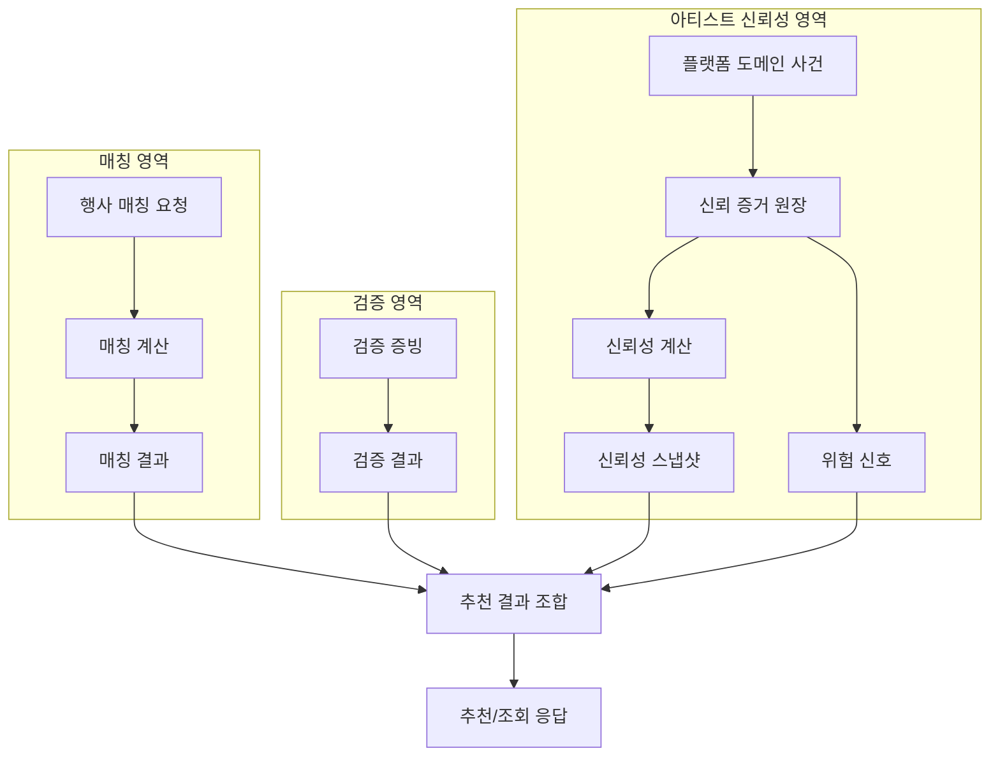
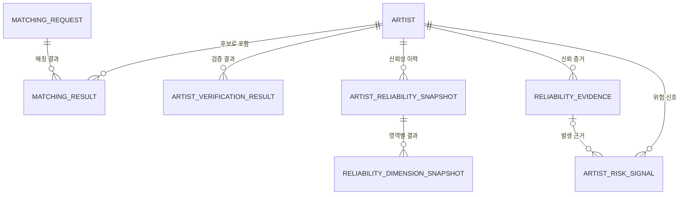
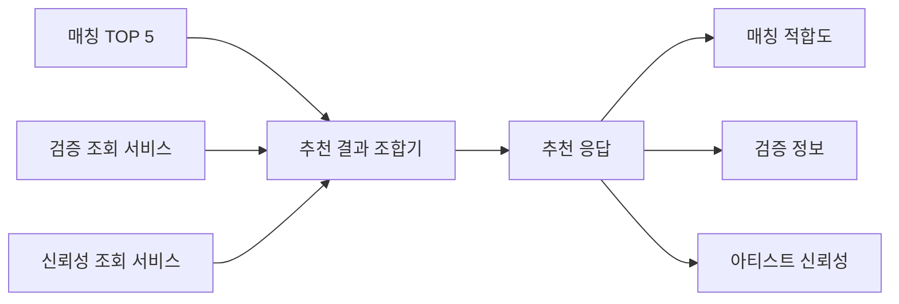
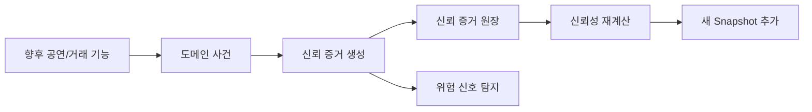

# ADR-003: 매칭·검증·아티스트 신뢰성 데이터 모델 경계

- 상태: **Accepted**
- 결정일: **2026-09-30**
- 관련 요구사항: TRUST-143, TRUST-145, TRUST-146, TRUST-149, TRUST-150, TRUST-151, TRUST-152, TRUST-153, TRUST-154
- 관련 이슈: NSU-53 / GitHub #57
- 상위 결정:
  - [ADR-001: 아티스트 신뢰성 V2의 계산 구조와 초기 파라미터](./ADR-001-artist-reliability-v2.md)
  - [ADR-002: 신뢰 증거 사건과 계산 입력 계약](./ADR-002-reliability-evidence-contract.md)

> 이 ADR은 **매칭 적합도, 검증 정보, 아티스트 신뢰성을 Spring 백엔드의 데이터 모델·저장 구조·응답 계약에서 어떻게 분리할지**를 확정한다.  
> 신뢰성 계산 공식은 ADR-001, 신뢰 증거 입력 규칙은 ADR-002를 따른다.

---

## 1. 이 ADR이 해결하는 문제

우리 서비스에는 비슷해 보이지만 서로 다른 세 종류의 정보가 있다.

1. **매칭 적합도**
   - 특정 행사에 특정 아티스트가 얼마나 잘 맞는지
   - 음악 의미, BPM, 리듬, 공연 스타일 등
2. **검증 정보**
   - 아티스트가 누구인지, 어떤 권리·활동이 확인되었는지
   - 실명, 외부 계정, 저작권, 실연, 활동 증빙 등
3. **아티스트 신뢰성**
   - 플랫폼 안에서 약속된 행동을 얼마나 안정적으로 이행했는지
   - 공연 완료, 귀책 취소, 노쇼, 응답, 검증 후기 등

이 세 정보를 하나의 점수나 하나의 테이블에 합치면 다음 문제가 발생한다.

- 특정 행사에 대한 적합성과 아티스트의 장기 행동 이력이 섞인다.
- 저작권 검증 같은 자격 정보가 신뢰성 점수처럼 오해될 수 있다.
- 신규 아티스트의 데이터 부족을 0점으로 표현하게 될 수 있다.
- 최종 점수의 근거를 추적하기 어려워진다.
- 매칭 로직 변경과 신뢰성 정책 변경이 서로 영향을 준다.
- 추천 API가 Matching, Verification, Reliability의 책임 경계를 잃는다.

따라서 **저장 모델부터 응답 모델까지 세 영역을 분리**한다.

---

## 2. 결정 요약

다음 경계를 공식화한다.

| 영역 | 기준 | 저장/조회 의미 |
| --- | --- | --- |
| 매칭 결과 | matchingRequestId + artistId | 이 행사에 얼마나 적합한가 |
| 검증 결과 | artistId + verificationType | 무엇이 검증되었는가 |
| 신뢰 증거 | artistId + 원본 사건 | 어떤 행동이 실제 발생했는가 |
| 신뢰성 스냅샷 | artistId + calculatedAt + policyVersion | 특정 시점에 계산된 신뢰성 |
| 위험 신호 | artistId + riskType | 현재 어떤 위험 근거가 있는가 |

핵심 결정은 다음과 같다.

- Matching Result와 Artist Reliability는 별도 모델로 관리한다.
- Verification Result와 Artist Reliability는 별도 모델로 관리한다.
- Reliability Evidence와 Reliability Snapshot을 분리한다.
- Risk Signal은 Reliability Score와 별도 모델로 관리한다.
- Matching Result는 Reliability Snapshot을 직접 FK로 참조하지 않는다.
- 추천 응답 조합은 Application 계층에서 artistId를 기준으로 수행한다.
- 신규 아티스트는 INSUFFICIENT_DATA + score = null로 표현한다.
- 신뢰성 스냅샷은 최신 값만 덮어쓰지 않고 **이력으로 누적 저장**한다.
- 스냅샷에 policyVersion을 저장한다.
- Ranking 보정값은 원본 Matching Score나 Reliability Snapshot에 저장하지 않는다.
- 추천 TOP N 조회 시 신뢰성·검증 정보를 아티스트별로 반복 조회하지 않고 일괄 조회한다.

---

## 3. 전체 데이터 흐름



추천 결과 조합기는 각 영역의 점수를 다시 계산하지 않는다.

역할은 오직:

```text
매칭 결과
+
검증 결과
+
최신 신뢰성 스냅샷
+
활성 위험 신호
        ↓
추천/조회 응답 조립
```

이다.

---

## 4. 영역별 수명과 소유권

### 4.1 매칭 결과

매칭 결과는 특정 Matching Request에 종속된다.

```text
행사 A + 아티스트 42
→ 매칭 89점

행사 B + 같은 아티스트 42
→ 매칭 74점
```

같은 아티스트라도 행사 조건이 바뀌면 값이 달라질 수 있다.

따라서 기준 식별자는:

```text
matchingRequestId + artistId
```

이다.

### 4.2 검증 결과

검증 결과는 특정 행사와 무관하다.

예:

```text
아티스트 42
저작권 보유 검증 = VERIFIED
```

이 값은 Matching Request가 바뀌어도 동일한 검증 사실이다.

### 4.3 아티스트 신뢰성

Artist Reliability도 특정 행사 요청에 종속되지 않는다.

아티스트의 플랫폼 행동 이력을 바탕으로 계산한다.

따라서 Reliability에 matchingRequestId를 저장하지 않는다.

---

## 5. 데이터 모델 관계



의도적으로 없는 관계가 있다.

```text
MATCHING_RESULT
    X
ARTIST_RELIABILITY_SNAPSHOT
```

두 모델은 DB FK로 직접 연결하지 않는다.

이유는 수명이 다르기 때문이다.

- Matching Result: 매칭 요청마다 생성
- Reliability Snapshot: 아티스트 행동 이력이나 정책 변경에 따라 재계산

추천 응답에서만 artistId를 기준으로 조합한다.

---

## 6. PostgreSQL 테이블 설계

이 ADR에서 신뢰성 경계에 필요한 테이블명을 다음처럼 확정한다.

### 6.1 matching_result

매칭 계산 결과만 저장한다.

```sql
CREATE TABLE matching_result (
    id BIGSERIAL PRIMARY KEY,

    matching_request_id BIGINT NOT NULL,
    artist_id BIGINT NOT NULL,

    overall_score NUMERIC(6, 3) NOT NULL,
    music_similarity_score NUMERIC(6, 3),
    bpm_score NUMERIC(6, 3),
    rhythm_score NUMERIC(6, 3),
    performance_style_score NUMERIC(6, 3),

    calculated_at TIMESTAMPTZ NOT NULL,

    CONSTRAINT uk_matching_result_request_artist
        UNIQUE (matching_request_id, artist_id)
);
```

이 테이블에는 다음 컬럼을 두지 않는다.

```text
reliability_score
confidence_level
risk_score
copyright_verified
ranking_adjustment
```

### 6.2 artist_verification_result

Verification은 Reliability와 별도로 저장한다.

NSU-33에서 세부 증빙 저장 정책을 확장할 수 있도록 최소 경계만 정의한다.

```sql
CREATE TABLE artist_verification_result (
    id BIGSERIAL PRIMARY KEY,

    artist_id BIGINT NOT NULL,
    verification_type VARCHAR(64) NOT NULL,
    verification_status VARCHAR(32) NOT NULL,

    verified_at TIMESTAMPTZ,
    created_at TIMESTAMPTZ NOT NULL,
    updated_at TIMESTAMPTZ NOT NULL,

    CONSTRAINT uk_artist_verification_type
        UNIQUE (artist_id, verification_type)
);
```

검증 결과를 신뢰성 점수에 직접 더하지 않는다.

### 6.3 reliability_evidence

아티스트 신뢰성의 **원본 증거 원장**이다.

```sql
CREATE TABLE reliability_evidence (
    id BIGSERIAL PRIMARY KEY,

    artist_id BIGINT NOT NULL,

    evidence_type VARCHAR(64) NOT NULL,
    dimension VARCHAR(32) NOT NULL,

    outcome_value NUMERIC(5, 4) NOT NULL,

    occurred_at TIMESTAMPTZ NOT NULL,

    source_type VARCHAR(32) NOT NULL,
    verification_status VARCHAR(32) NOT NULL,
    attribution_party VARCHAR(32) NOT NULL,

    included BOOLEAN NOT NULL,
    exclusion_reason VARCHAR(64) NOT NULL,

    source_domain VARCHAR(32) NOT NULL,
    source_id BIGINT NOT NULL,

    event_context VARCHAR(32) NOT NULL,
    risk_candidate BOOLEAN NOT NULL DEFAULT FALSE,

    created_at TIMESTAMPTZ NOT NULL,
    updated_at TIMESTAMPTZ NOT NULL,

    CONSTRAINT ck_reliability_outcome_value
        CHECK (outcome_value >= 0.0 AND outcome_value <= 1.0),

    CONSTRAINT uk_reliability_evidence_source
        UNIQUE (source_domain, source_id, evidence_type)
);
```

Evidence는 계산 결과가 아니라 원본이다.

정책 버전이 바뀌어도 과거 Evidence를 변경하지 않고 다시 계산할 수 있어야 한다.

### 6.4 artist_reliability_snapshot

특정 시점에 계산된 종합 신뢰성 결과를 저장한다.

```sql
CREATE TABLE artist_reliability_snapshot (
    id BIGSERIAL PRIMARY KEY,

    artist_id BIGINT NOT NULL,

    status VARCHAR(32) NOT NULL,

    overall_score NUMERIC(6, 3),

    confidence_value NUMERIC(6, 5) NOT NULL,
    confidence_level VARCHAR(16) NOT NULL,

    evidence_count BIGINT NOT NULL,
    effective_evidence_weight NUMERIC(12, 6) NOT NULL,

    policy_version VARCHAR(64) NOT NULL,

    calculated_at TIMESTAMPTZ NOT NULL,
    evidence_cutoff_at TIMESTAMPTZ,

    created_at TIMESTAMPTZ NOT NULL
);
```

추천 조회 성능을 위해 다음 인덱스를 둔다.

```sql
CREATE INDEX idx_reliability_snapshot_artist_calculated
    ON artist_reliability_snapshot (
        artist_id,
        calculated_at DESC
    );
```

### 6.5 reliability_dimension_snapshot

스냅샷의 네 신뢰성 영역 결과를 별도 저장한다.

```sql
CREATE TABLE reliability_dimension_snapshot (
    snapshot_id BIGINT NOT NULL,
    dimension VARCHAR(32) NOT NULL,

    score NUMERIC(6, 3) NOT NULL,

    alpha NUMERIC(12, 6) NOT NULL,
    beta NUMERIC(12, 6) NOT NULL,

    evidence_count BIGINT NOT NULL,
    effective_weight NUMERIC(12, 6) NOT NULL,

    PRIMARY KEY (snapshot_id, dimension)
);
```

네 영역:

```text
PERFORMANCE
SCHEDULE
COMMUNICATION
REPUTATION
```

을 독립적으로 설명할 수 있어야 한다.

### 6.6 artist_risk_signal

위험 신호는 Reliability Score와 별도로 관리한다.

```sql
CREATE TABLE artist_risk_signal (
    id BIGSERIAL PRIMARY KEY,

    artist_id BIGINT NOT NULL,

    risk_type VARCHAR(64) NOT NULL,
    status VARCHAR(32) NOT NULL,

    source_evidence_id BIGINT,

    detected_at TIMESTAMPTZ NOT NULL,
    resolved_at TIMESTAMPTZ,

    policy_version VARCHAR(64) NOT NULL,

    created_at TIMESTAMPTZ NOT NULL,
    updated_at TIMESTAMPTZ NOT NULL
);
```

예:

```text
RECENT_NO_SHOW
REPEATED_ARTIST_CANCELLATION
REPEATED_LATE_ARRIVAL
REPEATED_NO_RESPONSE
REPUTATION_MANIPULATION_SUSPECTED
ACCOUNT_SANCTION
```

Risk Signal은 설명과 운영 판단에 사용할 수 있지만 같은 사건을 다시 고정 감점하지 않는다.

---

## 7. Evidence와 Snapshot을 분리하는 이유

둘은 역할이 완전히 다르다.

```text
Reliability Evidence
= 무슨 일이 실제로 있었는가?

Reliability Snapshot
= 그 증거들을 현재 정책으로 계산하면 결과가 무엇인가?
```

예:

```text
Evidence
- 공연 완료
- 공연 완료
- 늦은 응답
- 검증 후기

        ↓ V2 정책 계산

Snapshot
- 종합 신뢰성 87.4
- 확신 보통
- 공연 이행 90.1
- 소통 80.2
```

계산 정책을 V2.1에서 V2.2로 바꾸더라도 Evidence는 그대로 두고 새 Snapshot을 생성한다.

---

## 8. Snapshot은 덮어쓰지 않고 이력으로 저장한다

다음 방식을 사용하지 않는다.

```text
Artist 42
reliability_score = 83

재계산
↓
같은 row를 88로 UPDATE
```

대신:

```text
Artist 42

Snapshot #101
policyVersion = ARTIST_RELIABILITY_V2_1
score = 83.0

Snapshot #118
policyVersion = ARTIST_RELIABILITY_V2_1
score = 86.0

Snapshot #145
policyVersion = ARTIST_RELIABILITY_V2_2
score = 88.0
```

처럼 History를 남긴다.

장점:

- 과거 점수 추적
- 정책 변경 전후 비교
- 재계산 감사
- 설명 가능성
- 디버깅

현재 신뢰성은 가장 최근 Snapshot을 조회한다.

---

## 9. 정책 버전

Snapshot에는 반드시 policyVersion을 저장한다.

초기 예:

```text
ARTIST_RELIABILITY_V2_1
```

정책 버전은 최소 다음 값의 조합을 식별할 수 있어야 한다.

- Beta 사전분포
- 영역별 가중치
- 시간 감쇠 반감기
- 행사 맥락 가중치
- 증거 검증 가중치
- 확신 계산 공식과 임계값

정책 값이 바뀌면 기존 Snapshot의 의미를 잃지 않도록 새 policyVersion을 사용한다.

---

## 10. Cold Start API 규칙

실제 계산 가능한 신뢰 증거가 없는 신규 아티스트를 0점으로 표현하지 않는다.

공식 API 표현은 다음으로 확정한다.

```text
status = INSUFFICIENT_DATA
score = null

confidence.value = 0.0
confidence.level = LOW
```

중요한 의미:

```text
score = 0
→ 매우 낮은 신뢰성

score = null
→ 아직 신뢰성을 판단할 데이터가 없음
```

둘은 완전히 다른 상태다.

### 10.1 데이터가 없는 경우 Snapshot 저장

계산 가능한 Evidence가 전혀 없으면 0점 Snapshot을 만들지 않는다.

Query 계층이 최신 Snapshot 부재를 감지하여 INSUFFICIENT_DATA 응답을 조립한다.

즉:

```text
최신 Snapshot 없음
        ↓
신뢰성 0점 X
        ↓
INSUFFICIENT_DATA 응답
```

이 방식으로 가짜 중립 점수나 가짜 이력을 만들지 않는다.

---

## 11. Java 도메인 모델

### 11.1 매칭 결과

```java
import java.time.Instant;

public record MatchingResult(
        Long matchingRequestId,
        Long artistId,

        double overallScore,
        Double musicSimilarityScore,
        Double bpmScore,
        Double rhythmScore,
        Double performanceStyleScore,

        Instant calculatedAt
) {
}
```

MatchingResult에는 Reliability 관련 필드를 넣지 않는다.

### 11.2 신뢰성 상태

```java
public enum ReliabilityStatus {

    AVAILABLE,
    INSUFFICIENT_DATA
}
```

### 11.3 확신 수준

```java
public enum ConfidenceLevel {

    LOW,
    MEDIUM,
    HIGH
}
```

```java
public record Confidence(
        double value,
        ConfidenceLevel level
) {
}
```

### 11.4 영역별 신뢰성

```java
public enum ReliabilityDimension {

    PERFORMANCE,
    SCHEDULE,
    COMMUNICATION,
    REPUTATION
}
```

```java
public record DimensionReliability(
        ReliabilityDimension dimension,

        double score,

        double alpha,
        double beta,

        long evidenceCount,
        double effectiveWeight
) {
}
```

### 11.5 신뢰성 스냅샷

```java
import java.time.Instant;
import java.util.Map;

public record ArtistReliabilitySnapshot(
        Long snapshotId,
        Long artistId,

        ReliabilityStatus status,

        Double overallScore,

        Confidence confidence,

        Map<ReliabilityDimension, DimensionReliability> dimensions,

        long evidenceCount,
        double effectiveEvidenceWeight,

        String policyVersion,
        Instant calculatedAt,
        Instant evidenceCutoffAt
) {
}
```

overallScore가 Double인 이유는 Cold Start에서 null을 허용하기 위해서다.

단, 실제 저장 Snapshot은 계산 가능한 Evidence가 있을 때 생성하며, Snapshot이 없는 경우 Query 계층에서 Cold Start 응답을 만든다.

---

## 12. 위험 신호 모델

```java
import java.time.Instant;

public record ArtistRiskSignal(
        Long id,
        Long artistId,

        RiskSignalType type,
        RiskSignalStatus status,

        Long sourceEvidenceId,

        Instant detectedAt,
        Instant resolvedAt,

        String policyVersion
) {
}
```

```java
public enum RiskSignalStatus {

    ACTIVE,
    RESOLVED
}
```

위험 신호를 overallScore 안에 숨기지 않는다.

---

## 13. Verification 모델 경계

Verification은 Artist Reliability와 별개다.

최소 모델 예:

```java
public record ArtistVerificationResult(
        Long artistId,
        VerificationType type,
        VerificationStatus status
) {
}
```

예:

```text
IDENTITY
EXTERNAL_ACCOUNT
RIGHTS_OWNERSHIP
PERFORMANCE_PARTICIPATION
OFFICIAL_ACTIVITY
```

이 결과를 다음처럼 신뢰성 가산점으로 사용하지 않는다.

```java
// 사용하지 않는 방식
reliabilityScore += rightsVerified ? 20.0 : 0.0;
```

세부 Verification 저장·심사 구현은 NSU-33이 담당한다.

---

## 14. API 응답 계약

추천 API는 Matching, Verification, Reliability를 명시적으로 분리한다.

### 14.1 신뢰 데이터가 있는 아티스트

```json
{
  "artistId": 42,
  "matching": {
    "overallScore": 89.0,
    "musicSimilarityScore": 92.0,
    "bpmScore": 87.0,
    "rhythmScore": 85.0,
    "performanceStyleScore": 88.0
  },
  "verification": {
    "identityVerified": true,
    "externalAccountVerified": true,
    "rightsVerified": true
  },
  "reliability": {
    "status": "AVAILABLE",
    "score": 88.4,
    "confidence": {
      "value": 0.76,
      "level": "HIGH"
    },
    "dimensions": {
      "performance": 91.2,
      "schedule": 87.3,
      "communication": 82.1,
      "reputation": 86.7
    },
    "riskSignals": [],
    "evidenceSummary": {
      "totalEvidence": 18,
      "completedPerformances": 10,
      "artistCancellations": 1,
      "noShows": 0,
      "verifiedReviews": 7
    },
    "policyVersion": "ARTIST_RELIABILITY_V2_1",
    "calculatedAt": "2026-09-30T17:00:00+09:00"
  }
}
```

### 14.2 신규 아티스트

```json
{
  "artistId": 55,
  "matching": {
    "overallScore": 91.0,
    "musicSimilarityScore": 94.0
  },
  "verification": {
    "identityVerified": true,
    "externalAccountVerified": true,
    "rightsVerified": true
  },
  "reliability": {
    "status": "INSUFFICIENT_DATA",
    "score": null,
    "confidence": {
      "value": 0.0,
      "level": "LOW"
    },
    "dimensions": null,
    "riskSignals": [],
    "evidenceSummary": {
      "totalEvidence": 0
    },
    "policyVersion": null,
    "calculatedAt": null
  }
}
```

신규 아티스트가 매칭 점수 91점을 받는 것과 신뢰 데이터가 없는 것은 동시에 성립할 수 있다.

---

## 15. Spring Response DTO

### 15.1 최상위 추천 응답

```java
public record ArtistRecommendationResponse(
        Long artistId,
        MatchingResponse matching,
        VerificationResponse verification,
        ReliabilityResponse reliability
) {
}
```

### 15.2 매칭 응답

```java
public record MatchingResponse(
        double overallScore,
        Double musicSimilarityScore,
        Double bpmScore,
        Double rhythmScore,
        Double performanceStyleScore
) {
}
```

### 15.3 검증 응답

```java
public record VerificationResponse(
        boolean identityVerified,
        boolean externalAccountVerified,
        boolean rightsVerified
) {
}
```

### 15.4 신뢰성 응답

```java
import java.time.Instant;
import java.util.List;

public record ReliabilityResponse(
        ReliabilityStatus status,
        Double score,

        ConfidenceResponse confidence,
        ReliabilityDimensionsResponse dimensions,

        List<RiskSignalResponse> riskSignals,
        EvidenceSummaryResponse evidenceSummary,

        String policyVersion,
        Instant calculatedAt
) {
}
```

### 15.5 Cold Start 생성

```java
public final class ReliabilityResponseFactory {

    private ReliabilityResponseFactory() {
    }

    public static ReliabilityResponse insufficientData() {
        return new ReliabilityResponse(
                ReliabilityStatus.INSUFFICIENT_DATA,
                null,
                new ConfidenceResponse(
                        0.0,
                        ConfidenceLevel.LOW
                ),
                null,
                java.util.List.of(),
                EvidenceSummaryResponse.empty(),
                null,
                null
        );
    }
}
```

---

## 16. Recommendation 조합 계층

각 Aggregate를 API DTO에서만 조합한다.



조합기는 Matching Score나 Reliability Score를 다시 계산하지 않는다.

---

## 17. N+1 조회 방지

TOP 5 추천에서 아티스트별로 Reliability를 반복 조회하지 않는다.

사용하지 않는 방식:

```java
for (MatchingResult result : matchingResults) {
    reliabilityRepository.findLatestByArtistId(result.artistId());
}
```

권장 방식:

```java
List<Long> artistIds = matchingResults.stream()
        .map(MatchingResult::artistId)
        .toList();

Map<Long, ArtistReliabilitySnapshot> reliabilityByArtist =
        reliabilityQueryService.findLatestByArtistIds(artistIds);

Map<Long, VerificationSummary> verificationByArtist =
        verificationQueryService.findByArtistIds(artistIds);
```

이후 Application 계층에서 한 번에 조합한다.

---

## 18. 최신 Snapshot 일괄 조회

PostgreSQL에서는 최신 Snapshot을 한 번에 조회할 수 있다.

개념 SQL:

```sql
SELECT DISTINCT ON (artist_id)
       id,
       artist_id,
       status,
       overall_score,
       confidence_value,
       confidence_level,
       evidence_count,
       effective_evidence_weight,
       policy_version,
       calculated_at,
       evidence_cutoff_at
FROM artist_reliability_snapshot
WHERE artist_id = ANY (:artistIds)
ORDER BY artist_id, calculated_at DESC;
```

실제 JPA 구현 방식은 Repository 구현 단계에서 선택한다.

---

## 19. 추천 조합 서비스 예제

```java
import java.util.List;
import java.util.Map;

public class RecommendationQueryService {

    private final ReliabilityQueryService reliabilityQueryService;
    private final VerificationQueryService verificationQueryService;
    private final RecommendationAssembler recommendationAssembler;

    public List<ArtistRecommendationResponse> assemble(
            List<MatchingResult> matchingResults
    ) {
        List<Long> artistIds = matchingResults.stream()
                .map(MatchingResult::artistId)
                .toList();

        Map<Long, ArtistReliabilitySnapshot> reliabilityByArtist =
                reliabilityQueryService.findLatestByArtistIds(artistIds);

        Map<Long, VerificationSummary> verificationByArtist =
                verificationQueryService.findByArtistIds(artistIds);

        return matchingResults.stream()
                .map(result ->
                        recommendationAssembler.assemble(
                                result,
                                verificationByArtist.get(result.artistId()),
                                reliabilityByArtist.get(result.artistId())
                        )
                )
                .toList();
    }
}
```

Assembler는 Snapshot이 null이면 Cold Start 응답을 만든다.

```java
public ReliabilityResponse toReliabilityResponse(
        ArtistReliabilitySnapshot snapshot
) {
    if (snapshot == null) {
        return ReliabilityResponseFactory.insufficientData();
    }

    return ReliabilityResponseMapper.from(snapshot);
}
```

---

## 20. 패키지 경계

논리적인 패키지 구조는 다음과 같이 분리한다.

```text
matching/
├── domain/
└── application/

verification/
├── domain/
├── application/
└── infrastructure/

reliability/
├── domain/
│   ├── evidence/
│   ├── snapshot/
│   ├── risk/
│   └── policy/
├── application/
│   ├── calculate/
│   └── query/
└── infrastructure/
    └── persistence/

recommendation/
└── application/
    ├── RecommendationQueryService
    └── RecommendationAssembler
```

Reliability를 matching 패키지의 하위에 넣지 않는다.

---

## 21. Ranking 연계

이번 ADR에서 Ranking 보정 공식은 결정하지 않는다.

현재 확정하는 것은 **데이터 경계**다.

### 금지

```text
matching_result.overall_score
= matchingScore + reliabilityScore
```

또는:

```text
matching_result.ranking_adjustment
= reliability 기반 값 저장
```

### 허용 가능한 미래 구조

별도 Human Decision 이후 Ranking 보정이 필요하다면 추천 계산 시점의 파생 값으로 만든다.

```text
Matching Score
+
별도 Reliability 조회
        ↓
Ranking Policy
        ↓
일시적인 Ranking Derived Value
```

이 파생 값은 원본 Matching Score와 Artist Reliability의 의미를 변경하지 않는다.

---

## 22. Risk Signal 조회 정책

Risk Signal은 Snapshot 내부 JSON으로 고정 저장하지 않는다.

추천/프로필 조회에서:

```text
최신 Reliability Snapshot
+
현재 ACTIVE Risk Signal
```

을 조합한다.

이유:

- Risk Signal은 별도의 해제 수명을 가진다.
- 점수 재계산 없이 위험 상태만 RESOLVED가 될 수 있다.
- 동일 사건을 점수에서 중복 감점하면 안 된다.

---

## 23. Post-MVP 확장

현재는 데이터 구조를 먼저 준비하고 다음 사건은 관련 기능이 생긴 뒤 연결한다.

- 공연 정상 완료
- 아티스트 귀책 취소
- 노쇼
- 체크인
- 검증 거래 후기

확장 흐름:



기존 테이블을 깨지 않고 Evidence 종류만 추가할 수 있도록 한다.

---

## 24. 사용하지 않는 구조

### 24.1 하나의 Artist Score 테이블

사용하지 않는다.

```text
artist_score
├── music_score
├── bpm_score
├── copyright_verified
├── reliability_score
├── no_show_score
└── final_score
```

서로 다른 의미와 수명을 가진 데이터가 섞인다.

### 24.2 Matching Result가 Reliability Snapshot을 FK로 참조

사용하지 않는다.

Reliability가 갱신될 때 과거 Matching Result와 의미가 강하게 결합된다.

### 24.3 Snapshot 한 행을 계속 UPDATE

사용하지 않는다.

정책 변경과 과거 계산 결과를 추적하기 어렵다.

### 24.4 Cold Start를 score = 0으로 저장

사용하지 않는다.

데이터 부족과 실제 실패 이력을 구분할 수 없다.

### 24.5 Verification을 Reliability 보너스로 변환

사용하지 않는다.

Verification은 자격/권리 확인이고 Reliability는 행동 이력이다.

---

## 25. 테스트해야 할 핵심 시나리오

### 25.1 Matching과 Reliability 독립성

```java
@Test
void 매칭_결과는_신뢰성_없이도_존재할_수_있다() {
    MatchingResult result = matchingService.calculate(request, artist);

    assertThat(result.overallScore()).isNotNull();
}
```

### 25.2 Cold Start

```java
@Test
void 신뢰_증거가_없는_아티스트는_0점이_아니다() {
    ArtistReliabilitySnapshot snapshot = null;

    ReliabilityResponse response =
            mapper.toReliabilityResponse(snapshot);

    assertThat(response.status())
            .isEqualTo(ReliabilityStatus.INSUFFICIENT_DATA);

    assertThat(response.score()).isNull();
    assertThat(response.confidence().level())
            .isEqualTo(ConfidenceLevel.LOW);
}
```

### 25.3 Snapshot History

```java
@Test
void 재계산하면_기존_snapshot을_덮어쓰지_않고_새_snapshot을_만든다() {
    long before =
            snapshotRepository.countByArtistId(artistId);

    recalculationService.recalculate(artistId);

    long after =
            snapshotRepository.countByArtistId(artistId);

    assertThat(after).isEqualTo(before + 1);
}
```

### 25.4 Matching 원본에 Reliability가 섞이지 않음

```java
@Test
void 신뢰성이_바뀌어도_저장된_matching_score는_변하지_않는다() {
    double before = matchingResult.overallScore();

    reliabilityRecalculationService.recalculate(artistId);

    MatchingResult reloaded =
            matchingResultRepository.findById(matchingResultId)
                    .orElseThrow();

    assertThat(reloaded.overallScore()).isEqualTo(before);
}
```

---

## 26. GitHub #57 완료 조건 대응

| GitHub #57 Acceptance Criteria | 이 ADR |
| --- | --- |
| Matching Score와 Artist Reliability 별도 모델 | 4, 6, 11장 |
| Verification Signal과 Artist Reliability 별도 모델 | 4, 6, 13장 |
| Evidence와 Snapshot 분리 | 6~8장 |
| 위험 신호 별도 모델 | 6, 12, 22장 |
| 추천/조회 응답에서 적합·신뢰 정보 분리 | 14~19장 |
| 신규 아티스트를 0점으로 표현하지 않음 | 10, 14장 |
| 확신 수준과 산출 근거 표현 | 6, 11, 14장 |
| Matching Score 원본에 Reliability/보정값 미저장 | 6, 21장 |
| Post-MVP 거래·공연 사건 확장 | 23장 |
| DB/Java/API DTO 설계 일치 | 6, 11~19장 |

---

## 27. 이 ADR에서 확정하지 않는 것

다음 항목은 별도 결정 대상으로 남긴다.

- Artist Reliability를 실제 Ranking에 반영할지 여부
- Ranking 보정 공식
- 위험 신호별 발생 임계값
- 위험 신호의 사용자 노출 범위
- EVENT_PARTNER Reliability
- Verification 세부 심사 프로세스와 증빙 파일 저장 방식
- 실제 JPA fetch 전략과 세부 Repository 구현
- 신뢰성 재계산 트리거의 최종 구현 방식
- 캐시 도입 시점과 Redis 키 정책

---

## 28. 결과와 트레이드오프

### 장점

- 매칭, 검증, 신뢰성의 의미가 DB부터 API까지 분리된다.
- 신규 아티스트에게 잘못된 0점이 부여되지 않는다.
- Evidence와 Snapshot의 역할이 명확하다.
- 정책 버전별 신뢰성 결과를 재현할 수 있다.
- 과거 Snapshot을 보존해 설명 가능성과 감사 가능성이 높다.
- Risk Signal을 점수와 별도 수명으로 관리할 수 있다.
- 추천 TOP N 응답에서 N+1 조회를 피할 수 있다.
- Matching 로직과 Reliability 정책을 독립적으로 발전시킬 수 있다.

### 비용

- 테이블과 모델 수가 늘어난다.
- Snapshot History 관리가 필요하다.
- Application 계층에서 여러 Aggregate를 조합해야 한다.
- 최신 Snapshot 일괄 조회 쿼리가 필요하다.
- 정책 버전 관리가 필요하다.

이 비용은 **도메인 경계, 설명 가능성, 재계산 가능성, Cold Start 처리**를 위해 감수한다.

---

## 29. 후속 작업

이 ADR이 반영되면 다음 순서로 진행한다.

```text
ADR-001
신뢰성 계산 방식
        ↓
ADR-002
신뢰 증거 입력 계약
        ↓
ADR-003
DB / Java / API 경계
        ↓
NSU-33
Verification 결과 저장 구현
        +
Reliability 구현 이슈
        ↓
추천 결과 조합
```

NSU-53 / GitHub #57은 이 ADR이 Merge되면 데이터 모델 설계 관점의 Acceptance Criteria를 충족한다.
