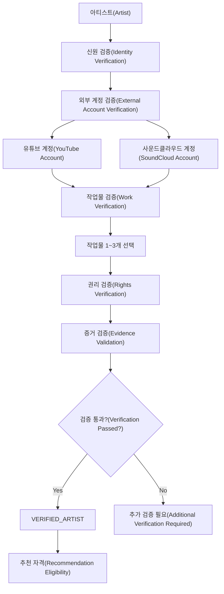
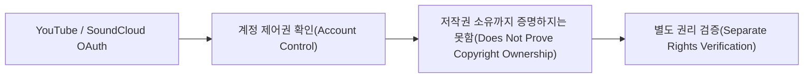
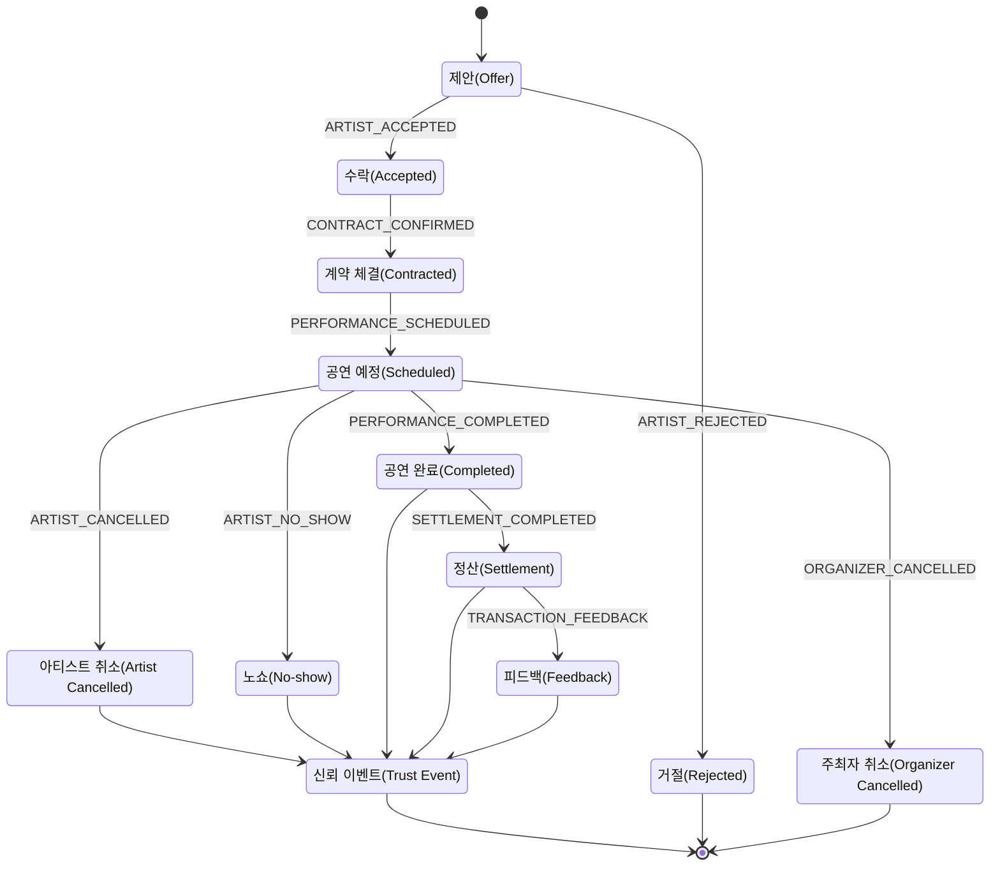
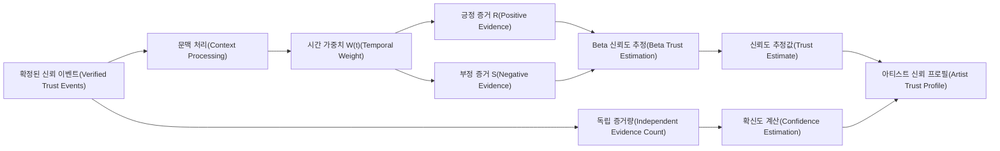
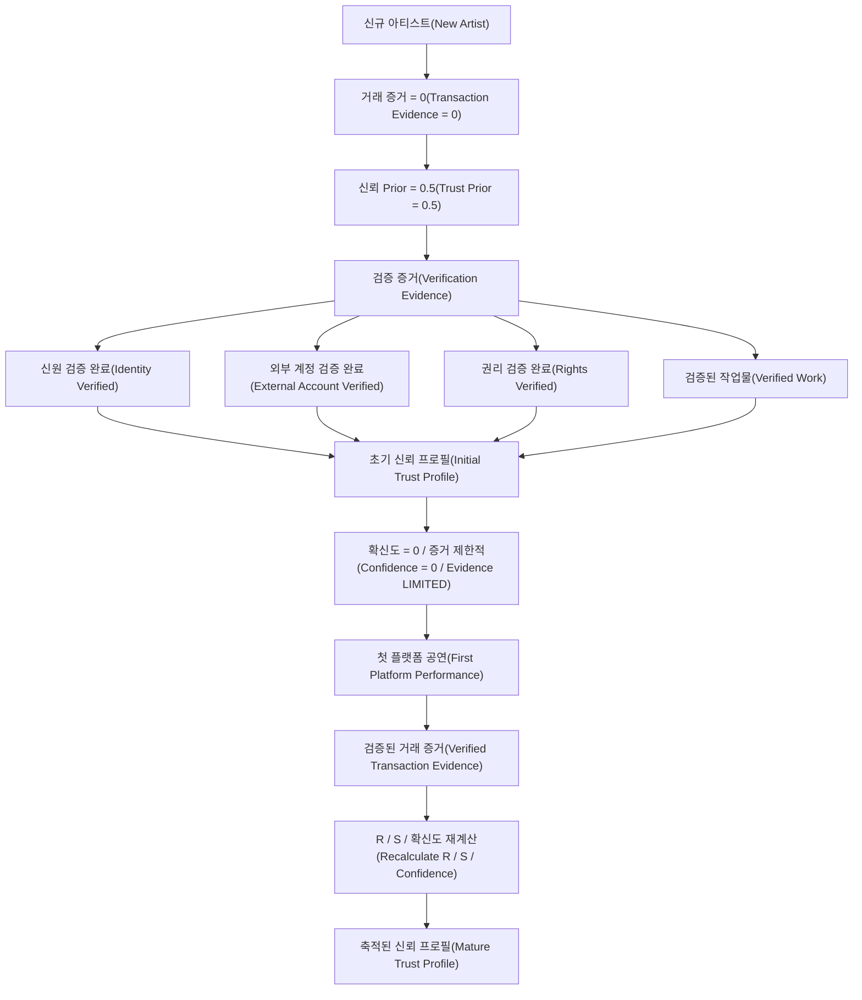
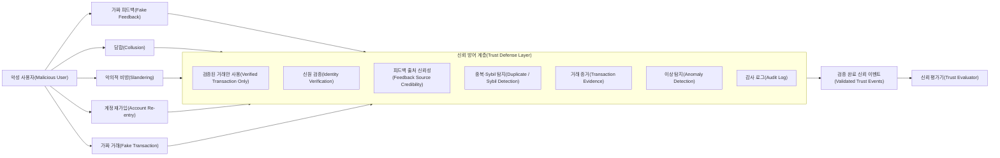
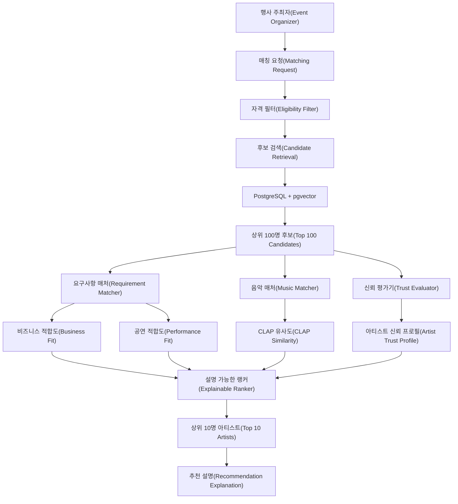
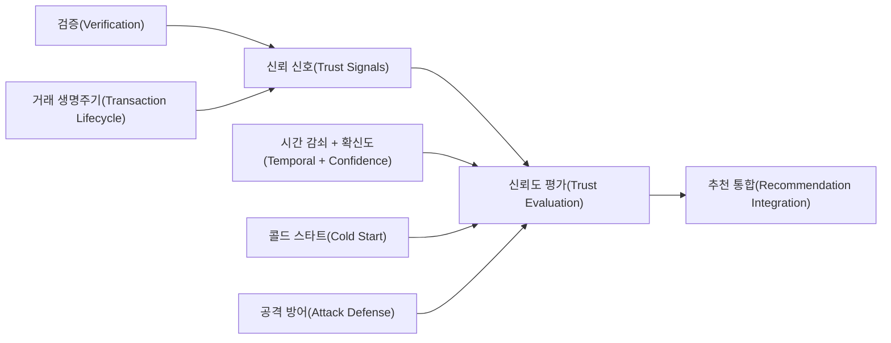

# Artist Trust Architecture

# 1. 문제 정의

행사 주최자가 온라인에서 처음 보는 아티스트와 계약한다고 생각해 보겠습니다.

음악을 들어 보니 행사와 매우 잘 어울릴 수 있습니다.

하지만 다음 문제는 여전히 남습니다.

```text
음악이 좋다
   ≠
실제 아티스트다
   ≠
작업물 권리를 가지고 있다
   ≠
공연 계약을 잘 지킨다
```

따라서 음악 추천 시스템과 별도로 **거래 신뢰성을 판단할 구조**가 필요합니다.

---

# 2. 시스템이 해결하려는 문제

Artist Trust System이 해결하려는 질문은 크게 세 종류입니다.

### 2.1 실제 아티스트인가?

- 본인 인증이 되었는가?
- 외부 활동 계정을 실제로 소유하고 있는가?
- 본인의 작업물을 제출했는가?
- 해당 작업물의 권리를 증명했는가?

이 영역을 **Verification**이라고 합니다.

---

### 2.2 실제 거래를 믿을 수 있는가?

- 계약 후 공연을 완료했는가?
- 아티스트 귀책으로 자주 취소했는가?
- 공연 당일 나타나지 않은 적이 있는가?
- 분쟁이 반복되는가?

이 영역을 **Transaction Trust**라고 합니다.

---

### 2.3 거래 과정에서 성실한 행동을 보이는가?

- 공연 제안에 응답하는가?
- 연락이 지나치게 늦지 않는가?
- 플랫폼에서 장기간 비활성 상태는 아닌가?

이 영역을 **Behavior Trust**라고 합니다.

---

# 3. 시스템 목표와 비목표

## 목표

Artist Trust System의 목표는 다음과 같습니다.

- 검증 가능한 정보를 기반으로 한다.
- 실제 플랫폼 거래 기록을 중요하게 사용한다.
- 신규 아티스트를 무조건 불신하지 않는다.
- 오래된 기록과 최근 기록을 구분할 수 있어야 한다.
- 데이터가 적을 때 불확실성을 표시할 수 있어야 한다.
- 부정행위와 조작 가능성을 고려한다.
- 추천 결과에서 근거를 설명할 수 있어야 한다.

## 비목표

이 시스템은 다음을 판단하기 위한 시스템이 아닙니다.

- 음악 실력이 뛰어난가?
- 인기 있는 아티스트인가?
- 예술적으로 좋은 음악인가?
- 특정 장르에서 최고인가?

음악 적합성은 **Music Matcher**, 공연 조건은 **Requirement Matcher**의 책임입니다.

---

# 4. 전체 Architecture

**상태: [확정]**



```mermaid
flowchart LR

    Artist["아티스트(Artist)"]

    Artist --> Verification["아티스트 검증(Artist Verification)"]

    Verification --> Eligibility["검증·자격(Verified / Eligibility)"]

    Eligibility --> Signal["신뢰 신호 수집(Trust Signal Collection)"]

    Signal --> Evaluator["신뢰 평가기(Trust Evaluator)"]

    Evaluator --> Profile["아티스트 신뢰 프로필(Artist Trust Profile)"]

    Profile --> Ranker["설명 가능한 랭커(Explainable Ranker)"]

    Ranker --> Result["추천 결과(Recommendation Result)"]

    subgraph TrustSystem["아티스트 신뢰 시스템(Artist Trust System)"]
        Signal
        Evaluator
        Profile
    end

    subgraph RecommendationSystem["추천 시스템(Recommendation System)"]
        Ranker
        Result
    end
```

읽는 방법은 간단합니다.

```text
아티스트
  ↓
실제 활동 가능한 사람인지 확인
  ↓
거래 과정에서 발생하는 신뢰 근거 수집
  ↓
신뢰 근거 평가
  ↓
신뢰 프로필 생성
  ↓
추천 시스템에서 하나의 독립 평가 축으로 사용
```

---

# 5. Artist Verification

**상태: [V1 구조 확정 / 외부 인증 공급자는 Adapter 뒤로 분리]**

Verification은 평판을 계산하기 위한 단계가 아닙니다.

목적은 **“이 계정의 주체와 제출한 정보가 검증되었는가?”**를 확인하는 것입니다.



## 5.1 Verification의 계층

```text
Identity Verification
       ↓
External Account Ownership
       ↓
Work Verification
       ↓
Rights Verification
```

### Identity Verification

실제 사람이 존재하며 해당 플랫폼 계정의 주체임을 확인합니다.

### External Account Verification

YouTube, SoundCloud 등의 계정을 실제로 관리하고 있는지 확인합니다.

### Work Verification

검증된 외부 계정 등에 실제 작업물이 존재하는지 확인합니다.

### Rights Verification

작업물을 사용할 권리가 있다는 근거를 확인합니다.

---

## 5.2 OAuth와 저작권 검증은 다르다

**상태: [확정]**



OAuth로 확인할 수 있는 것은 주로:

> “이 사람이 이 외부 계정을 실제로 제어할 수 있는가?”

입니다.

하지만 다음 질문의 답은 아닙니다.

> “이 계정에 올라온 모든 음악의 저작권을 이 사람이 가지고 있는가?”

따라서 **Account Ownership Verification과 Rights Verification은 분리**합니다.

---

# 6. Trust Signal Taxonomy

**상태: [설계 방향]**

신뢰성을 평가하기 위해 사용하는 데이터를 크게 세 종류로 나눕니다.

```mermaid
flowchart TD

    Artist["아티스트(Artist)"]

    Artist --> TrustSignals["신뢰 신호(Trust Signals)"]

    TrustSignals --> Verification["검증 신호(Verification Signals)"]
    TrustSignals --> Transaction["거래 신호(Transaction Signals)"]
    TrustSignals --> Behavior["행동 신호(Behavior Signals)"]

    subgraph VS["검증 신호(Verification Signals)"]
        V1["신원 검증 완료(Identity Verified)"]
        V2["외부 계정 검증 완료(External Account Verified)"]
        V3["작업물 검증 완료(Work Verified)"]
        V4["권리 검증 완료(Rights Verified)"]
        V5["공연 증거(Performance Evidence)"]
    end

    Verification --> V1
    Verification --> V2
    Verification --> V3
    Verification --> V4
    Verification --> V5

    subgraph TS["거래 신호(Transaction Signals)"]
        T1["공연 완료(Performance Completed)"]
        T2["아티스트 취소(Artist Cancellation)"]
        T3["노쇼(No-show)"]
        T4["분쟁(Dispute)"]
        T5["정산 완료(Settlement Completed)"]
        T6["거래 이력(Transaction History)"]
    end

    Transaction --> T1
    Transaction --> T2
    Transaction --> T3
    Transaction --> T4
    Transaction --> T5
    Transaction --> T6

    subgraph BS["행동 신호(Behavior Signals)"]
        B1["응답률(Response Rate)"]
        B2["응답 시간(Response Time)"]
        B3["제안 수락(Offer Acceptance)"]
        B4["계정 활동(Account Activity)"]
    end

    Behavior --> B1
    Behavior --> B2
    Behavior --> B3
    Behavior --> B4
```



---

# 7. 세 가지 Trust 영역

## 7.1 Verification Trust

질문:

> “이 사람이 누구이고, 무엇을 소유하거나 통제하는지 검증할 수 있는가?”

예:

- 본인 인증
- 외부 계정 연결
- 작업물 검증
- 권리 검증

---

## 7.2 Transaction Trust

질문:

> “이 아티스트와 실제 계약했을 때 계약을 안정적으로 완료할 가능성을 판단할 근거가 있는가?”

예:

- 공연 정상 완료
- 아티스트 귀책 취소
- No-show
- 분쟁
- 정산 완료

현재 설계에서 가장 중요한 신뢰 축입니다.

---

## 7.3 Behavior Trust

질문:

> “거래가 완료되기 전 과정에서 지속적으로 성실한 행동을 보이는가?”

예:

- 응답률
- 응답 시간
- 최근 플랫폼 활동
- 제안에 대한 처리 이력

단, 이런 데이터는 **실제 공연 완료 이벤트보다 조작 가능성이 높거나 상황 의존적일 수 있으므로** 향후 계산 시 같은 강도로 다룰 필요는 없습니다.

V1에서는 Behavior Signal을 **Beta Trust 계산과 추천 랭킹에 직접 넣지 않고**, 별도 설명용 프로필로만 노출합니다. 데이터가 충분히 축적된 뒤 V2에서 재검토합니다.

---

# 8. 공연 거래 Lifecycle

**상태: [설계 방향]**

신뢰도를 직접 수정하는 대신 **실제로 발생한 사건을 먼저 기록**합니다.



---

# 9. 왜 Event를 먼저 저장하는가

다음과 같은 방식은 단순하지만 문제가 있습니다.

```text
현재 점수 = 87

공연 완료
→ 현재 점수 = 89
```

몇 달 뒤 89점이 **왜 89점인지 설명하기 어렵습니다.**

반면 사건을 보존하면:

```text
2026-03-11 PERFORMANCE_COMPLETED
2026-04-02 PERFORMANCE_COMPLETED
2026-05-19 ARTIST_CANCELLED
2026-06-20 PERFORMANCE_COMPLETED
```

나중에 계산 방식이 바뀌어도 다시 계산할 수 있습니다.

따라서 개념적으로:

```text
사실(Event)
    ↓
파생 지표(Metric)
    ↓
신뢰 프로필(Profile)
```

의 방향을 사용합니다.

---

# 10. Trust Evaluation Pipeline (신뢰도 평가 수식)

**상태: [V1 확정]**

수집된 이벤트(Event)를 바탕으로 아티스트의 신뢰도를 계산하기 위해 **Beta Reputation System의 확률 모델**을 중심으로 사용하고, **PeerTrust의 Context 개념**을 이벤트 전처리 단계에 결합합니다.

> **논문과 프로젝트 수식의 경계**
>
> - `Trust = (R + 1) / (R + S + 2)`는 Beta 분포의 기댓값을 이용한 구조입니다.
> - 이벤트별 Severity와 Context는 논문이 자동으로 정해 주는 값이 아니라 서비스 정책입니다. V1에서는 `COMPLETED=R1`, `ARTIST_CANCELLED=S1/2/3`, `NO_SHOW=S5`로 확정했습니다.
> - 아래의 지수 시간 감쇠와 Confidence 포화 함수는 논문의 개념을 참고해 **프로젝트에서 채택한 구현 수식**이며, 논문의 수식을 그대로 복사한 것은 아닙니다.



## 10.1 증거 수집 및 가중치 부여 (Context Processing)

각 신뢰 이벤트는 **긍정 증거** 또는 **부정 증거**에 기여합니다.

이벤트 `i`의 기본 증거량을 `r_i`, `s_i`라고 하고, 사건이 오래될수록 작아지는 시간 가중치를 `W(t_i)`라고 하면:

- 긍정 증거 누적:

$$
R = \sum_i r_i \times W(t_i)
$$

- 부정 증거 누적:

$$
S = \sum_i s_i \times W(t_i)
$$

여기서:

- `R` = 시간과 Context가 반영된 긍정 증거량
- `S` = 시간과 Context가 반영된 부정 증거량
- `r_i` = 이벤트 `i`가 긍정 증거에 기여하는 정도
- `s_i` = 이벤트 `i`가 부정 증거에 기여하는 정도
- `W(t_i)` = 이벤트 `i`의 시간 가중치

V1에서는 다음처럼 확정합니다.

```text
PERFORMANCE_COMPLETED
  → Positive Evidence R = 1.0

ARTIST_CANCELLED
  → Negative Evidence S = 1.0 / 2.0 / 3.0

ARTIST_NO_SHOW_CONFIRMED
  → Negative Evidence S = 5.0
```

V1의 기본 Severity는 다음으로 확정합니다.

```text
PERFORMANCE_COMPLETED
→ r_i = 1.0

ARTIST_CANCELLED
→ 7일 이상 전: s_i = 1.0
→ 24시간~7일 전: s_i = 2.0
→ 24시간 미만: s_i = 3.0

ARTIST_NO_SHOW_CONFIRMED
→ s_i = 5.0

ORGANIZER_CANCELLED / EXCUSED_CANCELLATION
→ R/S에 반영하지 않음
```

이 숫자들은 논문이 제시한 최적값이 아니라 **V1 서비스 정책값**이며, `trust-v1` 정책 버전으로 관리하고 시뮬레이션 결과에 따라 V2에서 조정할 수 있습니다.

---

## 10.2 신뢰 점수 추정 (Trust Score Calculation)

Beta 확률 분포의 기댓값 구조를 사용합니다.

$$
Trust = \frac{R + 1}{R + S + 2}
$$

이를 Beta 분포의 파라미터로 쓰면:

$$
\alpha = R + 1
$$

$$
\beta = S + 1
$$

따라서:

$$
Trust = E[p] = \frac{\alpha}{\alpha + \beta}
$$

입니다.

### 예: 거래 증거가 전혀 없는 신규 아티스트

`R = 0`, `S = 0`이면:

$$
Trust = \frac{0 + 1}{0 + 0 + 2} = 0.5
$$

즉 **중립 Prior의 기댓값 50%**에서 시작합니다.

중요한 점은 이 `50%`를:

> “이 아티스트가 실제로 공연을 성공할 확률이 정확히 50%다.”

라고 해석하면 안 된다는 것입니다.

아직 데이터가 하나도 없으므로 **관측 근거가 없는 중립 시작값**입니다. 이 때문에 반드시 다음 섹션의 `Confidence`와 함께 해석합니다.

---

## 10.3 Beta Reputation + PeerTrust를 어떻게 융합하는가

두 논문의 역할을 같은 위치에 억지로 섞지 않습니다.

```text
PeerTrust-inspired Context
  └─ 어떤 사건인가?
  └─ 얼마나 중요한 사건인가?
  └─ 어떤 출처에서 나온 정보인가?
  └─ 최근 사건인가?

            ↓

Weighted Positive / Negative Evidence
            R / S

            ↓

Beta Reputation
  └─ 누적 Evidence를 확률 분포로 표현
  └─ Trust Estimate 계산
```

즉:

- **PeerTrust에서 얻는 아이디어:** 거래 수, Context, 정보 출처의 신뢰성, 시간 적응성
- **Beta Reputation에서 얻는 아이디어:** Positive / Negative Evidence를 확률적으로 누적하고 미래 행동에 대한 추정치를 표현

으로 책임을 나눕니다.

---

# 11. 데이터 충분도 (Confidence Estimation)

**상태: [V1 확정]**

다음 두 아티스트는 단순 성공률만 보면 동일합니다.

```text
Artist A
1번 공연 / 1번 성공
→ 100%

Artist B
100번 공연 / 100번 성공
→ 100%
```

하지만 우리가 가진 **증거의 양**은 크게 다릅니다.

따라서 `Trust`와 별개로 **데이터가 얼마나 충분한지**를 나타내는 `Confidence`를 둡니다.

$$
Confidence = 1 - e^{-kN_{\text{eff}}}
$$

여기서:

- `N_eff` = 독립적으로 검증된 거래 증거의 유효량
- `k` = Confidence가 증가하는 속도를 결정하는 상수
- `Confidence` = `0 ~ 1` 사이의 값

데이터가 누적될수록 Confidence는 1에 가까워집니다.

---

## 11.1 왜 `N = R + S`를 그대로 쓰지 않는가

초기 설계에서는 다음처럼 생각할 수 있습니다.

$$
N = R + S
$$

하지만 현재 구조에서는 `R`, `S`에 **Severity 가중치**가 들어갑니다.

예를 들어:

```text
No-show 1건 = Negative Evidence 5.0
```

으로 정하면 한 번의 No-show가 마치 **5개의 독립 거래를 관측한 것처럼 Confidence를 크게 높이는 문제**가 생깁니다.

Confidence가 표현하려는 것은 사건의 심각도가 아니라 **얼마나 많은 독립적인 거래 근거가 쌓였는가**이므로 두 개념을 분리합니다.

권장 구조는:

$$
N_{\text{eff}} = \sum_j W(t_j)
$$

입니다.

여기서 `j`는 **검증된 독립 거래(예: 공연 계약 단위)**를 뜻합니다.

따라서:

```text
Severity
  → R / S에 반영

Evidence Volume
  → N_eff에 반영
```

으로 책임을 나눕니다.

> 만약 모든 거래가 항상 `r_i + s_i = 1`이고 별도 Severity를 사용하지 않는 단순 모델이라면 `N = R + S`로 두어도 됩니다.

---

## 11.2 V1 Confidence 정책

V1은 `N_eff = 10`일 때 `Confidence = 0.80`이 되도록 정합니다.

$$
k = -\frac{\ln(1-0.8)}{10} \approx 0.16094
$$

따라서:

$$
Confidence = 1 - e^{-0.16094N_{\text{eff}}}
$$

등급은 다음과 같습니다.

```text
LIMITED   : Confidence < 0.40
MODERATE  : 0.40 <= Confidence < 0.80
HIGH      : Confidence >= 0.80
```

독립 Observation은 **최종 결과가 확정된 공연 계약 1건**입니다.

- `PERFORMANCE_COMPLETED` → Observation 1
- `ARTIST_CANCELLED` → Observation 1
- `ARTIST_NO_SHOW_CONFIRMED` → Observation 1
- `ORGANIZER_CANCELLED` → 아티스트 이행 능력을 관측하지 못했으므로 Observation 제외
- `EXCUSED_CANCELLATION` → Observation 제외

한 공연에서 여러 내부 Event가 발생하더라도 Confidence에는 한 번만 반영합니다.

---

# 12. 시간 감쇠 (Temporal Trust)

**상태: [V1 확정]**

과거의 행동을 현재의 행동과 완전히 똑같이 취급하면 현재 상태를 반영하기 어렵습니다.

반대로 과거 데이터를 삭제하면 과거의 반복적인 문제를 쉽게 세탁할 수 있습니다.

따라서 기록은 보존하되 **Trust 계산에 미치는 영향만 점진적으로 줄이는 지수 감쇠(Exponential Decay)**를 사용합니다.

$$
W(t) = e^{-\lambda \Delta t}
$$

여기서:

- `Δt` = 사건 발생 후 경과 시간
- `λ` = 감쇠율
- `W(t)` = 현재 계산에 적용할 시간 가중치

`W(t)`는 10.1의 `R`, `S` 계산에 곱해집니다.

---

## 12.1 반감기와 λ의 관계

운영 정책에서는 `λ` 자체보다 **반감기(Half-life)**가 이해하기 쉽습니다.

반감기를 `H`라고 하면:

$$
\lambda = \frac{\ln 2}{H}
$$

따라서 사건 발생 후 정확히 `H`만큼 시간이 지나면:

$$
W(H) = 0.5
$$

가 됩니다.

예:

```text
반감기 = 1년

오늘 발생한 사건       → weight ≈ 1.0
1년 지난 사건          → weight = 0.5
2년 지난 사건          → weight = 0.25
```

V1에서는 **반감기 1년(365일)**을 사용합니다.

$$
\lambda = \frac{\ln 2}{365} \approx 0.001899 \text{ / day}
$$

6개월보다 과거 문제 행동을 더 오래 기억하면서도, 오래된 사건의 영향이 영구히 동일하게 유지되는 문제를 피하기 위한 균형안입니다.

---

## 12.2 논문과의 관계

Beta Reputation System은 오래된 피드백의 영향력을 낮추기 위한 **forgetting factor**를 설명하고, PeerTrust 역시 최근 행동과 과거 행동을 다르게 다루는 **temporal adaptivity**를 논의합니다.

현재 프로젝트의:

$$
W(t) = e^{-\lambda \Delta t}
$$

는 이 연구 방향을 서비스에 적용하기 위해 선택한 **연속 시간 기반 프로젝트 수식**입니다.

즉 논문에서 이 식을 그대로 가져온 것이 아니라, 논문의 “오래된 증거의 영향력을 줄여야 한다”는 개념을 구현 가능한 형태로 구체화한 것입니다.

---

# 13. Cold Start 문제

**상태: [V1 확정]**

신규 아티스트는 아직 플랫폼 거래 기록이 없습니다.

이때:

```text
거래 이력 없음
→ 신뢰할 수 없음
```

이라고 판단하면 **정보가 없는 상태와 위험한 상태를 혼동**하게 됩니다.

현재 수식에서는 신규 아티스트의 거래 증거가 없을 때:

```text
R = 0
S = 0

Trust Estimate = 0.5
Confidence = 0
```

로 표현합니다.

따라서:

```text
낮은 Trust
        ≠
증거 부족
```

을 데이터 구조에서도 분리할 수 있습니다.

---

## 13.1 Cold Start Architecture



---

## 13.2 중요한 원칙

신규 아티스트에게 단순히 다음처럼 표시하지 않습니다.

```text
Trust = LOW
```

대신:

```text
Trust Estimate        50% (Neutral Prior)
Evidence Confidence   LIMITED
Verified Transactions 0
Identity              VERIFIED
Rights                VERIFIED
```

처럼 **추정값과 데이터 충분도를 함께 표시**합니다.

---

## 13.3 V1 Cold Start 추천 노출 정책

신규 아티스트를 단순히 낮은 Confidence 때문에 제거하지 않습니다.

V1에서는 다음 정책을 사용합니다.

```text
일반 Top 10 후보
+
최대 1개의 탐색 슬롯(Exploration Slot)
```

탐색 슬롯의 대상은 다음을 모두 만족해야 합니다.

- Eligibility Filter 통과
- 필수 Verification 완료
- 계정 상태 정상
- 행사 일정과 지역/예산/공연 조건 충족
- Music Fit / Business Fit / Performance Fit의 최소 조건 통과
- Confidence = LIMITED

탐색 슬롯은 **항상 강제로 채우지 않으며**, 조건을 만족하는 신규 후보가 있을 때만 최대 1명을 포함합니다.

또한 Ranker에서 `Trust × Confidence`처럼 Confidence를 직접 곱해 신규 아티스트를 이중 감점하지 않습니다. Confidence는 **근거 충분도를 설명하는 별도 신호**로 유지합니다.

---

# 14. Reputation Attack & Defense

**상태: [V1 방어 규칙 확정 / ML·EigenTrust는 V2 보류]**

평판 시스템은 점수를 만들기 시작하는 순간 **점수를 올리기 위한 조작**도 발생할 수 있습니다.

대표적인 공격은 다음과 같습니다.

- 가짜 거래 생성
- 서로 좋은 평가를 주는 담합
- 경쟁자를 악의적으로 낮게 평가
- 평판이 나빠지면 새 계정 생성
- 여러 계정을 이용한 Sybil 공격

---

## 14.1 방어 구조



---

# 15. Platform-observed Event와 사용자 의견

현재 프로젝트의 신뢰성 시스템은 **단순 별점 기반 시스템을 목표로 하지 않습니다.**

따라서 다음을 구분합니다.

### 사용자가 작성한 의견

```text
"좋은 아티스트였어요"
별점 5점
```

### 플랫폼이 직접 확인할 수 있는 사실

```text
계약 체결
공연 예정일 도달
공연 완료 확인
정산 완료
No-show 신고 및 검증
```

설계 방향은 **플랫폼이 검증한 거래 사실을 더 강한 근거로 사용**하고, 후기와 별점은 필요하다면 보조 정보로 사용하는 것입니다.

V1에서는 리뷰와 별점을 **Beta Trust Score에서 제외**합니다. 리뷰는 거래를 완료한 사용자만 작성할 수 있으며, UI의 정성적 보조 정보로만 제공합니다. 이렇게 하면 보복성 별점과 담합이 핵심 Trust 수식을 직접 움직이는 것을 막을 수 있습니다.

---

# 16. 기존 추천 시스템과 통합

**상태: [확정]**

현재 추천 시스템은 다음 흐름을 가집니다.



---

# 17. Trust를 독립 평가 축으로 유지하는 이유

한 개의 숫자로 모든 것을 섞는다고 생각해 보겠습니다.

```text
Final Score
= 음악 40%
+ 공연 조건 30%
+ 신뢰도 30%
```

계산은 쉽지만 다음 문제가 생깁니다.

> 왜 1위인지 설명하기 어렵다.

또한 서로 다른 성격의 값을 한 숫자로 섞게 됩니다.

예를 들어:

- BPM 적합성
- 예산 적합성
- No-show 이력

은 의미가 완전히 다릅니다.

따라서 시스템에서는 각 평가 결과를 먼저 독립적으로 유지합니다.

```text
Artist A

Music Fit
 └─ CLAP Similarity

Business Fit
 ├─ Budget
 ├─ Location
 └─ Event Requirements

Performance Fit
 └─ Performance Conditions

Artist Trust
 ├─ Verification
 ├─ Completed Performances
 ├─ Cancellation
 ├─ No-show
 └─ Evidence Confidence
```

이후 Explainable Ranker가 이 정보를 사용합니다.

---

# 18. 사용자에게 보여 줄 Trust Profile 예시

아직 최종 UI는 아니지만 개념적으로 다음 형태가 적절합니다.

```text
Artist Trust Profile

신원 확인
  본인 인증                         완료

권리 확인
  외부 계정                        연결됨
  작업물 확인                      완료
  권리 확인                        완료

플랫폼 거래
  검증된 공연                      17회
  정상 완료                        16회
  아티스트 귀책 취소               1회
  No-show                           0회
  분쟁                              0회

최근 활동
  최근 6개월 공연                   8회

데이터 충분도
  Confidence                       HIGH
```

중요한 점은 **점수만 보여주지 않고 원인도 함께 보여주는 것**입니다.

---

# 19. 전체 개념 관계



---

# 20. 현재 시스템의 핵심 불변 원칙

앞으로 계산식이나 DB가 바뀌어도 가능하면 유지해야 하는 원칙입니다.

### 원칙 1. 인증과 평판을 분리한다.

```text
Verification != Reputation
```

### 원칙 2. 모르는 것과 위험한 것을 구분한다.

```text
Unknown != Bad
```

### 원칙 3. 원본 사건을 결과 점수보다 먼저 보존한다.

```text
Event -> Metric -> Profile
```

### 원칙 4. 음악 적합성과 거래 신뢰성을 섞지 않는다.

```text
Music Fit != Trust
```

### 원칙 5. 신뢰 결과에는 근거가 있어야 한다.

```text
Trust Result -> Explanation
```

### 원칙 6. 현재 행동이 과거 행동보다 더 중요할 수 있지만 과거를 무조건 삭제하지 않는다.

```text
Historical Evidence -> Decay, not Delete
```

### 원칙 7. 사용자 평가만을 신뢰의 유일한 근거로 사용하지 않는다.

```text
Platform Evidence + Transaction History
```

---

# 21. V1 최종 정책 요약

현재 구현에 필요한 핵심 정책은 V1 기준으로 확정했습니다.

```text
Trust Model
  Beta + PeerTrust-inspired Context

Positive Evidence
  PERFORMANCE_COMPLETED = +1.0 R

Negative Evidence
  ARTIST_CANCELLED = +1 / +2 / +3 S
  ARTIST_NO_SHOW_CONFIRMED = +5 S

Neutral to Artist Trust
  ORGANIZER_CANCELLED
  EXCUSED_CANCELLATION

Temporal Decay
  Half-life = 365 days

Confidence
  k = 0.16094
  HIGH = 0.80 이상
  HIGH 도달 기준 = N_eff 10

Review
  Beta Trust 계산 제외

Behavior
  V1 점수·랭킹 계산 제외, 설명용 프로필

Cold Start
  Neutral Prior 0.5 + 별도 Confidence
  Top 10에 최대 1개 Exploration Slot

Hard Filter
  Trust 점수만으로 제거하지 않음
  Verification / 계정 상태 / 활성 Suspension만 Eligibility에 사용

Dispute
  PENDING 상태에서는 Trust 미반영
  V1의 분쟁 Trust Event는 관리자 확인 후 확정

Policy Version
  trust-v1
```

이 값들은 **V1 구현을 위한 정책 결정**이며 학술적으로 최적이라고 주장하지 않습니다. 실제 시뮬레이션과 테스트 데이터에서 민감도 분석을 수행하고, 값이 변경되면 `trust-v2`처럼 새 정책 버전으로 재계산합니다.
