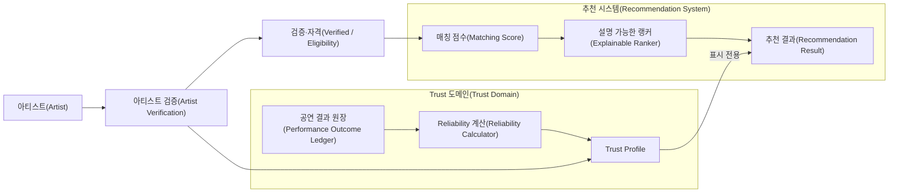
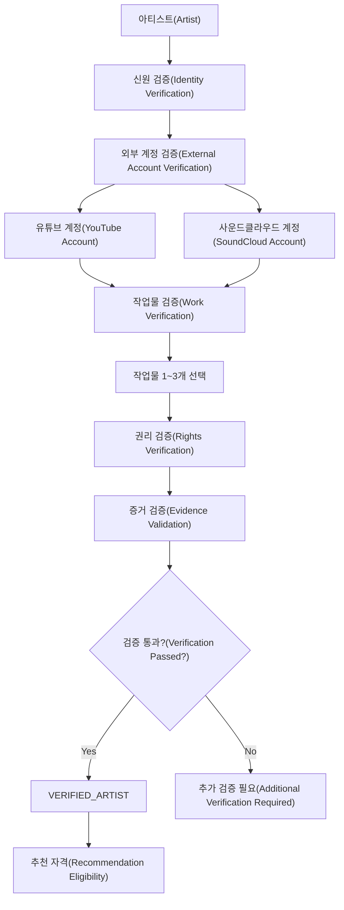
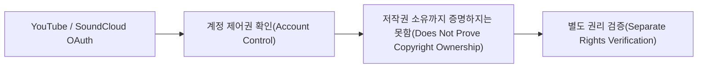
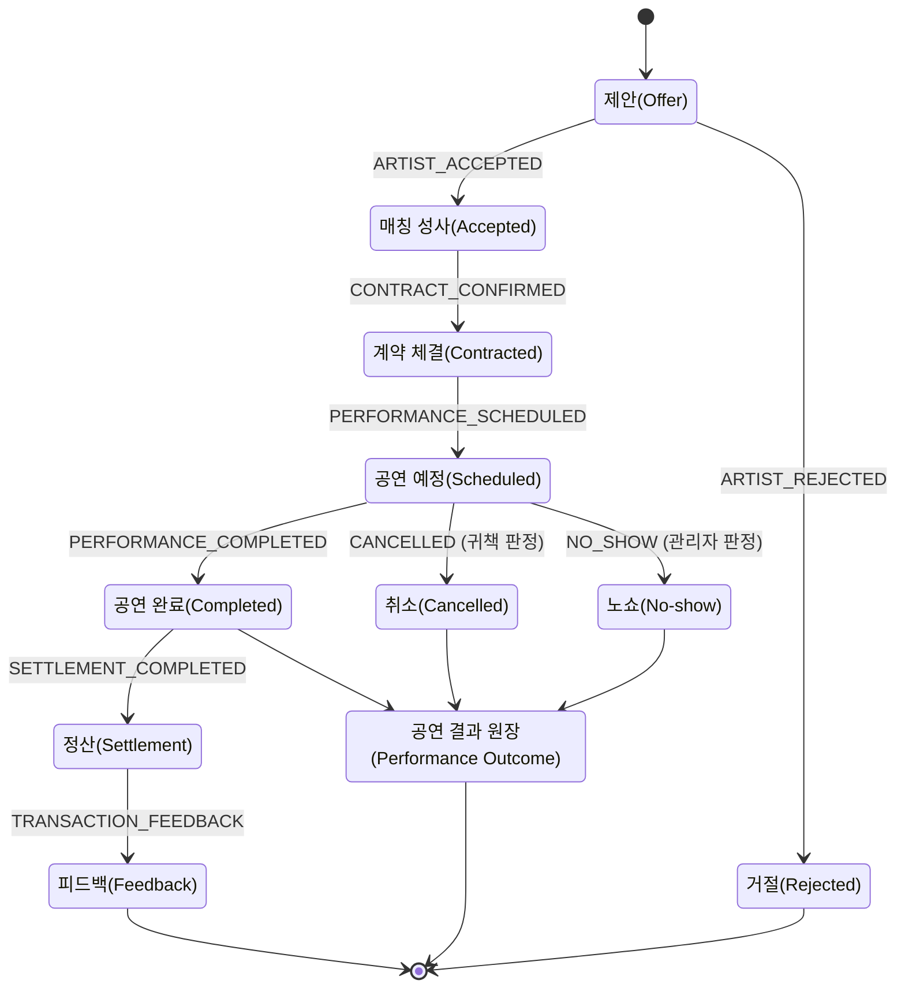
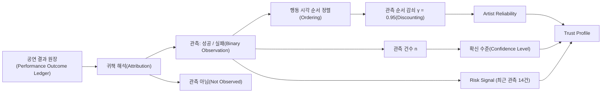
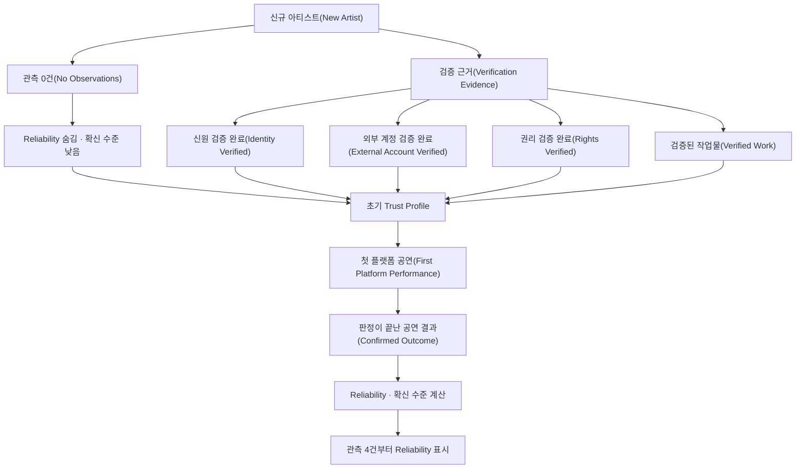
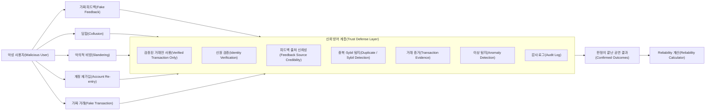
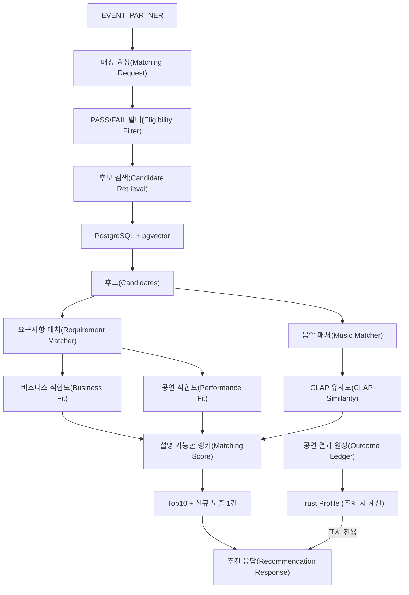
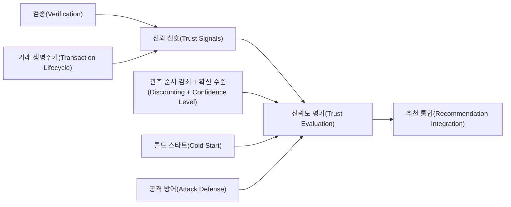

# Artist Trust Architecture

> 2026-10-03 개정: Reliability 계산 모델을 `trust-v1`에서 `reliability-v1`으로 바꿨습니다(이진 관측, 관측 순서 감쇠 γ = 0.95, 관측 건수 기반 확신 수준, 순위 미반영). 폐기된 이전 결정은 [08 문서](./08_deprecated_legacy_decisions.md#trust-v1에서-reliability-v1으로)에 있습니다.

<a id="d38-vocabulary"></a>

# 0. 용어

이 문서 묶음은 Linear SSOT의 용어를 따르며, 정의는 저장소 루트의 [CONTEXT.md](../../../CONTEXT.md)에 있습니다.

| 용어 | 뜻 | 쓰지 않는 표현 |
|---|---|---|
| Trust Profile | Verification, Artist Reliability, Risk Signal, 근거를 묶어 보여 주는 상위 개념 | Trust Score |
| Artist Reliability | 확정된 공연 결과로 추정한 공연 이행 가능성 | Trust Estimate, 신뢰도 점수 |
| EVENT_PARTNER | 행사를 등록하고 아티스트를 섭외하는 사용자 | Organizer, 주최자 |
| 공연 결과 | 공연 1건에 대해 판정으로 확정된 최종 결과와 귀책 | Trust Event |
| 관측 | Reliability 계산에 들어가는 공연 결과(정상 완료, 아티스트 귀책 취소·노쇼) | Evidence |
| 확신 수준 | Reliability를 뒷받침하는 관측이 얼마나 쌓였는지의 등급 | Confidence(%) |

“Trust”는 검증 정보까지 포함하는 상위 개념으로만 씁니다. 그래서 SSOT의 “선택적 Trust Verification”은 Trust Profile에 표시되지만 Artist Reliability에는 더해지지 않습니다.

---

# 1. 문제 정의

EVENT_PARTNER가 온라인에서 처음 보는 아티스트와 계약한다고 생각해 보겠습니다.

음악을 들어 보니 행사와 매우 잘 어울릴 수 있습니다.

하지만 다음 문제는 여전히 남습니다.

```text
음악이 좋다
   ≠
실제 아티스트다
   ≠
작업물 권리를 가지고 있다
   ≠
공연 계약을 잘 지킨다
```

따라서 음악 추천 시스템과 별도로 **거래 신뢰성을 판단할 구조**가 필요합니다.

---

# 2. 시스템이 해결하려는 문제

Artist Trust System이 해결하려는 질문은 크게 세 종류입니다.

### 2.1 실제 아티스트인가?

- 본인 인증이 되었는가?
- 외부 활동 계정을 실제로 소유하고 있는가?
- 본인의 작업물을 제출했는가?
- 해당 작업물의 권리를 증명했는가?

이 영역을 **Verification**이라고 합니다.

---

### 2.2 실제 거래를 믿을 수 있는가?

- 계약 후 공연을 완료했는가?
- 아티스트 귀책으로 자주 취소했는가?
- 공연 당일 나타나지 않은 적이 있는가?
- 분쟁이 반복되는가?

이 영역을 **Transaction Trust**라고 합니다.

---

### 2.3 거래 과정에서 성실한 행동을 보이는가?

- 공연 제안에 응답하는가?
- 연락이 지나치게 늦지 않는가?
- 플랫폼에서 장기간 비활성 상태는 아닌가?

이 영역을 **Behavior Trust**라고 합니다.

---

# 3. 시스템 목표와 비목표

## 목표

Artist Trust System의 목표는 다음과 같습니다.

- 검증 가능한 정보를 기반으로 한다.
- 실제 플랫폼 거래 기록을 중요하게 사용한다.
- 신규 아티스트를 무조건 불신하지 않는다.
- 오래된 기록과 최근 기록을 구분할 수 있어야 한다.
- 데이터가 적을 때 불확실성을 표시할 수 있어야 한다.
- 부정행위와 조작 가능성을 고려한다.
- 추천 결과에서 근거를 설명할 수 있어야 한다.

## 비목표

이 시스템은 다음을 판단하기 위한 시스템이 아닙니다.

- 음악 실력이 뛰어난가?
- 인기 있는 아티스트인가?
- 예술적으로 좋은 음악인가?
- 특정 장르에서 최고인가?

음악 적합성은 **Music Matcher**, 공연 조건은 **Requirement Matcher**의 책임입니다.

---

# 4. 전체 Architecture

**상태: [확정]**



읽는 방법은 간단합니다.

```text
아티스트
  ↓
실제 활동 가능한 사람인지 확인 (Verification, Eligibility)
  ↓
행사 적합도로 순위 결정 (Matching Score)
  ↓
판정이 끝난 공연 결과로 Artist Reliability 계산
  ↓
Trust Profile을 추천 결과 옆에 표시 (순위에는 쓰지 않음)
```

---

# 5. Artist Verification

**상태: [V1 구조 확정 / 외부 인증 공급자는 Adapter 뒤로 분리]**

Verification은 평판을 계산하기 위한 단계가 아닙니다.

목적은 **“이 계정의 주체와 제출한 정보가 검증되었는가?”**를 확인하는 것입니다.



## 5.1 Verification의 계층

```text
Identity Verification
       ↓
External Account Ownership
       ↓
Work Verification
       ↓
Rights Verification
```

### Identity Verification

실제 사람이 존재하며 해당 플랫폼 계정의 주체임을 확인합니다.

### External Account Verification

YouTube, SoundCloud 등의 계정을 실제로 관리하고 있는지 확인합니다.

### Work Verification

검증된 외부 계정 등에 실제 작업물이 존재하는지 확인합니다.

### Rights Verification

작업물을 사용할 권리가 있다는 근거를 확인합니다.

---

## 5.2 OAuth와 저작권 검증은 다르다

**상태: [확정]**



OAuth로 확인할 수 있는 것은 주로:

> “이 사람이 이 외부 계정을 실제로 제어할 수 있는가?”

입니다.

하지만 다음 질문의 답은 아닙니다.

> “이 계정에 올라온 모든 음악의 저작권을 이 사람이 가지고 있는가?”

따라서 **Account Ownership Verification과 Rights Verification은 분리**합니다.

---

# 6. Trust Signal Taxonomy

**상태: [설계 방향]**

신뢰성을 평가하기 위해 사용하는 데이터를 크게 세 종류로 나눕니다.

```mermaid
flowchart TD

    Artist["아티스트(Artist)"]

    Artist --> TrustSignals["신뢰 신호(Trust Signals)"]

    TrustSignals --> Verification["검증 신호(Verification Signals)"]
    TrustSignals --> Transaction["거래 신호(Transaction Signals)"]
    TrustSignals --> Behavior["행동 신호(Behavior Signals)"]

    subgraph VS["검증 신호(Verification Signals)"]
        V1["신원 검증 완료(Identity Verified)"]
        V2["외부 계정 검증 완료(External Account Verified)"]
        V3["작업물 검증 완료(Work Verified)"]
        V4["권리 검증 완료(Rights Verified)"]
        V5["공연 증거(Performance Evidence)"]
    end

    Verification --> V1
    Verification --> V2
    Verification --> V3
    Verification --> V4
    Verification --> V5

    subgraph TS["거래 신호(Transaction Signals)"]
        T1["공연 완료(Performance Completed)"]
        T2["아티스트 취소(Artist Cancellation)"]
        T3["노쇼(No-show)"]
        T4["분쟁(Dispute)"]
        T5["정산 완료(Settlement Completed)"]
        T6["거래 이력(Transaction History)"]
    end

    Transaction --> T1
    Transaction --> T2
    Transaction --> T3
    Transaction --> T4
    Transaction --> T5
    Transaction --> T6

    subgraph BS["행동 신호(Behavior Signals)"]
        B1["응답률(Response Rate)"]
        B2["응답 시간(Response Time)"]
        B3["제안 수락(Offer Acceptance)"]
        B4["계정 활동(Account Activity)"]
    end

    Behavior --> B1
    Behavior --> B2
    Behavior --> B3
    Behavior --> B4
```



---

# 7. 세 가지 Trust 영역

## 7.1 Verification Trust

질문:

> “이 사람이 누구이고, 무엇을 소유하거나 통제하는지 검증할 수 있는가?”

예:

- 본인 인증
- 외부 계정 연결
- 작업물 검증
- 권리 검증

---

## 7.2 Transaction Trust (Artist Reliability)

질문:

> “이 아티스트와 실제 계약했을 때 계약을 안정적으로 완료할 가능성을 판단할 근거가 있는가?”

예:

- 공연 정상 완료
- 아티스트 귀책 취소
- No-show
- 분쟁
- 정산 완료

현재 설계에서 가장 중요한 신뢰 축이며, 판정이 끝난 공연 결과로 Artist Reliability를 계산합니다. 분쟁과 정산은 공연 결과를 확정하는 과정의 정보이며 별도 관측이 아닙니다.

---

## 7.3 Behavior Trust

질문:

> “거래가 완료되기 전 과정에서 지속적으로 성실한 행동을 보이는가?”

예:

- 응답률
- 응답 시간
- 최근 플랫폼 활동
- 제안에 대한 처리 이력

단, 이런 데이터는 **실제 공연 완료 이벤트보다 조작 가능성이 높거나 상황 의존적일 수 있으므로** 향후 계산 시 같은 강도로 다룰 필요는 없습니다.

V1에서는 Behavior Signal을 **Artist Reliability 계산과 추천 순위에 넣지 않고**, 별도 설명용 프로필로만 노출합니다. 데이터가 충분히 축적된 뒤 V2에서 재검토합니다.

---

# 8. 공연 거래 Lifecycle

**상태: [설계 방향]**

신뢰도를 직접 수정하는 대신 **실제로 발생한 사건을 먼저 기록**합니다.

> MVP는 매칭 성사(Offer `ACCEPTED`)까지만 제공합니다(SSOT `BOOKING-061`). 계약 체결 이후 단계와 공연 결과 기록은 Contract 도입 시 활성화합니다.



정산과 피드백은 공연 결과를 추가하지 않습니다. 공연 1건의 공연 결과는 하나입니다.

---

# 9. 왜 Event를 먼저 저장하는가

다음과 같은 방식은 단순하지만 문제가 있습니다.

```text
현재 점수 = 87

공연 완료
→ 현재 점수 = 89
```

몇 달 뒤 89점이 **왜 89점인지 설명하기 어렵습니다.**

반면 사건을 보존하면:

```text
2026-03-11 PERFORMANCE_COMPLETED
2026-04-02 PERFORMANCE_COMPLETED
2026-05-19 ARTIST_CANCELLED
2026-06-20 PERFORMANCE_COMPLETED
```

나중에 계산 방식이 바뀌어도 다시 계산할 수 있습니다.

따라서 개념적으로:

```text
공연 결과(Outcome)
    ↓
Artist Reliability · 확신 수준 · Risk Signal
    ↓
Trust Profile
```

의 방향을 사용합니다.

---

# 10. Artist Reliability 계산

**상태: [V1 확정, `reliability-v1`]**

판정이 끝난 공연 결과를 **이진 관측**으로 해석하고, **관측 순서 기반 감쇠**를 적용한 Beta-Bernoulli 모델로 Artist Reliability를 계산합니다. PeerTrust의 Context 개념은 “어떤 결과를 관측으로 볼 것인가”와 “어떤 순서로 반영할 것인가”에 결합합니다.

> **논문과 프로젝트 수식의 경계**
>
> - 성공·실패 관측으로 Beta 분포를 갱신하고 기댓값을 평판으로 쓰는 구조는 Beta Reputation System의 정의를 따릅니다.
> - 관측 순서 기반 감쇠, `γ = 0.95`, 확신 수준 경계는 논문 개념을 참고해 **프로젝트가 정한 정책값**입니다. 근거는 [09 ADR](./09_reliability_decay_gamma.md)에 있습니다.



## 10.1 공연 결과를 관측으로 해석

| 결과 | 귀책 | 관측 | `x` |
|---|---|---|---:|
| 정상 완료 | - | 예 | 1 |
| 취소 | ARTIST | 예 | 0 |
| 노쇼 | ARTIST | 예 | 0 |
| 취소·노쇼 | EVENT_PARTNER, MUTUAL, FORCE_MAJEURE, PLATFORM, OTHER | 아니오 | - |

통지 시점(7일 이상 전 / 24시간~7일 전 / 24시간 미만)과 노쇼 여부 같은 심각도는 `x`에 넣지 않고 근거 분류와 Risk Signal로 표현합니다. 이유는 [D40](./04_final_policy_decisions.md#d40-binary-outcome)에 있습니다.

---

## 10.2 계산식

```text
α₀ = 1,  β₀ = 1
αₜ = 0.95 × αₜ₋₁ + xₜ
βₜ = 0.95 × βₜ₋₁ + (1 − xₜ)
Rₜ = αₜ / (αₜ + βₜ)
```

- α는 지켜진 약속의 누적 무게, β는 깨진 약속의 누적 무게입니다.
- 관측이 하나 확정될 때마다 기존 무게의 영향력을 95%로 줄이고 새 결과를 1만큼 더합니다.
- Reliability는 전체 무게 중 지켜진 약속의 비율, 즉 관측(성패가 아티스트에게 달려 있었던 결과)에 대해 최근 결과에 더 큰 비중을 둔 이행률 추정치입니다. 아티스트 귀책이 아닌 결과는 분모에서 빠지므로 공연이 실제로 열릴 확률은 아닙니다.

관측 순서는 행동 시각으로 정합니다. 정상 완료와 노쇼는 공연 예정 시작 시각, 아티스트 귀책 취소는 취소 통보 시각을 씁니다([D43](./04_final_policy_decisions.md#d43-outcome-ordering)).

### 예: 관측이 없는 신규 아티스트

`α = β = 1`이므로 Reliability는 0.5입니다.

이 값을 “이 아티스트가 공연을 이행할 확률이 50%다”라고 해석하면 안 됩니다. 관측 근거가 없는 출발점일 뿐입니다. 그래서 확신 수준이 낮은 동안에는 화면에 표시하지 않습니다(11장).

---

## 10.3 Beta Reputation + PeerTrust를 어떻게 융합하는가

두 논문의 역할을 같은 위치에 억지로 섞지 않습니다.

```text
PeerTrust-inspired Context
  └─ 누구의 귀책인가?            → 관측 여부
  └─ 거래가 얼마나 쌓였는가?      → 확신 수준
  └─ 어떤 출처로 확정되었는가?    → 판정이 끝난 결과만 원장에 기록
  └─ 최근 행동인가?              → 관측 순서 감쇠

            ↓

Binary Observations (x = 1 / 0)

            ↓

Beta Reputation
  └─ 관측을 확률 분포로 누적
  └─ Artist Reliability 계산
```

---

# 11. 확신 수준

**상태: [V1 확정]**

다음 두 아티스트는 단순 성공률만 보면 동일합니다.

```text
Artist A
1번 공연 / 1번 성공

Artist B
100번 공연 / 100번 성공
```

하지만 근거의 양은 크게 다릅니다. 따라서 Reliability와 별개로 **확신 수준**을 둡니다(SSOT `TRUST-149`).

## 11.1 관측 건수로 정한다

| 확신 수준 | 관측 건수 n | Reliability 표시 |
|---|---|---|
| 낮음 | n ≤ 3 | 숨김 (“근거 부족 · 관측 n건”) |
| 보통 | 4 ≤ n ≤ 9 | 표시 |
| 높음 | n ≥ 10 | 표시 |

n은 관측(정상 완료, 아티스트 귀책 취소, 노쇼)의 건수이며 감쇠하지 않습니다. 화면에 보이는 “관측 17건”과 등급의 근거가 같아서 그대로 설명할 수 있습니다.

## 11.2 연속 Confidence 공식을 쓰지 않는 이유

이전 설계의 `Confidence = 1 − e^{−0.16094·N_eff}`는 등급 경계(0.40, 0.80)가 결국 `N_eff` 임계값과 같은 뜻이라 지수 함수가 역할을 하지 않았고, “Confidence 80%”라는 표시는 확률로 오해받을 수 있었습니다. 관측 순서 감쇠에서는 감쇠된 근거량이 최대 20에서 멈추기도 합니다.

경계값 3과 10은 이전 등급 경계(`N_eff` 3.17, 10)를 건수로 옮긴 값입니다.

## 11.3 심각도와 근거량은 섞이지 않는다

이전 설계에서는 노쇼 1건이 실패 5건으로 환산되어 근거량을 부풀렸기 때문에 근거량을 따로 세야 했습니다. 이진 관측에서는 결과 1건이 관측 1건이므로 이 문제가 생기지 않습니다. 심각도는 Risk Signal이 담당합니다.

---

# 12. 최근성 감쇠

**상태: [V1 확정]**

과거 행동을 현재 행동과 완전히 똑같이 취급하면 현재 상태를 반영하기 어렵습니다.

반대로 과거 데이터를 삭제하면 과거의 반복적인 문제를 쉽게 세탁할 수 있습니다.

따라서 기록은 보존하되 **계산에 미치는 영향만 점진적으로 줄입니다.**

## 12.1 시간이 아니라 관측 순서로 감쇠한다

새 관측이 하나 생길 때마다 이전 기록의 영향력은 95%만 남습니다.

```text
사건 반감기 = ln(0.5) / ln(0.95) ≈ 13.5건
장기 증거량 = 1 / (1 − 0.95) = 20
```

- 과거 관측 하나의 영향력은 이후 약 14건의 관측이 쌓이면 절반이 됩니다.
- 최근 20건의 관측이 전체 영향력의 약 2/3를 차지하고, 그보다 오래된 관측도 영향력이 0이 되지 않습니다.
- 새 관측이 없으면 값이 변하지 않습니다. 시간만 지나서는 회복되지 않고, 과거 실패는 이후의 이행으로만 희석됩니다.
- 공연 빈도가 값에 영향을 주지 않습니다. 같은 무결점 20회 이력이 시간 감쇠(반감기 365일)에서는 연 1회 공연자 0.750, 연 10회 공연자 0.924였지만, 관측 순서 감쇠에서는 둘 다 0.974입니다.
- 최근 활동 여부는 Activity Freshness로 따로 표시합니다([D44](./04_final_policy_decisions.md#d44-activity-freshness)).

γ 후보 비교와 선택 근거는 [09 ADR](./09_reliability_decay_gamma.md)에 있습니다.

---

## 12.2 논문과의 관계

Beta Reputation System은 오래된 피드백의 영향력을 낮추기 위한 **forgetting factor**를 설명하고, PeerTrust 역시 최근 행동과 과거 행동을 다르게 다루는 **temporal adaptivity**를 논의합니다.

현재 프로젝트는 이 개념을 “관측이 확정될 때마다 누적값에 γ를 곱한다”는 형태로 구체화했습니다. 실제 서비스 사례로 Storj의 Beta 평판 모델도 감사(audit) 1건마다 forgetting factor를 적용합니다.

---

# 13. Cold Start 문제

**상태: [V1 확정]**

신규 아티스트는 아직 플랫폼 거래 기록이 없습니다.

이때:

```text
거래 이력 없음
→ 신뢰할 수 없음
```

이라고 판단하면 **정보가 없는 상태와 위험한 상태를 혼동**하게 됩니다.

현재 설계에서는 신규 아티스트의 관측이 없을 때:

```text
n = 0
확신 수준 = 낮음
Artist Reliability = 표시하지 않음 (내부 값 0.5)
```

로 표현합니다.

따라서:

```text
낮은 Reliability
        ≠
근거 부족
```

을 데이터 구조와 화면 모두에서 분리할 수 있습니다.

---

## 13.1 Cold Start Architecture



---

## 13.2 중요한 원칙

신규 아티스트에게 단순히 다음처럼 표시하지 않습니다.

```text
Reliability = 50%
```

대신:

```text
Artist Reliability    근거 부족 (관측 0건)
Identity              VERIFIED
Rights                VERIFIED
```

처럼 **근거 상태와 지금 확인할 수 있는 검증 정보를 함께 표시**합니다.

---

## 13.3 신규 노출 슬롯

Reliability가 순위에 들어가지 않으므로 이력이 없다는 이유로 순위가 내려가지는 않습니다. 신규 노출 슬롯은 신뢰 보정이 아니라 첫 매칭 기회를 주기 위한 노출 정책입니다.

- 신규 아티스트: 매칭 성사 0건이고 Artist 활성화 후 90일 이내
- 곡 Top10 아래 별도 1칸에 신규 아티스트의 곡 1개
- Top10에 신규 아티스트의 곡이 없고, PASS/FAIL Filter를 통과한 신규 아티스트 곡의 최고 종합 적합도가 10위 곡 대비 10점 이내일 때만 표시
- 상세: [D21](./04_final_policy_decisions.md#d21-exploration)

---

# 14. Reputation Attack & Defense

**상태: [V1 방어 규칙 확정 / ML·EigenTrust는 V2 보류]**

평판 시스템은 점수를 만들기 시작하는 순간 **점수를 올리기 위한 조작**도 발생할 수 있습니다.

대표적인 공격은 다음과 같습니다.

- 가짜 거래 생성
- 서로 좋은 평가를 주는 담합
- 경쟁자를 악의적으로 낮게 평가
- 평판이 나빠지면 새 계정 생성
- 여러 계정을 이용한 Sybil 공격

---

## 14.1 방어 구조



---

# 15. Platform-observed Event와 사용자 의견

현재 프로젝트의 신뢰성 시스템은 **단순 별점 기반 시스템을 목표로 하지 않습니다.**

따라서 다음을 구분합니다.

### 사용자가 작성한 의견

```text
"좋은 아티스트였어요"
별점 5점
```

### 플랫폼이 직접 확인할 수 있는 사실

```text
계약 체결
공연 예정일 도달
공연 완료 확인
정산 완료
No-show 신고 및 검증
```

설계 방향은 **플랫폼이 검증한 거래 사실을 더 강한 근거로 사용**하고, 후기와 별점은 필요하다면 보조 정보로 사용하는 것입니다.

V1에서는 리뷰와 별점을 **Artist Reliability 계산에서 제외**합니다. 리뷰는 거래를 완료한 사용자만 작성할 수 있으며, UI의 정성적 보조 정보로만 제공합니다. 이렇게 하면 보복성 별점과 담합이 핵심 수식을 직접 움직이는 것을 막을 수 있습니다.

---

# 16. 기존 추천 시스템과 통합

**상태: [확정]**

현재 추천 시스템은 다음 흐름을 가집니다. 순위는 Matching Score만으로 정하고, Trust Profile은 추천 결과에 표시만 합니다([D39](./04_final_policy_decisions.md#d39-display-only)).



---

# 17. Trust를 독립 평가 축으로 유지하는 이유

한 개의 숫자로 모든 것을 섞는다고 생각해 보겠습니다.

```text
Final Score
= 음악 40%
+ 공연 조건 30%
+ 신뢰도 30%
```

계산은 쉽지만 다음 문제가 생깁니다.

> 왜 1위인지 설명하기 어렵다.

또한 서로 다른 성격의 값을 한 숫자로 섞게 됩니다.

예를 들어:

- BPM 적합성
- 예산 적합성
- No-show 이력

은 의미가 완전히 다릅니다.

따라서 시스템에서는 각 평가 결과를 먼저 독립적으로 유지합니다.

```text
Artist A

Music Fit
 └─ CLAP Similarity

Business Fit
 ├─ Budget
 ├─ Location
 └─ Event Requirements

Performance Fit
 └─ Performance Conditions

Trust Profile
 ├─ Verification
 ├─ Artist Reliability
 ├─ 확신 수준
 ├─ Risk Signal
 └─ Activity Freshness
```

Explainable Ranker는 Music Fit, Business Fit, Performance Fit으로 순위를 정하고, Trust Profile은 순위에 섞지 않고 별도 필드로 함께 보여 줍니다.

---

# 18. 사용자에게 보여 줄 Trust Profile 예시

아직 최종 UI는 아니지만 개념적으로 다음 형태가 적절합니다.

```text
Trust Profile

신원 확인
  본인 인증                         완료

권리 확인
  외부 계정                        연결됨
  작업물 확인                      완료
  권리 확인                        완료

공연 이행 (Artist Reliability)
  아티스트 귀책 기준 이행률        91%
  확신 수준                        높음 (관측 17건)
  정상 완료                        16회
  아티스트 귀책 취소               1회 (3일 전 통보)
  노쇼                              0회
  계산 제외                        1건 (EVENT_PARTNER 귀책 취소)

위험 신호
  없음

최근 활동 (Activity Freshness)
  마지막 공연                      2026-08
  최근 12개월 공연                  8회
```

예시의 91%는 정상 완료 9회, 아티스트 귀책 취소 1회, 정상 완료 7회 순서로 계산한 값(0.911)입니다.

중요한 점은 **점수만 보여주지 않고 원인도 함께 보여주는 것**입니다.

---

# 19. 전체 개념 관계



---

# 20. 현재 시스템의 핵심 불변 원칙

앞으로 계산식이나 DB가 바뀌어도 가능하면 유지해야 하는 원칙입니다.

### 원칙 1. 인증과 평판을 분리한다.

```text
Verification != Reputation
```

### 원칙 2. 모르는 것과 위험한 것을 구분한다.

```text
Unknown != Bad
```

### 원칙 3. 원본 사건을 결과 점수보다 먼저 보존한다.

```text
Outcome -> Reliability -> Profile
```

### 원칙 4. 음악 적합성과 거래 신뢰성을 섞지 않는다.

```text
Music Fit != Trust
```

### 원칙 5. 신뢰 결과에는 근거가 있어야 한다.

```text
Trust Result -> Explanation
```

### 원칙 6. 현재 행동이 과거 행동보다 더 중요할 수 있지만 과거를 무조건 삭제하지 않는다.

```text
Historical Evidence -> Decay, not Delete
```

### 원칙 7. 사용자 평가만을 신뢰의 유일한 근거로 사용하지 않는다.

```text
Platform Evidence + Transaction History
```

### 원칙 8. 공연 빈도는 신뢰성에 유리하게도 불리하게도 작용하지 않는다.

```text
Same Outcome Order -> Same Reliability
```

### 원칙 9. 시간이 지나기만 해서는 신뢰가 회복되지 않는다.

```text
Recovery <- New Fulfillment, not Waiting
```

---

# 21. V1 최종 정책 요약

현재 구현에 필요한 핵심 정책은 V1 기준으로 확정했습니다.

```text
Reliability Model
  사건 순서 기반 Discounted Beta-Bernoulli
  α₀ = β₀ = 1, γ = 0.95

관측
  정상 완료 = 성공 1건
  아티스트 귀책 취소 = 실패 1건
  아티스트 귀책 노쇼 = 실패 1건

관측 아님
  EVENT_PARTNER / MUTUAL / FORCE_MAJEURE / PLATFORM / OTHER 귀책

관측 순서
  행동 시각 (완료·노쇼 = 공연 예정 시작, 취소 = 통보 시각)

확신 수준
  관측 건수 n: 낮음 ≤ 3 (점수 숨김) / 보통 4~9 / 높음 ≥ 10

Risk Signal (최근 관측 14건)
  RECENT_NO_SHOW
  LATE_ARTIST_CANCELLATION
  REPEATED_ARTIST_CANCELLATION

Activity Freshness
  마지막 공연 시점, 최근 12개월 공연 횟수 (Risk Signal 아님)

추천 순위
  Matching Score만 사용, Trust Profile은 표시 전용

신규 노출
  Top10 아래 별도 1칸
  신규 = 매칭 성사 0건 + 활성화 90일 이내, 10위 대비 10점 이내

Review / Behavior
  Reliability 계산과 순위에서 제외, 설명용

Hard Filter
  Reliability만으로 제거하지 않음
  Eligibility는 SSOT AI-MATCH-051을 따름 (04 §18)
  (계정/인증 상태 / 일정 / 활동 정지 / 저작권 / 지역 이동 / 예산)

판정
  판정이 끝난 공연 결과만 원장에 기록

Policy Version
  reliability-v1
```

이 값들은 **V1 구현을 위한 정책 결정**이며 학술적으로 최적이라고 주장하지 않습니다. 시뮬레이션과 운영 데이터로 재검증하고, 값이 변경되면 `reliability-v2`처럼 새 정책 버전으로 재계산합니다.
