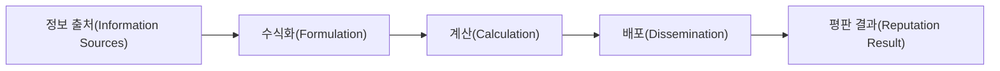
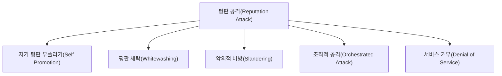
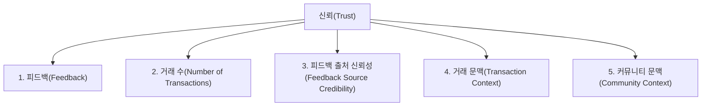
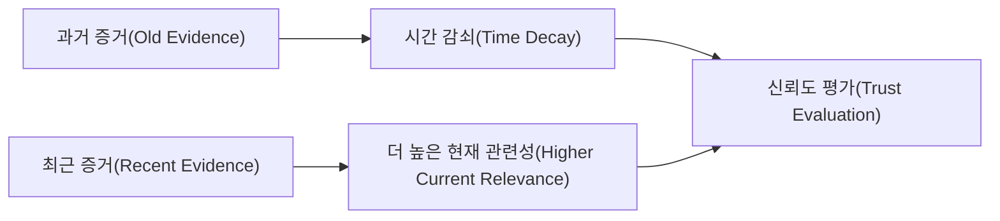
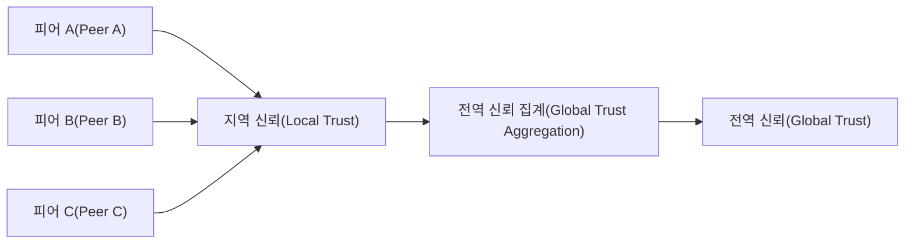
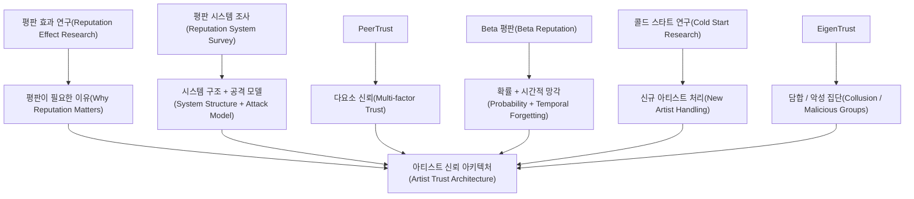

# 논문 근거와 현재 아키텍처의 연결

이 문서는 업로드된 논문을 단순 요약하는 것이 목적이 아닙니다.

목적은:

> **각 논문이 우리 Artist Trust Architecture의 어떤 문제를 설명하고, 어떤 설계 아이디어를 제공하는가?**

를 연결해서 이해하는 것입니다.

주의할 점은 논문의 알고리즘을 우리 서비스에 그대로 복사하지 않는다는 것입니다.

논문에서 검증된 개념을 참고하되 서비스의 도메인, 데이터 구조, 중앙화된 백엔드 구조에 맞게 재설계합니다.

---

# 1. Reputation effects in peer-to-peer online markets: A meta-analysis

## 논문이 다루는 문제

온라인 시장에서는 거래 상대를 직접 알기 어렵습니다.

그래서 과거 평판 정보가 거래 상대의:

- 신뢰성
- 역량

을 판단하는 신호로 사용됩니다.

이 논문은 다수 연구를 종합해 온라인 시장에서 평판과 거래 성과의 관계를 분석합니다.

---

## 우리 서비스와의 연결

EVENT_PARTNER도 비슷한 불확실성을 가집니다.

```text
EVENT_PARTNER
  ↓
처음 보는 아티스트
  ↓
실제 공연을 잘 이행할지 알 수 없음
```

따라서 아티스트의 과거 플랫폼 거래 이력이 향후 거래 판단의 **Signal** 역할을 할 수 있습니다.

---

## 이 논문이 우리에게 말해 주지 않는 것

이 논문만으로 다음을 결정할 수는 없습니다.

- No-show를 몇 점 감점해야 하는가?
- 취소를 몇 % 반영해야 하는가?
- 우리 서비스의 최적 가중치가 얼마인가?

즉, **평판이 중요한 이유에 대한 연구 근거**이지 우리 계산식을 직접 제공하는 논문은 아닙니다.

---

# 2. A Survey of Attack and Defense Techniques for Reputation Systems

## 핵심 개념

이 논문은 Reputation System을 크게 다음 세 부분으로 나누어 분석합니다.



### Formulation

어떤 데이터를 받아 어떤 의미의 평판을 만들 것인가?

### Calculation

실제 시스템에서 그 공식을 어떻게 계산할 것인가?

### Dissemination

계산된 Reputation을 어떻게 저장하고 사용자/시스템에 제공할 것인가?

---

## 우리 서비스에 적용

### Formulation

```text
Verification Event
Performance Event
Cancellation
No-show
Dispute
Response Behavior
```

등을 어떤 방식으로 Trust Metric으로 바꿀지 결정합니다.

### Calculation

Spring Boot 애플리케이션에서 Trust Evaluator가 계산하게 됩니다.

### Dissemination

계산 결과를:

- Artist Trust Profile
- Explainable Ranker
- API Response

등에서 사용하게 됩니다.

---

## 공격 모델과 연결

논문에서 다루는 주요 유형은 다음과 같습니다.



우리 서비스로 번역하면:

| 연구 개념 | 우리 서비스 예시 |
|---|---|
| Self Promotion | 가짜 거래로 자신의 평판 상승 |
| Whitewashing | 나쁜 평판 후 새 계정 재가입 |
| Slandering | 경쟁 아티스트에게 악의적 평가 |
| Collusion | 여러 계정이 서로 평가 |
| Sybil | 한 사람이 여러 계정을 생성 |

따라서 Trust System은 계산 공식만 만드는 것으로 끝나면 안 됩니다.

**입력 정보가 조작되지 않았는지**도 반드시 고려해야 합니다.

---

# 3. PeerTrust

논문:

> A Reputation-Based Trust Model for Peer-to-Peer eCommerce Communities

---

## 핵심 아이디어

PeerTrust는 단순 피드백 합계만으로는 Trust를 충분히 계산하기 어렵다고 봅니다.

중요한 요소로 다음 다섯 가지를 제시합니다.



---

## 3.1 Feedback

거래 상대가 얼마나 만족했는가?

하지만 이것만 보면 부족합니다.

---

## 3.2 Number of Transactions

다음 두 사람을 생각합니다.

```text
A: 1번 거래 / 1번 성공
B: 100번 거래 / 99번 성공
```

단순 성공률만으로는 데이터의 규모를 충분히 표현하지 못할 수 있습니다.

우리 구조의:

```text
Evidence Count
Confidence
```

개념과 연결됩니다.

---

## 3.3 Feedback Source Credibility

모든 평가자의 말이 동일하게 신뢰할 만한 것은 아닙니다.

악의적인 평가나 담합이 가능하기 때문입니다.

우리 시스템에서는 이 아이디어를:

```text
사용자 리뷰를 그대로 핵심 점수로 사용하지 않음
+
플랫폼 검증 Event 우선
```

이라는 방향으로 반영하고 있습니다.

---

## 3.4 Transaction Context

모든 거래가 같지 않을 수 있습니다.

예를 들어:

- 작은 행사
- 대규모 공연
- 장거리 이동 공연
- 긴 준비 기간이 필요한 공연

은 거래 위험이나 중요도가 다를 수 있습니다.

V1에서는 Context 중 **취소 통보 시점, 확정된 Outcome, 시간 경과**만 수치 계산에 사용하고, 거래 금액·사용자 평가자 신뢰도 같은 추가 Context Weight는 V2로 보류합니다.

---

## 3.5 Community Context / Temporal Adaptivity

PeerTrust는 현재 행동을 반영하기 위해 과거 이력과 최근 이력을 다르게 볼 수 있는 구조를 설명합니다.

우리 시스템의:

```text
Temporal Processing
```

과 연결됩니다.

---

# 4. The Beta Reputation System

## 핵심 아이디어

Beta Reputation은 과거 긍정/부정 관측을 바탕으로 미래의 성공 가능성을 확률적으로 표현할 수 있는 모델입니다.

개념적으로:

```text
Positive Evidence
Negative Evidence
        ↓
Beta Distribution
        ↓
Expected Reputation
```

입니다.

---

## 우리 시스템과 잘 맞는 부분

공연 거래에는 성공/실패로 해석 가능한 일부 Event가 있습니다.

예:

```text
PERFORMANCE_COMPLETED
ARTIST_NO_SHOW
```

또한 Bayesian 방식은 데이터가 적은 신규 사용자의 불확실성을 다루는 데 참고하기 좋습니다.

---

## 그대로 적용하기 어려운 부분

우리 Event는 단순히 Positive / Negative 두 종류가 아닙니다.

예:

```text
정상 공연 완료
아티스트 취소
No-show
분쟁
정산 문제
```

No-show와 단순 취소를 동일한 `negative 1건`으로 보면 정보가 손실될 수 있습니다.

이 검토 이후 V1은 **Beta Reputation을 핵심 추정 모델로 채택**했습니다. 결과는 이진 관측(정상 완료 = 성공, 아티스트 귀책 취소·노쇼 = 실패)으로 해석하고, 사건의 종류가 주는 정보(취소 통보 시점, 노쇼 여부)는 Risk Signal과 근거 분류로 보존합니다.

이전 `trust-v1`은 Severity를 실패 건수로 환산(노쇼 = 실패 5건)했지만, 그렇게 하면 값이 어떤 사건의 확률도 아니게 되어 폐기했습니다([D40](./04_final_policy_decisions.md#d40-binary-outcome)).

---

# 5. Beta Reputation의 Forgetting

논문에서는 행동이 시간에 따라 변할 수 있기 때문에 오래된 Feedback에 더 적은 영향을 주는 **forgetting factor**를 설명합니다.

우리 시스템에서는 다음 문제와 연결됩니다.

```text
5년 전 No-show
vs
지난달 No-show
```

같은 영향으로 볼 것인가?

---

## 우리 설계 방향



단, 과거를 완전히 삭제하는 것이 아니라 **영향을 줄이는 방식**을 사용합니다.

V1은 달력 시간이 아니라 **관측이 확정될 때마다** 기존 누적값에 `γ = 0.95`를 곱하는 방식으로 forgetting을 구체화했습니다. 시간 기준으로 감쇠하면 공연 빈도가 낮은 아티스트가 구조적으로 불리해지고, 시간만 지나도 실패 이력이 희석되기 때문입니다. 실제 서비스 사례로 Storj의 Beta 평판 모델도 감사(audit) 1건마다 forgetting factor를 적용합니다. 근거는 [09 ADR](./09_reliability_decay_gamma.md)에 있습니다.

---

# 6. Monitoring and the Cold Start Problem in Digital Platforms

## 핵심 문제

Reputation System은 과거 기록이 많은 사용자에게 유리합니다.

신규 사용자는 잘못한 것이 없더라도:

```text
평판 없음
→ 고용자가 불확실하게 느낌
→ 선택되지 않음
→ 거래 기회 없음
→ 평판을 쌓지 못함
```

이라는 문제가 생깁니다.

이것이 **Cold Start Problem**입니다.

---

## 연구에서의 Monitoring

해당 연구에서는 현재 프로젝트의 행동을 직접 관측하는 Monitoring이 신규 작업자의 위험에 대한 불확실성을 줄이고 진입 장벽을 낮출 수 있음을 분석합니다.

---

## 우리 서비스에 그대로 적용하면 안 되는 부분

논문에서 말하는 Monitoring에는 온라인 노동 플랫폼의 작업 시간, 활동 추적 등이 포함됩니다.

우리 서비스에서 아티스트를:

- 화면 캡처
- 키 입력 추적
- 실시간 행동 감시

하는 방식으로 적용하자는 의미가 아닙니다.

---

## 우리 서비스에 적용하는 핵심 원리

논문의 중요한 아이디어는:

> 과거 reputation이 부족하다면 현재 확인 가능한 다른 근거가 필요하다.

입니다.

따라서 신규 아티스트는:

```text
Platform Transaction History = 없음
```

이라고 해서 바로 낮은 Trust로 판단하지 않고:

```text
Identity Verification
External Account Verification
Work Verification
Rights Verification
```

같은 **현재 확인 가능한 Evidence**를 보여 줍니다.

그리고 첫 공연부터 실제 거래 Event가 쌓이기 시작합니다.

---

# 7. EigenTrust

## 핵심 아이디어

EigenTrust는 P2P 네트워크에서 참여자 간의 Local Trust를 바탕으로 Global Trust를 계산합니다.

또한 악성 peer들이 서로 높은 평가를 주는 **Malicious Collective** 문제를 다룹니다.



---

## 우리 시스템에 도움이 되는 부분

EigenTrust에서 참고할 수 있는 것은 특히:

- 담합을 고려해야 한다는 점
- 평가 주체 자체의 신뢰도 문제
- 악성 집단이 서로를 밀어주는 문제
- Reputation 계산 자체도 공격 대상이 된다는 점

입니다.

---

## 직접 적용하지 않는 이유

EigenTrust의 핵심 배경은 **분산된 P2P 네트워크**입니다.

현재 졸업작품은:

```text
Spring Boot
PostgreSQL
중앙 플랫폼
```

구조이므로 동일한 계산 구조를 그대로 사용할 필요는 없습니다.

따라서 현재는:

> EigenTrust의 공격 모델과 설계 아이디어는 참고하지만 알고리즘 자체를 핵심 Trust Engine으로 사용하지 않는다.

는 방향입니다.

---

# 8. 논문과 우리 아키텍처 Mapping

| 우리 아키텍처 문제 | 관련 연구 아이디어 |
|---|---|
| 왜 Reputation이 필요한가 | Reputation Effect Meta-analysis |
| 전체 Reputation System을 어떻게 분해할까 | Reputation System Survey |
| 별점 하나만 보면 왜 부족한가 | PeerTrust |
| 거래 수와 평가자 신뢰도를 왜 봐야 하는가 | PeerTrust |
| 시간에 따라 행동 변화를 어떻게 반영할까 | PeerTrust Temporal Adaptivity, Beta Forgetting |
| 성공/실패를 확률적으로 어떻게 볼까 | Beta Reputation |
| 신규 사용자를 어떻게 다룰까 | Monitoring & Cold Start |
| 담합/악성 집단은 어떻게 볼까 | EigenTrust, Reputation Attack Survey |
| Reputation 자체가 공격받을 수 있는가 | Reputation Attack Survey |

---

# 9. 연구에서 현재 구조로 연결되는 전체 그림



---

# 10. 논문을 사용할 때 주의할 점

## “논문에 있으니까 그대로 적용”은 위험하다

각 논문의 연구 환경이 다릅니다.

| 논문 | 주요 환경 |
|---|---|
| EigenTrust | P2P 파일 공유 |
| PeerTrust | P2P eCommerce |
| Beta Reputation | eCommerce Reputation |
| Cold Start | Online Labor Platform |
| Meta-analysis | 다양한 온라인 시장 |

우리 서비스는:

```text
아티스트 ↔ EVENT_PARTNER
공연 거래 플랫폼
추천 시스템
```

입니다.

따라서 논문은 **설계 근거와 아이디어**로 사용하고 실제 도메인 규칙은 별도로 검증해야 합니다.

---

# 11. 현재 논문들이 충분히 뒷받침하는 것

현재 자료는 다음 설계를 설명하는 데 충분한 근거를 제공합니다.

- 과거 행동 정보가 거래 판단에 중요하다는 점
- 단순 피드백 합계만으로 Trust를 표현하기 어렵다는 점
- 거래 수와 평가자 신뢰성 같은 Context가 중요하다는 점
- Reputation System 자체가 조작 공격을 받을 수 있다는 점
- 시간에 따른 행동 변화를 고려할 필요가 있다는 점
- 신규 참여자에게 Cold Start 문제가 발생할 수 있다는 점
- Positive / Negative Evidence를 확률 모델로 처리할 수 있다는 점

---

# 12. 현재 논문들만으로 확정할 수 없는 것

다음은 별도의 설계와 실험이 필요합니다.

- 우리 서비스에서 최적의 가중치
- 취소와 No-show의 상대적 심각도를 경고에 반영하는 기준
- 몇 건의 관측이 있어야 확신 수준이 높음인지
- 감쇠 계수 γ의 최적값
- Cold Start에서 사용할 prior의 **최적성** (현재 프로젝트는 `α₀ = β₀ = 1`을 채택했지만 이것이 도메인 최적값인지는 미검증)
- 아티스트 공연 도메인에 특화된 Fraud Rule
- 최종 추천 랭킹의 최적 조합

이 값들의 **도메인 최적성**은 실제 데이터가 없으므로 보장할 수 없습니다. V1에서는 구현과 시뮬레이션을 시작하기 위한 기본값을 확정하고 `reliability-v1`으로 버전 관리하며, 이후 민감도 분석으로 재검토합니다.

---

# 13. 참고 문헌

프로젝트에 제공된 PDF를 기준으로 정리했습니다.

1. Jiao, R., Przepiorka, W., & Buskens, V. — *Reputation effects in peer-to-peer online markets: A meta-analysis*
2. Liang, C., Hong, Y., & Gu, B. — *Monitoring and the Cold Start Problem in Digital Platforms: Theory and Evidence from Online Labor Markets*
3. Kamvar, S. D., Schlosser, M. T., & Garcia-Molina, H. — *The EigenTrust Algorithm for Reputation Management in P2P Networks*
4. Hoffman, K., Zage, D., & Nita-Rotaru, C. — *A Survey of Attack and Defense Techniques for Reputation Systems*
5. Jøsang, A., & Ismail, R. — *The Beta Reputation System*
6. Xiong, L., & Liu, L. — *A Reputation-Based Trust Model for Peer-to-Peer eCommerce Communities*

---

# 14. 수식 출처 정확성 검토

현재 프로젝트에서 사용하는 수식은 **논문에서 직접 가져온 부분**과 **논문 개념을 바탕으로 프로젝트에서 정의한 부분**을 구분해야 합니다.

## 논문에서 직접 근거를 얻는 부분

### Beta 기댓값

성공·실패 관측의 누적값을 `α`, `β`로 둘 때:

$$
R = \frac{\alpha}{\alpha + \beta}
$$

는 `Beta(α, β)`의 기대값입니다. 관측 전 `α₀ = β₀ = 1`이면 관측이 없을 때 0.5에서 출발합니다.

## 논문 아이디어를 프로젝트 수식으로 구체화한 부분

### 관측 순서 기반 감쇠

$$
\alpha_t = \gamma\,\alpha_{t-1} + x_t,\qquad \beta_t = \gamma\,\beta_{t-1} + (1 - x_t),\qquad \gamma = 0.95
$$

관측이 확정될 때마다 기존 누적값의 영향력을 γ만큼 남기고 새 결과를 더합니다. Beta Reputation 논문은 **forgetting factor**, PeerTrust는 **temporal adaptivity**를 논의하지만, `γ = 0.95`와 관측 순서 기준은 프로젝트가 정한 정책입니다.

### 확신 수준

관측 건수 n의 경계(3, 10)로 낮음/보통/높음을 정합니다. PeerTrust는 거래 수를 신뢰 판단에 고려해야 한다고 설명하지만, 이 경계값을 해당 논문이 직접 제시하는 것은 아닙니다.

따라서 감쇠식과 확신 수준 경계는 **논문 개념을 기반으로 프로젝트가 선택한 구현 규칙**으로 문서화합니다.

이 구분을 유지해야 발표나 보고서에서 “논문에 있는 수식”과 “논문을 근거로 우리가 설계한 수식”을 혼동하지 않습니다.

---

# 15. 연구 근거와 V1 정책값의 경계

다음은 **연구에서 직접 지지하는 설계 아이디어**입니다.

- Positive / Negative Evidence를 누적해 Beta 분포로 평판을 표현할 수 있음
- 오래된 Feedback의 영향력을 줄이는 Forgetting 개념
- 단순 Feedback 외에 거래 수, 정보 출처 신뢰성, Transaction Context가 중요할 수 있음
- Cold Start가 신규 참여자의 진입 장벽을 만들 수 있음
- Reputation System 자체가 담합·평판 세탁·악의적 비방 등의 공격 대상이 될 수 있음

반면 다음 값들은 논문이 “우리 공연 플랫폼에 최적”이라고 제시한 숫자가 아닙니다.

```text
γ = 0.95 (사건 반감기 약 14건)
α₀ = β₀ = 1
확신 수준 경계 = 관측 3건 / 10건
Risk Signal 창 = 최근 관측 14건
No-show report grace = 15 minutes
Artist response window = 48 hours
신규 노출 = TOP 5 아래 1칸, 신규 기간 90일, 5위 대비 10점
```

이 값들은 **연구 개념을 실제 졸업작품 도메인에 적용하기 위해 선택한 V1 정책값**입니다.

따라서 발표나 보고서에서는:

> “논문에서 이 숫자를 제안했다.”

라고 설명하면 안 됩니다.

대신:

> “논문에서 제시한 원리와 문제를 바탕으로, 설명 가능성과 구현 복잡도의 Trade-off를 고려해 V1 정책값을 정했고 이후 시뮬레이션으로 검증한다.”

라고 설명하는 것이 정확합니다.
