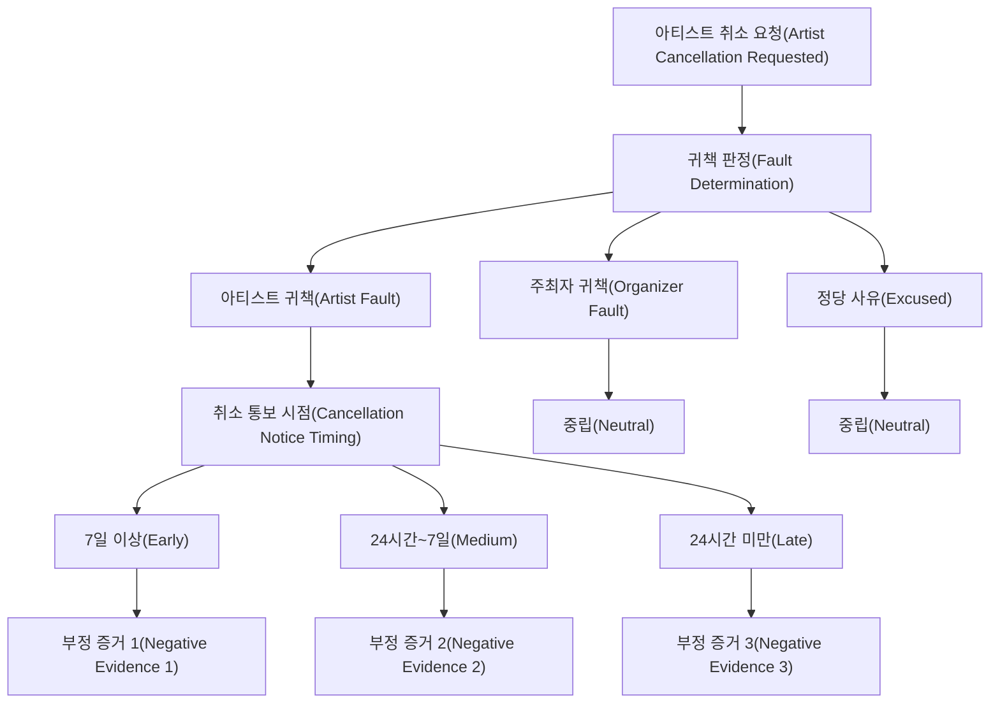
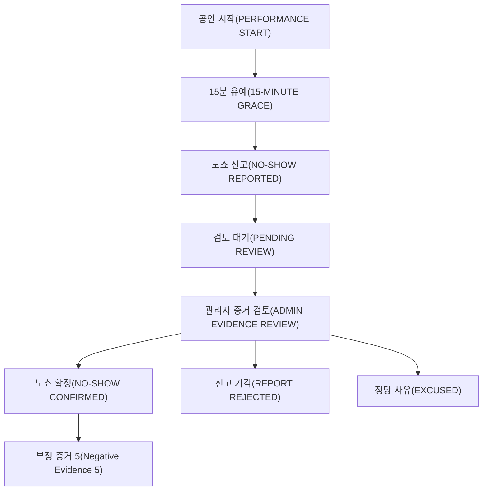

# V1 최종 정책 결정서

이 문서는 더 이상 “무엇을 정해야 하는가?”를 나열하는 문서가 아닙니다.

**구현을 시작하기 위한 V1 기본 정책을 실제로 선택하고, 선택하지 않은 대안과 Trade-off를 기록**합니다.

> 중요: 아래 숫자들은 서비스 정책값입니다. 논문이 공연 플랫폼의 최적값으로 보장한 값이 아닙니다. 원본 Event를 보존하고 `trust-v1` 정책 버전으로 관리하여 이후 재계산 가능하게 설계합니다.

---

# 1. 최종 결정 한눈에 보기

| 항목 | V1 결정 |
|---|---|
| Trust Model | Beta Reputation + PeerTrust-inspired Context |
| 정상 공연 | `R += 1.0` |
| 아티스트 취소 | 7일 이상 `S += 1`, 24h~7일 `S += 2`, 24h 미만 `S += 3` |
| No-show | 확정 시 `S += 5` |
| Organizer 취소 | Artist Trust Neutral |
| Excused Cancellation | Artist Trust Neutral |
| No-show 신고 가능 | `performanceStartAt + 15분` |
| No-show 최종 확정 | V1 관리자 확인 |
| 아티스트 소명 기간 | 48시간 |
| GPS 필수 | 사용하지 않음 |
| Check-in | 강한 보조 Evidence, 절대 판정 기준 아님 |
| 시간 감쇠 | Exponential Decay |
| 반감기 | 365일 |
| Confidence | `1 - exp(-0.16094 × N_eff)` |
| Confidence 등급 | LIMITED < 0.40, MODERATE < 0.80, HIGH >= 0.80 |
| HIGH 목표 | `N_eff = 10`에서 0.80 |
| Review | Trust 계산 제외, UI 보조 |
| Behavior | V1 점수/랭킹 제외, 설명용 |
| Cold Start | Neutral Prior 0.5 + 최대 1개 Exploration Slot |
| Hard Filter | Trust 점수로 제거하지 않음 |
| Dispute | PENDING 동안 Trust 미반영, 관리자 최종 판정 |
| Fraud V1 | 검증된 계약·단일 Outcome·Idempotency·Audit Log·관리자 판정 |
| ML/EigenTrust/LTR | V2 |

---

<a id="d13-performance-completed"></a>

# 2. PERFORMANCE_COMPLETED

## 선택지 A. 주최자 확인만으로 완료

**장점:** 구현이 단순합니다.

**단점:** 주최자가 응답하지 않거나 악의적으로 완료 확인을 거부할 수 있습니다.

## 선택지 B. 다중 확인 경로

다음 중 하나로 최종 완료를 확정합니다.

1. 주최자가 직접 완료 확인
2. 양측의 완료 상태가 일치
3. 주최자가 응답하지 않았지만 체크인·플랫폼 기록 등 충분한 근거가 있고 이의가 없는 경우 관리자/자동 정책으로 확정
4. 분쟁 시 관리자 확인

**추천 및 적용: B**

V1에서 `PERFORMANCE_COMPLETED`가 CONFIRMED되면:

```text
r_i = 1.0
s_i = 0
Independent Observation = 1
```

정산 기록은 존재할 경우 강한 검증 근거로 사용하지만 **별도의 Positive Evidence를 추가하지 않습니다.**

### 선택 근거

한 공연을 계약, 공연, 정산 세 번의 성공으로 계산하면 동일 거래를 중복 집계하게 됩니다.

### Trade-off

완료 확인 로직이 단순 버튼 방식보다 복잡해지는 대신, 주최자 한 명의 행동에 Trust가 과도하게 좌우되는 문제를 줄입니다.

---

<a id="d14-artist-cancelled"></a>

# 3. ARTIST_CANCELLED

## 선택지 A. 모든 아티스트 취소를 S=1

단순하지만 조기 취소와 당일 취소의 피해 차이를 무시합니다.

## 선택지 B. 통보 시점별 1 / 2 / 3

```text
7일 이상 전       → S += 1
24시간~7일 전     → S += 2
24시간 미만       → S += 3
공연 시작 이후    → No-show 판정 흐름
```

## 선택지 C. 시점 × 사유 × 반복 횟수

정교하지만 V1에서 규칙이 지나치게 복잡해지고 같은 문제 행동을 중복 벌점할 수 있습니다.

**추천 및 적용: B**

Reason은 **귀책 판단**에 사용하고, Severity는 **통보 시점**을 중심으로 정합니다.



### 반복 취소 multiplier

V1에서는 사용하지 않습니다. 반복 취소는 사건이 반복될 때 `S`가 자연스럽게 누적되므로 별도 multiplier는 이중 패널티가 될 수 있습니다.

---

<a id="d15-artist-no-show"></a>

# 4. ARTIST_NO_SHOW

## 시간 기준 선택

- 시작 즉시 신고: 오탐 위험이 큼
- **시작 +15분: 균형안**
- 시작 +30분: 짧은 공연에는 늦음

**추천 및 적용: +15분**

`+15분`은 **신고 가능 시점**이지 자동 확정 시점이 아닙니다.

## 확정 주체 선택

### A. Organizer 신고 즉시 확정

빠르지만 보복성 신고에 취약합니다.

### B. 자동 규칙 + 이의제기

확장성은 좋지만 초기에는 Evidence Rule이 충분히 검증되지 않았습니다.

### C. V1 모든 No-show 관리자 최종 확인

운영 비용은 있지만 졸업작품 규모에서 가장 안전하고 설명 가능합니다.

**추천 및 적용: C**

아티스트에게 48시간 소명 기회를 부여합니다. 소명 여부 자체만으로 유죄/무죄를 정하지 않고 실제 Evidence를 함께 확인합니다.

## 위치/체크인 정책

- GPS 실시간 추적: 개인정보 부담과 오탐 가능성 때문에 사용하지 않음
- QR/일회용 체크인: 강한 보조 Evidence로 사용
- Check-in 누락만으로 No-show 확정하지 않음

## Severity

### 후보 3

당일 취소와 차이가 약합니다.

### 후보 5

당일 취소보다 분명히 강하지만 한 번의 사건으로 영구 퇴출 수준까지 가지 않습니다.

### 후보 8~10

신규 아티스트 한 번의 사고에 지나치게 민감합니다.

**추천 및 적용: `S += 5`**



---

<a id="d16-organizer-cancelled"></a>

# 5. ORGANIZER_CANCELLED

## 선택지 A. Artist Confidence에는 포함

“거래를 경험했다”는 이유로 Observation을 늘릴 수 있습니다.

**문제:** 실제로 아티스트가 공연을 이행할 수 있었는지는 관측하지 못했습니다.

## 선택지 B. Artist Trust와 Confidence 모두 Neutral

**추천 및 적용: B**

```text
R += 0
S += 0
N_eff += 0
```

다만 취소 시점과 원인은 원본 Event에 보존합니다. 향후 Organizer Trust를 설계할 때 사용할 수 있습니다.

---

<a id="d17-excused-cancellation"></a>

# 6. EXCUSED_CANCELLATION

## 선택지 A. 아티스트가 취소했으므로 약한 S 부여

구현은 단순하지만 불가항력까지 잘못으로 취급할 수 있습니다.

## 선택지 B. 정책상 정당 사유가 확인되면 Neutral

**추천 및 적용: B**

```text
R += 0
S += 0
N_eff += 0
```

V1 Reason Category:

- 자연재해(Natural Disaster)
- 공공기관 통제(Public Restriction)
- 광범위한 교통 마비(Major Transport Disruption)
- 증빙 가능한 긴급 의료 상황(Verified Medical Emergency)
- 증빙 가능한 중대한 가족 긴급 상황(Verified Family Emergency)
- 기타 관리자 승인(Other Admin-approved Emergency)

의료 정보는 **진단 상세를 Trust DB에 저장하지 않고**, 필요한 최소 승인 결과와 증빙 참조만 저장합니다.

---

<a id="d18-shared-fault"></a>

# 7. Shared Fault

## 선택지 A. 50% 책임으로 S를 절반 부여

현실적이지만 `0.5 책임` 자체가 또 하나의 주관적 점수가 됩니다.

## 선택지 B. V1에서는 부분 책임 수치화를 하지 않음

명확히 Artist / Organizer / None으로 판정할 수 있을 때만 Trust에 반영하고, 책임이 끝내 불명확하면 `UNRESOLVED`로 유지합니다.

**추천 및 적용: B**

설명 가능성과 오판 방지를 우선합니다.

Trade-off는 일부 현실적인 공동 책임 사례가 수치에 반영되지 않을 수 있다는 점입니다.

---

# 8. 시간 감쇠 반감기

## 선택지 A. 6개월

최근 행동을 빠르게 반영하지만 과거 큰 문제도 빨리 약해집니다.

## 선택지 B. 1년

회복 가능성과 과거 이력 보존의 중간값입니다.

## 선택지 C. Event별 다른 반감기

정교하지만 설명과 튜닝 비용이 큽니다.

**추천 및 적용: B**

$$
H = 365 \text{ days}
$$

$$
\lambda = \frac{\ln 2}{365} \approx 0.001899/day
$$

V1은 모든 Transaction Trust Evidence에 같은 반감기를 사용합니다.

---

# 9. Confidence

## 선택지 A. 5건에서 HIGH

Cold Start에는 유리하지만 증거가 적습니다.

## 선택지 B. 20건에서 HIGH

보수적이지만 신규 아티스트의 진입 장벽이 큽니다.

## 선택지 C. 10건에서 80% HIGH

중간값으로 설명하기 쉽고 테스트 가능한 기준입니다.

**추천 및 적용: C**

$$
C_{high}=0.80
$$

$$
N_{high}=10
$$

$$
k=-\frac{\ln(1-0.8)}{10}\approx0.16094
$$

$$
Confidence=1-e^{-0.16094N_{eff}}
$$

| N_eff | Confidence |
|---:|---:|
| 0 | 0.0% |
| 1 | 14.9% |
| 3 | 38.3% |
| 4 | 47.5% |
| 5 | 55.3% |
| 10 | 80.0% |
| 20 | 96.0% |

등급:

```text
LIMITED  < 40%
MODERATE 40% ~ <80%
HIGH     >= 80%
```

---

<a id="d19-review"></a>

# 10. Review

## 선택지 A. Review를 R/S에 반영

태도·매너를 반영할 수 있지만 담합과 보복성 평가 방어가 핵심 Trust 계산에 들어옵니다.

## 선택지 B. 계산 제외, UI 보조

**추천 및 적용: B**

거래 완료 사용자만 리뷰를 작성할 수 있지만 별점/텍스트는 `R`, `S`에 들어가지 않습니다.

---

<a id="d20-behavior"></a>

# 11. Behavior Signal

응답률, 응답 시간은 유용하지만 실제 공연 이행과 동일한 의미는 아닙니다.

**V1 결정**

- 별도 Behavior Profile 생성 가능
- Beta Trust에 미반영
- Explainable Ranker에도 직접 미반영
- UI 설명용
- V2에서 실제 Outcome과 상관관계를 검증한 뒤 재검토

---

<a id="d21-exploration"></a>

# 12. Cold Start 노출

## 선택지 A. 낮은 Confidence를 곧바로 감점

신규 사용자에게 구조적인 불이익이 생깁니다.

## 선택지 B. 아무 보호도 두지 않음

기존 아티스트가 계속 상위권을 차지할 수 있습니다.

## 선택지 C. 제한적인 Exploration Slot

**추천 및 적용: C**

Top 10 기준 **최대 1명**을 LIMITED Confidence 신규 아티스트 탐색 슬롯으로 허용합니다.

단:

- Eligibility 통과
- 필수 Verification 완료
- Music / Business / Performance 최소 조건 충족

이 필수입니다.

조건을 만족하는 신규 후보가 없으면 슬롯을 강제로 채우지 않습니다.

---

<a id="d22-hard-filter"></a>

# 13. Hard Filter

**V1 결정**

Trust 점수나 Confidence만으로 후보를 Hard Filter하지 않습니다.

Hard Filter는 다음에 한정합니다.

- 필수 Verification 미완료
- 계정 비활성/정지
- 일정 불가능
- 필수 계약·동의 조건 미충족
- 관리자에 의해 활성화된 Suspension

Repeated No-show 자동 Suspension 횟수 규칙은 V1에서 두지 않습니다. 실제 운영 데이터 없이 임의의 정지 기준을 만들지 않기 위함입니다.

---

<a id="d23-fraud"></a>

# 14. Fraud / Abuse V1

V1은 ML을 사용하지 않습니다.

적용:

- 실제 `performance_contract_id`가 있는 Event만 Trust Evidence 가능
- 한 Contract에 최종 Transaction Outcome은 하나만 유효
- Idempotency Key로 중복 Event 방지
- 원본 Event 수정 대신 Reversal / Supersede
- No-show는 관리자 최종 판정
- 모든 관리자 판정 Audit Log
- Review는 Trust Score에서 제외
- 거래 금액·반복 상대방 등 Context는 향후 분석을 위해 저장 가능

Trade-off는 정교한 담합 탐지를 V1에서 하지 못한다는 점입니다. 대신 핵심 Trust 계산 자체의 공격 표면을 줄입니다.

---

<a id="d24-snapshot-policy"></a>

# 15. Snapshot과 Policy Version

**V1 결정**

```text
Raw TrustEvent
  변경하지 않는 사실

TrustEvidence
  trust-v1 정책으로 해석한 R/S

ArtistTrustSnapshot
  현재 시점의 R/S/Trust/Confidence 집계
```

Snapshot 갱신:

1. CONFIRMED / REVERSED Event 발생 시 즉시 재계산
2. 매일 1회 시간 감쇠 반영 재계산
3. 추천 시 Snapshot이 24시간보다 오래되었다면 재계산 가능

원본 Event에는 Severity를 저장하지 않습니다.

정책 버전은 Evidence와 Snapshot에 기록합니다.

```text
policy_version = trust-v1
```

---

# 16. 최종 V1 원칙

> **V1은 많은 신호를 한 번에 점수화하기보다, 공연 계약 결과라는 강한 사실을 중심으로 Beta Trust를 계산한다. 사용자 의견과 행동 신호는 분리하고, 불확실한 신고는 확정되기 전까지 점수에 반영하지 않으며, 모든 정책값은 버전 관리해 재계산 가능하게 만든다.**
