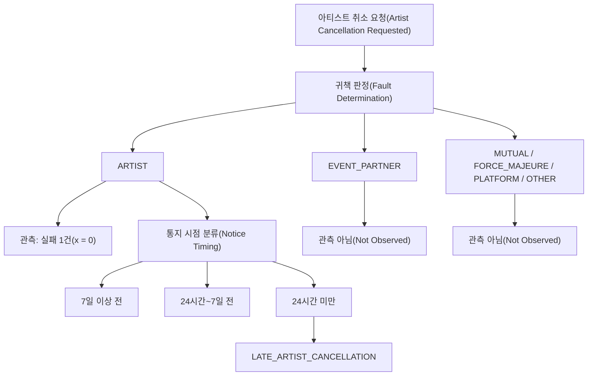
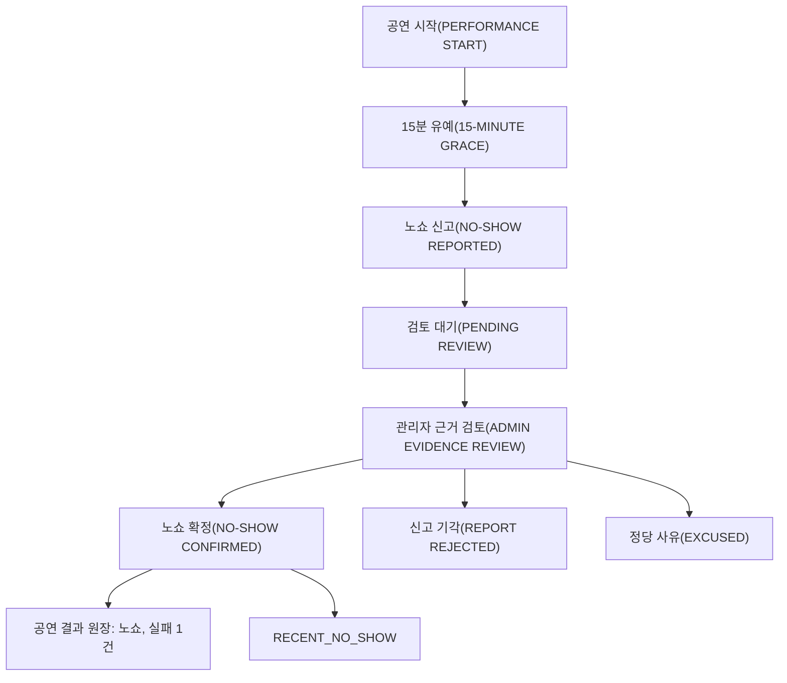

# V1 최종 정책 결정서 (`reliability-v1`)

이 문서는 더 이상 “무엇을 정해야 하는가?”를 나열하는 문서가 아닙니다.

**구현을 시작하기 위한 V1 기본 정책을 실제로 선택하고, 선택하지 않은 대안과 Trade-off를 기록**합니다.

> 중요: 아래 숫자들은 서비스 정책값입니다. 논문이 공연 플랫폼의 최적값으로 보장한 값이 아닙니다. 공연 결과 원장을 보존하고 `reliability-v1` 정책 버전으로 관리하여 이후 재계산 가능하게 설계합니다.

> 2026-10-03 개정: 이전 `trust-v1` 정책(Severity S=1/2/3/5, 시간 감쇠 365일, 지수 Confidence, Top 10 Exploration Slot)을 `reliability-v1`으로 대체했습니다. 폐기한 결정과 이유는 [08 문서](./08_deprecated_legacy_decisions.md#trust-v1에서-reliability-v1으로)에 있습니다. 용어는 [CONTEXT.md](../../../CONTEXT.md)를 따릅니다.

---

# 1. 최종 결정 한눈에 보기

| 항목 | V1 결정 |
|---|---|
| Reliability 모델 | 사건 순서 기반 Discounted Beta-Bernoulli |
| 정상 완료 | 성공 1건 (`x = 1`) |
| 아티스트 귀책 취소 | 실패 1건 (`x = 0`), 통지 시점은 근거 분류와 Risk Signal로 표현 |
| 노쇼 | 실패 1건 (`x = 0`), `RECENT_NO_SHOW` Risk Signal |
| EVENT_PARTNER 귀책 취소 | 관측 아님 |
| 불가항력·공동·플랫폼·기타 귀책 | 관측 아님 |
| 사전분포 | `α₀ = β₀ = 1` |
| 최근성 감쇠 | 관측 순서 기준, `γ = 0.95` (반감기 약 14건) |
| 관측 순서 | 행동 시각 기준 |
| 확신 수준 | 관측 건수 n: 낮음 ≤ 3 / 보통 4~9 / 높음 ≥ 10 |
| 점수 표시 | 확신 수준이 낮음이면 숨기고 관측 건수만 표시 |
| Risk Signal | `RECENT_NO_SHOW`, `LATE_ARTIST_CANCELLATION`, `REPEATED_ARTIST_CANCELLATION` (최근 관측 14건 창) |
| Activity Freshness | Reliability와 분리한 중립 정보 |
| 추천 순위 | Matching Score만 사용, Reliability는 표시 전용 |
| 신규 노출 | Top10 아래 별도 1칸 (신규 = 매칭 성사 0건 + 활성화 90일 이내, 10위 대비 10점 이내) |
| 노쇼 신고 가능 | 공연 시작 + 15분 (Contract 도입 시 적용) |
| 노쇼 최종 확정 | 관리자 판정 (Contract 도입 시 적용) |
| 아티스트 소명 기간 | 48시간 (Contract 도입 시 적용) |
| GPS | 사용하지 않음 |
| 체크인 | 강한 보조 근거, 단독 판정 기준 아님 |
| Review | 계산 제외, UI 보조 |
| Behavior | 계산·순위 제외, 설명용 |
| Hard Filter | Reliability로 후보를 제거하지 않음 |
| 판정 대기·분쟁 | 공연 결과 원장에 넣지 않음 |
| Fraud V1 | 판정 끝난 결과만 기록, 공연 1건당 유효 결과 1개, 정정은 다음 revision, 실패 결과는 단일 당사자 확인으로 확정 불가, 관리자 판정 Audit Log |
| ML / EigenTrust / LTR | V2 |

---

<a id="d40-binary-outcome"></a>

# 2. 공연 결과를 이진 관측으로 해석한다

## 선택지 A. Severity를 실패 건수로 환산 (이전 `trust-v1`)

노쇼를 실패 5건, 24시간 미만 통보 취소를 실패 3건처럼 가상의 관측 횟수로 넣습니다.

**문제:**

- 값이 더 이상 어떤 사건의 확률도 아닙니다. 정상 완료 10회 후 노쇼 1회가 실제 이행 비율(10/11)과 동떨어진 0.647로 계산되었습니다.
- “얼마나 자주 약속을 어기는가”와 “어겼을 때 얼마나 심각했는가”가 한 숫자에 섞입니다. 이는 [D04](./02_problem_solution_tradeoffs.md#d04-trust-profile)·[D05](./02_problem_solution_tradeoffs.md#d05-music-trust-separation)의 다차원 원칙과 어긋납니다.
- 실패 가중치가 관측 수를 부풀려 Confidence용 관측 수를 따로 세야 했습니다.

## 선택지 B. 결과 유형별 다범주 모델 (Dirichlet)

이행률과 기대 피해 지수를 따로 계산합니다. 가장 정교하지만 숫자가 두 개가 되고 설명·구현 비용이 큽니다.

## 선택지 C. 이진 관측 + 심각도는 점수 밖

공연 결과 1건을 관측 1건으로 보고, 정상 완료는 성공, 아티스트 귀책 취소와 노쇼는 실패로 해석합니다. 심각도는 근거 분류와 Risk Signal로 표현합니다.

**추천 및 적용: C**

| 결과 | 귀책 | 관측 | `x` |
|---|---|---|---:|
| 정상 완료 | - | 예 | 1 |
| 취소 | ARTIST | 예 | 0 |
| 노쇼 | ARTIST | 예 | 0 |
| 취소·노쇼 | EVENT_PARTNER, MUTUAL, FORCE_MAJEURE, PLATFORM, OTHER | 아니오 | - |

Reliability는 **관측, 즉 성패가 아티스트에게 달려 있었던 공연 결과 중에서 아티스트가 이행한 비율의 추정치**이며 최근 결과에 더 큰 비중을 둡니다. Beta Reputation의 정의(성공·실패 관측으로 성공 확률을 추정)를 따르며, 다범주 모델에서 관측 범주(정상 완료, 아티스트 귀책 취소, 노쇼)만 남겼을 때의 완료 확률에 해당합니다.

이 값은 **약속된 공연이 실제로 열릴 확률이 아닙니다.** EVENT_PARTNER 귀책 취소나 불가항력처럼 아티스트가 통제할 수 없는 결과는 분모에서 빠지기 때문입니다. 예를 들어 정상 완료 10회와 EVENT_PARTNER 귀책 취소 10건은 정상 완료 10회만 있는 경우와 같은 값을 냅니다. 이는 귀책이 아닌 사건을 아티스트의 부정 근거로 계산하지 않는다는 SSOT `TRUST-146`을 따른 의도된 동작입니다. 그래서 화면에는 “아티스트 귀책 기준 이행률”로 표시하고, 계산에서 제외한 결과를 사유별 건수로 함께 보여 줍니다.

### Trade-off

숫자만 보면 노쇼와 7일 전 취소가 같은 영향을 줍니다. 따라서 Trust Profile은 Reliability와 함께 근거 분류(“아티스트 귀책 취소 1건 · 3일 전 통보”)와 Risk Signal을 반드시 함께 표시합니다.

---

<a id="d13-performance-completed"></a>

# 3. 정상 완료

## 선택지 A. EVENT_PARTNER 확인만으로 완료

**장점:** 구현이 단순합니다.

**단점:** EVENT_PARTNER가 응답하지 않거나 악의적으로 완료 확인을 거부할 수 있습니다.

## 선택지 B. 다중 확인 경로

다음 중 하나로 최종 완료를 확정합니다.

| 경로 | 확정 출처 |
|---|---|
| 1. EVENT_PARTNER가 직접 완료 확인 | `EVENT_PARTNER_CONFIRMATION` |
| 2. 양측의 완료 상태가 일치 | `BILATERAL_CONFIRMATION` |
| 3. EVENT_PARTNER가 응답하지 않았지만 체크인·플랫폼 기록 등 충분한 근거가 있고 이의 기간 안에 이의가 없음 | `PLATFORM_AUTOMATIC` 또는 `ADMIN_DECISION` |
| 4. 분쟁 시 관리자 확인 | `ADMIN_DECISION` |

**추천 및 적용: B**

판정이 끝난 정상 완료는 관측 1건이며 `x = 1`입니다.

한쪽 당사자의 확인만으로 확정되는 경우는 경로 1 하나뿐입니다. EVENT_PARTNER의 완료 확인은 스스로 이의 제기 기회를 내려놓는 진술이기 때문입니다. 실패 결과(아티스트 귀책 취소, 노쇼)는 한쪽 진술로 확정하지 않습니다([05 §13.1](./05_trust_event_catalog.md#131-확정-출처)).

정산 기록이 생기더라도 **별도의 성공 관측을 추가하지 않습니다.**

### 선택 근거

한 공연을 계약, 공연, 정산 세 번의 성공으로 계산하면 같은 거래를 중복 집계하게 됩니다.

### Trade-off

완료 확인 로직이 단순 버튼 방식보다 복잡해지는 대신, EVENT_PARTNER 한 명의 행동에 Reliability가 과도하게 좌우되는 문제를 줄입니다.

---

<a id="d14-artist-cancelled"></a>

# 4. 아티스트 귀책 취소

Reason과 판정은 **귀책**을 정하고, 통지 시점은 **근거 분류**를 정합니다. 귀책이 ARTIST로 확정된 취소는 통지 시점과 관계없이 실패 1건(`x = 0`)입니다.



| 통지 시점 | Reliability | 표시 |
|---|---|---|
| 7일 이상 전 | 실패 1건 | 근거 분류 |
| 24시간~7일 전 | 실패 1건 | 근거 분류 |
| 24시간 미만 | 실패 1건 | 근거 분류 + `LATE_ARTIST_CANCELLATION` |
| 공연 시작 이후 | - | 노쇼 판정 흐름 |

### 반복 취소 multiplier

사용하지 않습니다. 반복 취소는 실패 관측이 반복되면서 자연스럽게 반영되고, 반복 자체는 `REPEATED_ARTIST_CANCELLATION` Risk Signal로 표시합니다.

---

<a id="d15-artist-no-show"></a>

# 5. 노쇼

## 시간 기준 선택

- 시작 즉시 신고: 오탐 위험이 큼
- **시작 +15분: 균형안**
- 시작 +30분: 짧은 공연에는 늦음

**추천 및 적용: +15분**

`+15분`은 **신고 가능 시점**이지 자동 확정 시점이 아닙니다.

## 확정 주체 선택

### A. EVENT_PARTNER 신고 즉시 확정

빠르지만 보복성 신고에 취약합니다.

### B. 자동 규칙 + 이의제기

확장성은 좋지만 초기에는 판정 규칙이 충분히 검증되지 않았습니다.

### C. V1 모든 노쇼 관리자 최종 확인

운영 비용은 있지만 졸업작품 규모에서 가장 안전하고 설명 가능합니다.

**추천 및 적용: C**

아티스트에게 48시간 소명 기회를 부여합니다. 소명 여부만으로 결론을 내리지 않고 실제 근거를 함께 확인합니다.

신고·소명·판정 흐름은 Booking/Dispute 도메인이 소유하며 Contract 도입 시 구현합니다. 판정이 끝난 노쇼만 공연 결과 원장에 기록됩니다.

## 위치/체크인 정책

- GPS 실시간 추적: 개인정보 부담과 오탐 가능성 때문에 사용하지 않음
- QR/일회용 체크인: 강한 보조 근거로 사용
- 체크인 누락만으로 노쇼를 확정하지 않음

## 심각도

노쇼는 실패 1건(`x = 0`)이고, 심각도는 `RECENT_NO_SHOW` Risk Signal로 표시합니다. 실패를 5건으로 환산하던 이전 방식은 [2장](#d40-binary-outcome)의 이유로 폐기했습니다.



---

<a id="d16-organizer-cancelled"></a>

# 6. EVENT_PARTNER 귀책 취소

## 선택지 A. 아티스트 관측에는 포함

“거래를 경험했다”는 이유로 관측 수를 늘릴 수 있습니다.

**문제:** 실제로 아티스트가 공연을 이행할 수 있었는지는 관측하지 못했습니다.

## 선택지 B. 관측 아님

**추천 및 적용: B**

Reliability와 확신 수준 모두 바뀌지 않습니다. 취소 시점과 원인은 공연 결과 원장에 보존합니다. 향후 EVENT_PARTNER 신뢰성을 설계할 때 사용할 수 있습니다.

---

<a id="d17-excused-cancellation"></a>

# 7. 정당 사유 취소

## 선택지 A. 아티스트가 취소했으므로 실패로 처리

구현은 단순하지만 불가항력까지 잘못으로 취급할 수 있습니다.

## 선택지 B. 정당 사유가 확인되면 관측 아님

**추천 및 적용: B**

귀책이 FORCE_MAJEURE로 판정되면 관측이 아닙니다.

V1 Reason Category:

- 자연재해(Natural Disaster)
- 공공기관 통제(Public Restriction)
- 광범위한 교통 마비(Major Transport Disruption)
- 증빙 가능한 긴급 의료 상황(Verified Medical Emergency)
- 증빙 가능한 중대한 가족 긴급 상황(Verified Family Emergency)
- 기타 관리자 승인(Other Admin-approved Emergency)

의료 정보는 **진단 상세를 저장하지 않고**, 필요한 최소 승인 결과와 증빙 참조만 저장합니다.

---

<a id="d18-shared-fault"></a>

# 8. 공동 귀책

## 선택지 A. 50% 책임으로 실패를 절반 부여

현실적이지만 `0.5 책임` 자체가 또 하나의 주관적 점수가 됩니다.

## 선택지 B. 부분 책임을 수치화하지 않음

**추천 및 적용: B**

귀책이 MUTUAL로 판정되면 관측이 아닙니다. 판정이 끝나지 않은 결과는 원장에 들어가지 않습니다.

설명 가능성과 오판 방지를 우선합니다. Trade-off는 일부 현실적인 공동 책임 사례가 수치에 반영되지 않는다는 점입니다.

---

# 9. 최근성 감쇠

**적용: 관측 순서 기준 감쇠, `γ = 0.95`**

```text
α₀ = 1,  β₀ = 1
αₜ = 0.95 × αₜ₋₁ + xₜ
βₜ = 0.95 × βₜ₋₁ + (1 − xₜ)
Rₜ = αₜ / (αₜ + βₜ)
```

새 관측이 확정될 때마다 기존 이행·실패 누적값의 영향력을 95%로 줄인 뒤 새 결과를 더합니다. Reliability는 전체 누적값 중 이행이 차지하는 비율입니다. 과거 관측 하나의 영향력은 이후 약 14건의 관측이 쌓이면 절반이 됩니다. 새 관측이 없으면 값은 변하지 않습니다.

달력 시간 기준 감쇠(반감기 365일)를 대체한 이유와 γ 후보 비교는 [09 ADR](./09_reliability_decay_gamma.md)에 있습니다.

| 이력 | n | Reliability |
|---|---:|---:|
| 신규 | 0 | 0.500 (표시하지 않음) |
| 정상 완료 4회 | 4 | 0.847 |
| 정상 완료 10회 | 10 | 0.935 |
| 정상 완료 10회 → 노쇼 1회 | 11 | 0.839 |
| 정상 완료 20회 | 20 | 0.974 |
| 정상 완료 20회 → 노쇼 1회 | 21 | 0.903 |

---

<a id="d43-outcome-ordering"></a>

# 10. 관측 순서

계산 결과가 관측의 순서에 의존하므로 순서 기준을 고정합니다.

| 결과 | 순서 기준 시각 |
|---|---|
| 정상 완료 | 공연 예정 시작 시각 |
| 노쇼 | 공연 예정 시작 시각 |
| 아티스트 귀책 취소 | 취소 통보 시각 |

시각이 같으면 공연 식별자 순으로 정합니다.

**확정 시각을 쓰지 않는 이유:** 노쇼 판정은 소명 기간과 관리자 검토를 거쳐 늦게 확정됩니다. 확정 시각을 기준으로 하면 관리자 처리 속도에 따라 같은 행동의 값이 달라집니다.

늦게 확정된 결과가 앞선 순서에 들어가거나 과거 결과가 정정되면, 해당 아티스트의 공연 결과 원장을 처음부터 다시 계산합니다.

---

<a id="d09-confidence-level"></a>

# 11. 확신 수준

## 선택지 A. 지수 포화 Confidence (이전 `trust-v1`)

`Confidence = 1 − e^(−0.16094 × N_eff)`와 경계 0.40 / 0.80을 사용합니다.

**문제:** 등급 경계는 결국 `N_eff` 임계값과 같은 뜻이라 지수 함수와 `k`가 역할을 하지 않습니다. 화면에 “80%”를 보여 주면 “80% 확률로 믿을 수 있다”로 오해받습니다. 관측 순서 감쇠에서는 감쇠된 근거량이 최대 20에서 멈춰 기존 경계와도 맞지 않습니다.

## 선택지 B. 감쇠된 근거량 기준

점수 계산과 같은 근거량을 쓰지만, 높음에 도달하려면 관측 14건이 필요하고 화면의 관측 건수와 등급의 근거가 달라집니다.

## 선택지 C. 관측 건수 기준

**추천 및 적용: C**

관측 건수 n은 판정이 끝난 정상 완료, 아티스트 귀책 취소, 노쇼의 수입니다. EVENT_PARTNER 귀책 취소처럼 관측이 아닌 결과는 세지 않습니다.

| 확신 수준 | 조건 | 표시 |
|---|---|---|
| 낮음 | n ≤ 3 | Reliability를 숨기고 “근거 부족 · 관측 n건”만 표시 |
| 보통 | 4 ≤ n ≤ 9 | “아티스트 귀책 기준 이행률 85% · 확신 수준 보통 · 관측 4건 · 계산 제외 1건(EVENT_PARTNER 귀책 취소)” |
| 높음 | n ≥ 10 | 같은 형식 |

경계값 3과 10은 이전 Confidence 등급 경계(`N_eff` 3.17, 10)를 건수로 옮긴 값입니다.

확신 수준이 낮을 때 Reliability를 숨기는 이유는, 정상 완료 1회 아티스트의 0.672(“67%”)가 낮은 평가로 읽혀 “Unknown ≠ Bad” 원칙을 깨기 때문입니다.

---

<a id="d19-review"></a>

# 12. Review

## 선택지 A. Review를 Reliability에 반영

태도·매너를 반영할 수 있지만 담합과 보복성 평가 방어가 핵심 계산에 들어옵니다.

## 선택지 B. 계산 제외, UI 보조

**추천 및 적용: B**

거래 완료 사용자만 리뷰를 작성할 수 있지만 별점과 텍스트는 Reliability에 들어가지 않습니다.

---

<a id="d20-behavior"></a>

# 13. Behavior Signal

응답률, 응답 시간은 유용하지만 실제 공연 이행과 같은 의미는 아닙니다.

**V1 결정**

- 별도 Behavior Profile 생성 가능
- Reliability에 미반영
- 추천 순위에 미반영
- UI 설명용
- V2에서 실제 결과와의 상관관계를 검증한 뒤 재검토

---

<a id="d44-activity-freshness"></a>

# 14. Activity Freshness

관측 순서 감쇠에서는 새 관측이 없으면 Reliability가 변하지 않습니다. 오랫동안 공연이 없던 아티스트의 값은 마지막 값 그대로 남습니다. 이것은 의도된 동작입니다.

| 질문 | 정보 |
|---|---|
| 약속을 지켜 왔는가? | Artist Reliability |
| 지금도 활동 중인가? | Activity Freshness |

Activity Freshness는 다음 사실 정보로 구성합니다.

- 마지막 공연 시점(`lastPerformanceAt`)
- 최근 12개월 공연 횟수
- 최근 활동 여부

**두 정보를 분리하는 이유**

- 활동이 없다는 이유로 Reliability를 깎으면 공연 빈도가 다시 값에 영향을 줍니다.
- 반대로 활동이 없다는 이유로 과거 실패가 희석되면, 시간만 지나도 회복되는 문제가 다시 생깁니다.

활동이 적다는 상태는 위험 사건이 아니므로 **Risk Signal로 분류하지 않고** 중립 정보로 표시합니다.

---

<a id="d41-risk-signal-rules"></a>

# 15. Risk Signal

Risk Signal은 Reliability를 깎지 않고, 실패의 심각도를 Trust Profile에 경고로 표시합니다. 활성 범위는 **최근 관측 14건**입니다. 14건은 `γ = 0.95`의 사건 반감기로, “그 사건의 영향력이 Reliability에 절반 이상 남아 있는 동안 경고한다”는 뜻입니다.

| Risk Signal | 활성 조건 |
|---|---|
| `RECENT_NO_SHOW` | 최근 관측 14건 안에 노쇼가 1건 이상 |
| `LATE_ARTIST_CANCELLATION` | 최근 관측 14건 안에 24시간 미만 통보 아티스트 귀책 취소가 1건 이상 |
| `REPEATED_ARTIST_CANCELLATION` | 최근 관측 14건 안에 아티스트 귀책 취소가 2건 이상 |

- 달력 시간(예: 최근 12개월)을 쓰지 않는 이유는, 그 경우 공연 없이 기다리기만 해도 경고가 꺼지고 공연 빈도에 따라 경고 유지 기간이 달라지기 때문입니다.
- 표시에는 날짜를 함께 씁니다. 예: “최근 관측 14건 중 노쇼 1건 (2025-05)”
- 24시간 이상 전에 통보한 단발성 취소는 경고 없이 근거 분류로만 표시합니다.

Risk Signal로 두지 않는 것:

- 활동 부족: Activity Freshness의 중립 정보
- 계정 제재: Eligibility(Hard Filter)에서 처리
- 평판 조작 의심: 관리자 전용 내부 신호

---

<a id="d39-display-only"></a>

# 16. 추천 순위 반영

## 선택지 A. 표시 전용

순위는 Matching Score만으로 정하고, Reliability·근거·Risk Signal은 Trust Profile 필드로 표시합니다.

## 선택지 B. Risk Signal 기반 하향

활성 Risk Signal이 있는 후보만 신호가 없는 후보 아래로 내립니다.

## 선택지 C. 동점 구간 보정 / 선택지 D. 가중 결합

Reliability를 순위 계산에 섞습니다. 이력이 없는 신규 아티스트(0.5)가 정상 완료 1회 이상인 아티스트보다 구조적으로 아래로 가고, 사전분포와 정책값이 순위를 직접 좌우합니다.

**추천 및 적용: A**

- SSOT `TRUST-153`의 기본값(“기존 Matching Score 중심 후보 순위 정책을 유지”)과 일치하며, SSOT v1.4에서 Human Decision으로 확정되었습니다(2026-10-04 승인).
- 순위 설명은 매칭 항목 차이만으로 유지됩니다(`AI-MATCH-054`).
- MVP에는 공연 결과가 없어 어떤 보정 방식을 고르든 순위 효과가 없습니다.

Contract 도입 후 보정이 필요해지면 선택지 B를 우선 검토하고, `TRUST-153`에 따른 별도 기술 설계와 Human Decision을 거칩니다.

---

<a id="d21-exploration"></a>

# 17. 신규 노출 슬롯

Reliability가 순위에 들어가지 않으므로, 신규 노출 슬롯은 신뢰 보정이 아니라 **신규 아티스트에게 첫 매칭 기회를 주는 노출 정책**입니다.

**신규 아티스트:** 매칭 성사 이력이 0건이고 Artist 활성화 후 90일이 지나지 않은 Artist

- 매칭 성사는 양측이 같은 Offer Revision을 Accept한 상태로, MVP에서도 관측할 수 있습니다.
- 첫 매칭이 성사되거나 90일이 지나면 자동으로 신규에서 벗어납니다.
- 활성화일은 ARTIST 사용자의 가입 완료 시점(`users.created_at`)입니다. SSOT `AUTH-008`에 따라 User는 가입 완료 시점에 생성되어 바로 `ACTIVE`가 됩니다.
- 가입에 휴대폰 인증이 필요하지만 휴대폰 번호는 유일 제약이 아니므로, 탈퇴 후 재가입으로 신규 자격을 다시 얻는 것을 V1에서 막지 않습니다. 신규 칸은 1명이고 Top10 순위를 바꾸지 않으므로 악용 효과는 노출 1칸으로 제한됩니다.

**슬롯 규칙**

> 2026-10-04 개정: 최종 추천 인원을 AI 서버 협의 005에 따라 Top10으로 바꾸면서 기준을 TOP 5·5위에서 Top10·10위로 바꿨습니다. SSOT `AI-MATCH-053`·`AI-MATCH-155`의 동기화가 필요합니다.

- Top10은 Matching Score 순서 그대로 유지합니다.
- Top10 아래에 별도 1칸을 둡니다.
- 다음 조건을 모두 만족할 때만 표시합니다.
  - Top10에 신규 아티스트가 없음
  - PASS/FAIL Filter를 통과한 신규 아티스트가 있음
  - 그중 가장 높은 종합 적합도가 10위 대비 10점 이내
- 표시 예: “신규 아티스트 · 매칭 성사 0건 · 종합 적합도 81% (10위 대비 −4점)”

절대 임계값 대신 마지막 순위 대비 격차를 쓰는 이유는, 종합 적합도 분포가 행사마다 다르고 실제 점수 차이로 설명할 수 있기 때문입니다. 비교 대상을 화면에 노출되는 마지막 후보로 두는 이유는, 그보다 높은 신규 후보는 이미 Top10에 들어가기 때문입니다.

신규 아티스트가 retrieval 상위 후보 밖에 있어도 채점되도록, Backend는 신규 아티스트의 후보만으로 retrieval을 한 번 더 요청해 같은 후보 풀에서 순위를 매깁니다([서버 협의 006](../server-agreements/006-new-artist-candidate-retrieval.md)). 응답 계약은 [추천 응답 확장](../../api/02_recommendation_trust_and_new_artist.md)에 있습니다.

이 슬롯은 SSOT v1.4의 `AI-MATCH-155`로 반영되었습니다(2026-10-04 승인). 추천 인원 10명, 90일, 10점은 정책값으로 관리합니다.

---

<a id="d22-hard-filter"></a>

# 18. Hard Filter

**V1 결정**

Reliability, 확신 수준, Risk Signal만으로 후보를 Hard Filter하지 않습니다.

Hard Filter 항목은 SSOT `AI-MATCH-051`의 PASS/FAIL 필수 조건을 따릅니다.

- Artist 계정/인증 상태
- 행사 날짜 공연 가능 여부
- 활동 정지 여부(관리자 Suspension 포함)
- 저작권 조건 충족 여부
- 행사 지역 이동 가능 여부
- 예산 범위 충족 여부

AI 분석 동의 등 AI 추천 참여 조건(SSOT `AI-031`)은 후보 풀에 들어가기 전 단계에서 걸러지므로 Hard Filter 항목으로 따로 두지 않습니다. 추천 응답의 표시 형식은 [추천 응답 확장 §2.3](../../api/02_recommendation_trust_and_new_artist.md#23-eligibilitypassedconditions)에 있습니다.

반복 노쇼 자동 Suspension 횟수 규칙은 V1에서 두지 않습니다. 실제 운영 데이터 없이 임의의 정지 기준을 만들지 않기 위함입니다.

---

<a id="d23-fraud"></a>

# 19. Fraud / Abuse V1

V1은 ML을 사용하지 않습니다.

적용:

- 판정이 끝난 공연 결과만 원장에 기록
- 공연 1건에 유효한 공연 결과는 하나만 존재
- 정정은 기존 행을 수정하지 않고 같은 공연의 다음 revision으로 기록
- 실패 결과(아티스트 귀책 취소, 노쇼)는 단일 당사자 확인으로 확정하지 않음 (DB 제약)
- 노쇼는 관리자 최종 판정
- 모든 관리자 판정 Audit Log
- Review는 Reliability에서 제외
- 거래 금액·반복 상대방 등 Context는 향후 분석을 위해 저장 가능

Trade-off는 정교한 담합 탐지를 V1에서 하지 못한다는 점입니다. 대신 핵심 계산 자체의 공격 표면을 줄입니다.

---

<a id="d24-snapshot-policy"></a>

# 20. Policy Version

**V1 결정**

```text
공연 결과 원장
  정책과 무관한 판정 결과

reliability-v1
  결과 해석, γ, 사전분포, 확신 수준 경계, Risk Signal 창
```

- 공연 결과 원장에는 정책값(`x`, 가중치, 점수)을 저장하지 않습니다.
- Reliability는 원장과 정책 버전으로 조회 시 계산합니다. Snapshot 테이블은 V1에서 두지 않습니다([D42](./06_database_and_implementation_roadmap.md#d42-outcome-ledger)).
- 정책을 바꾸면 같은 원장을 새 정책 버전(`reliability-v2`)으로 다시 계산합니다.

---

# 21. 최종 V1 원칙

> **V1은 판정이 끝난 공연 결과를 이진 관측으로 보고, 관측 순서 기반 감쇠로 Artist Reliability를 계산한다. 공연 빈도와 시간 경과는 값에 영향을 주지 않고, 실패의 심각도는 Risk Signal로, 최근 활동 여부는 Activity Freshness로 분리한다. Reliability는 순위가 아니라 설명에 쓰며, 모든 정책값은 버전 관리해 재계산 가능하게 만든다.**
