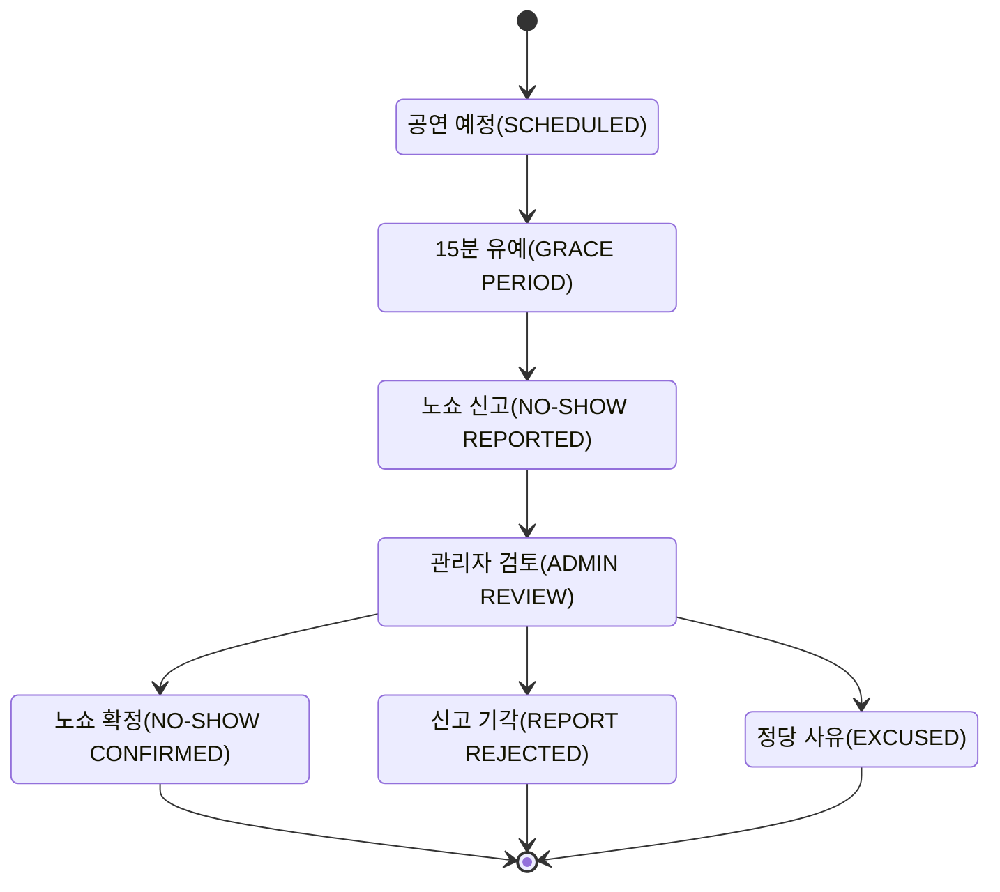
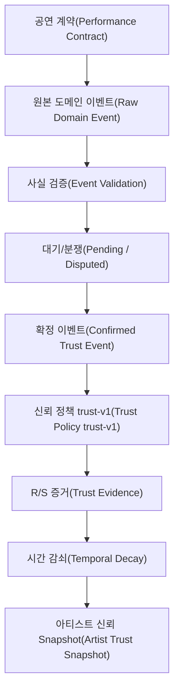
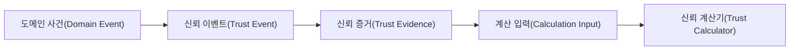

# Trust Event Catalog

이 문서는 구현 시 사용하는 Trust Event의 의미를 고정합니다.

핵심 원칙:

> **Event는 “점수가 얼마나 변했는가”가 아니라 “무슨 일이 실제로 일어났는가”를 저장합니다.**

---

# 1. 핵심 Event 목록

| Event | 발생 조건 | Actor | 책임 | R/S | Base Severity | N_eff | 상태 전이 | 분쟁 처리 |
|---|---|---|---|---|---:|---:|---|---|
| `PERFORMANCE_COMPLETED` | 계약된 공연이 실제 완료되고 완료 사실이 확정 | Artist/System/Organizer | Artist 이행 성공 | R | `+1.0` | +1 | `SCHEDULED → COMPLETED` | 완료 여부 이견 시 PENDING 후 관리자 판정 |
| `ARTIST_CANCELLED` | 공연 시작 전 Artist 귀책 취소 확정 | Artist | Artist | S | `+1/+2/+3` | +1 | `SCHEDULED → CANCELLED_BY_ARTIST` | 귀책 확정 전 R/S 반영 금지 |
| `ARTIST_NO_SHOW_CONFIRMED` | 시작+15분 이후 미도착·미공연, 관리자 Artist 귀책 확정 | Organizer가 신고, Admin 확정 | Artist | S | `+5.0` | +1 | `SCHEDULED → NO_SHOW_PENDING → NO_SHOW` | 모든 V1 No-show 관리자 확인 |
| `ORGANIZER_CANCELLED` | Organizer 귀책으로 공연 취소 확정 | Organizer | Organizer | Neutral | `0` | 0 | `SCHEDULED → CANCELLED_BY_ORGANIZER` | Artist Trust 영향 없음 |
| `EXCUSED_CANCELLATION` | 불가항력/정당 사유 승인 | Artist/Organizer/System | None | Neutral | `0` | 0 | `SCHEDULED → CANCELLED_EXCUSED` | 증빙 최소화 + 관리자 승인 |
| `NO_SHOW_REPORTED` | 시작+15분 이후 Organizer가 미도착 신고 | Organizer | UNKNOWN | Neutral | `0` | 0 | `SCHEDULED → NO_SHOW_PENDING` | 신고 자체는 점수 미반영 |
| `DISPUTE_OPENED` | 당사자가 귀책/사실 관계에 이의 제기 | Artist/Organizer | UNKNOWN | Neutral | `0` | 0 | `PENDING → DISPUTED` | 관리자 판정 |
| `DISPUTE_RESOLVED` | 관리자 최종 책임 판정 | Admin | ARTIST/ORGANIZER/NONE | 자체 R/S 없음 | `0` | 0 | `DISPUTED → RESOLVED` | 최종 Outcome Event를 확정·기각 |
| `SETTLEMENT_COMPLETED` | 정산 완료 | System | None | Beta 제외 | `0` | 0 | `COMPLETED → SETTLED` | 완료 검증 보조 근거 |
| `REVIEW_SUBMITTED` | 거래 완료 사용자가 리뷰 제출 | Organizer/Artist | None | Beta 제외 | `0` | 0 | Review 상태만 변경 | UI 보조 정보 |

---

# 2. Event와 Observation을 구분한다

한 공연에는 여러 Event가 생길 수 있습니다.

```text
CONTRACT_CONFIRMED
PERFORMANCE_SCHEDULED
CHECK_IN_CONFIRMED
PERFORMANCE_COMPLETED
SETTLEMENT_COMPLETED
REVIEW_SUBMITTED
```

하지만 Trust 관점의 독립 Observation은 **공연 계약 하나**입니다.

```text
정상 완료        → Observation 1
Artist 취소      → Observation 1
Artist No-show   → Observation 1

Organizer 취소   → Artist 이행 능력 미관측 → Observation 0
Excused 취소     → Artist 이행 능력 미관측 → Observation 0
```

---

# 3. PERFORMANCE_COMPLETED

## 확정 조건

최소 조건:

- 유효한 계약
- 공연 종료 시간이 지남
- Cancel / No-show 최종 상태가 아님
- 공연 수행에 대한 확인 근거 존재
- 분쟁이 있으면 해결 완료

완료 Event:

```text
R += 1.0 × W(t)
N_eff += 1 × W(t)
```

정산/리뷰는 같은 공연의 Positive Evidence를 추가하지 않습니다.

```mermaid
flowchart TD
    Scheduled["공연 예정(SCHEDULED)"]
    Scheduled --> Perform["공연 수행(PERFORMANCE PERFORMED)"]
    Perform --> Confirm["완료 확인(COMPLETION CONFIRMATION)"]
    Confirm --> Dispute{"이의 있음?(DISPUTED?)"}
    Dispute -->|아니오(NO)| Completed["공연 완료 확정(PERFORMANCE_COMPLETED)"]
    Dispute -->|예(YES)| Review["관리자 검토(ADMIN REVIEW)"]
    Review --> Completed
```

---

# 4. ARTIST_CANCELLED

## Severity

```text
notice >= 168h        → S += 1
24h <= notice < 168h  → S += 2
0h < notice < 24h     → S += 3
notice <= 0           → No-show 판정 흐름
```

`notice = scheduled_at_snapshot - requested_at`

Reason은 귀책 여부를 판정하고, 시간은 Severity를 판정합니다.

대표 Reason:

- `SCHEDULE_CONFLICT`
- `DOUBLE_BOOKING`
- `PERSONAL_REASON`
- `UNPREPARED`
- `TRANSPORTATION_SELF_CAUSED`
- `MEDICAL_EMERGENCY`
- `FAMILY_EMERGENCY`
- `NATURAL_DISASTER`
- `PUBLIC_RESTRICTION`
- `ORGANIZER_BREACH`
- `OTHER`

`MEDICAL_EMERGENCY`, `FAMILY_EMERGENCY`, `OTHER` 등은 자동으로 Artist Fault로 처리하지 않고 검토합니다.

---

# 5. ARTIST_NO_SHOW

## 신고 가능

```text
reportEligibleAt = performanceStartAt + 15 minutes
```

이 시각부터 생성할 수 있는 것은:

```text
NO_SHOW_REPORTED
```

이며, 아직 Negative Evidence가 아닙니다.

## V1 확정

- 주최자 신고만으로 확정하지 않음
- 모든 No-show 관리자 판정
- Artist 48시간 소명 가능
- GPS 필수 아님
- QR/일회용 Check-in은 보조 Evidence
- Check-in 누락 단독으로 No-show 확정 금지
- 최종 `ARTIST_NO_SHOW_CONFIRMED`에만 `S=5`



---

# 6. ORGANIZER_CANCELLED

Artist Trust:

```text
R = 0
S = 0
N_eff = 0
```

저장할 정보:

- 요청 시각
- 원래 공연 시각 Snapshot
- Reason
- Organizer ID
- 귀책 판정
- 관련 분쟁

이 정보는 나중에 Organizer Trust의 입력이 될 수 있지만 현재 Artist Trust에는 반영하지 않습니다.

---

# 7. EXCUSED_CANCELLATION

정당 사유가 승인되면:

```text
R = 0
S = 0
N_eff = 0
```

승인 가능한 Category:

- 자연재해
- 공공 통제
- 광범위한 교통 마비
- 긴급 의료 상황
- 중대한 가족 긴급 상황
- 관리자 승인 기타 긴급 상황

증빙은 “승인 여부를 판단하는 최소 정보”만 사용하고, Trust Event에는 상세 민감정보를 복사하지 않습니다.

---

# 8. Trust Event Status

```text
PENDING
CONFIRMED
REJECTED
DISPUTED
SUPERSEDED
REVERSED
```

정책:

- `PENDING`: R/S 미반영
- `DISPUTED`: R/S 미반영
- `CONFIRMED`: Evidence 생성 가능
- `REJECTED`: Evidence 없음
- `SUPERSEDED`: 새로운 Event가 사실관계를 대체
- `REVERSED`: 이전 확정 Event의 효력을 취소하고 Snapshot 재계산

원본 Row를 직접 덮어써서 과거 사실을 잃지 않습니다.

---

# 9. Actor와 Responsible Party

둘은 반드시 분리합니다.

```text
actor
= 누가 신고/행동했는가?

responsibleParty
= 최종적으로 누구의 귀책인가?
```

예:

```text
Organizer가 No-show 신고

actor = ORGANIZER
responsibleParty = UNKNOWN
```

관리자 판정 후:

```text
responsibleParty = ARTIST
```

가 될 수 있습니다.

---

# 10. Verification Event

다음 Event는 Artist Trust와 관련 있지만 Beta R/S에는 들어가지 않습니다.

| Event | 역할 |
|---|---|
| `IDENTITY_VERIFIED` | 신원 검증 상태 |
| `EXTERNAL_ACCOUNT_VERIFIED` | 외부 계정 제어권 |
| `WORK_VERIFIED` | 작업물 확인 |
| `RIGHTS_VERIFIED` | 권리 확인 |
| `VERIFICATION_REVOKED` | 검증 취소 |
| `ACCOUNT_SUSPENDED` | Eligibility 차단 |

```text
Verification != Transaction Reputation
```

이라는 원칙을 유지합니다.

---

# 11. Behavior / Review Event

V1 Beta Trust에는 제외합니다.

```text
OFFER_RESPONDED
OFFER_EXPIRED
MESSAGE_RESPONSE_DELAY
PROFILE_INACTIVE
REVIEW_SUBMITTED
```

이벤트 자체를 저장할 수는 있지만 Trust R/S로 변환하지 않습니다.

---

# 12. 최종 Event 처리 흐름




---

<a id="d25-evidence-contract"></a>

# 13. 이전 ADR에서 유지하는 Evidence Contract

이 섹션은 기존 `ADR-002-reliability-evidence-contract.md`에서 **현재 `trust-v1` 문서와 충돌하지 않으면서 아직 명시되지 않았던 입력 계약**만 합친 것입니다.

현재 V1은 Review/Behavior를 Beta Trust에 넣지 않으므로, 기존 ADR의 `OFFER_RESPONDED_LATE = 0.5`, `VERIFIED_REVIEW → Reliability 계산` 규칙은 이 문서에 다시 적용하지 않습니다. 해당 관계는 [이전 ADR 정합성 기록](./08_previous_adr_reconciliation.md)에서 확인할 수 있습니다.

## 13.1 Evidence Source Type

Trust Event가 확정된 뒤 Evidence로 변환될 때 **정보가 어디서 왔는지**를 별도로 기록합니다.

```text
PLATFORM_AUTOMATIC
BILATERAL_CONFIRMATION
SINGLE_PARTY_REPORT
```

의미:

| Source Type | 의미 |
|---|---|
| `PLATFORM_AUTOMATIC` | 시스템 상태 머신이나 서버 로그로 플랫폼이 직접 확인한 정보 |
| `BILATERAL_CONFIRMATION` | 아티스트와 주최자가 모두 확인한 정보 |
| `SINGLE_PARTY_REPORT` | 한쪽 당사자가 제공한 신고·진술 |

`sourceType`은 **누가 또는 무엇이 정보를 만들었는가**를 나타냅니다.

No-show처럼 강한 Negative Evidence는 `SINGLE_PARTY_REPORT` 상태만으로 확정하지 않고 현재 V1의 관리자 검토 정책을 따릅니다.

---

## 13.2 Evidence Verification Status

Event의 상태와 별개로 계산 입력의 검증 상태를 둘 수 있습니다.

```text
VERIFIED
PENDING
REJECTED
```

| Verification Status | Trust 계산 |
|---|---|
| `VERIFIED` | 계산 가능 |
| `PENDING` | 계산 제외 |
| `REJECTED` | 계산 제외 |

현재 V1에서는 일반적으로:

```text
TrustEvent CONFIRMED
        ↓
TrustEvidence VERIFIED
```

로 이어지지만, 두 개념을 같은 컬럼으로 합치지는 않습니다.

- Event Status = 사실관계 처리 생명주기
- Evidence Verification Status = 계산 입력 자격

---

## 13.3 계산 포함 여부와 제외 사유

Evidence가 저장되었다고 해서 항상 `R/S`에 반영하지 않습니다.

```text
included = true / false
```

제외된 경우 이유를 명시합니다.

```text
NONE
NON_ARTIST_ATTRIBUTION
UNVERIFIED
DUPLICATE
INVALID_SOURCE
OUT_OF_POLICY
MANUAL_REVIEW
```

예:

```text
type = ARTIST_CANCELLED
responsibleParty = ORGANIZER

included = false
exclusionReason = NON_ARTIST_ATTRIBUTION
```

이를 통해 “왜 이 사건이 점수에 들어가지 않았는가?”를 나중에 설명할 수 있습니다.

---

## 13.4 원본 도메인 사건 추적

각 Evidence는 원본 사건을 추적할 수 있어야 합니다.

```text
sourceDomain
sourceId
```

예:

```text
sourceDomain = PERFORMANCE
sourceId = 456
type = PERFORMANCE_COMPLETED
```

또는:

```text
sourceDomain = PERFORMANCE
sourceId = 456
type = ARTIST_NO_SHOW_CONFIRMED
```

---

## 13.5 멱등성 계약

같은 원본 사건을 여러 번 처리해도 Evidence가 중복 생성되면 안 됩니다.

개념적으로 다음 조합은 유일해야 합니다.

```text
sourceDomain
+ sourceId
+ evidenceType
+ policyVersion
```

V1의 `idempotency_key`는 이 정보를 안정적으로 직렬화하거나 별도 Unique Constraint로 보장할 수 있습니다.

---

## 13.6 계산 엔진 입력은 JPA Entity가 아니다

Spring Boot 계산기는 Persistence Entity를 직접 입력으로 받지 않습니다.



계산 전용 입력 모델에는 최소 다음 정보가 들어갑니다.

- Event/Evidence Type
- Artist ID
- 발생 시각
- Positive / Negative Evidence
- Source Type
- Verification Status
- Responsible Party
- Included 여부
- Exclusion Reason
- Source Domain / Source ID
- Policy Version

이 경계 덕분에 JPA 변경이 Trust 수학 모델까지 직접 전파되는 것을 줄일 수 있습니다.
