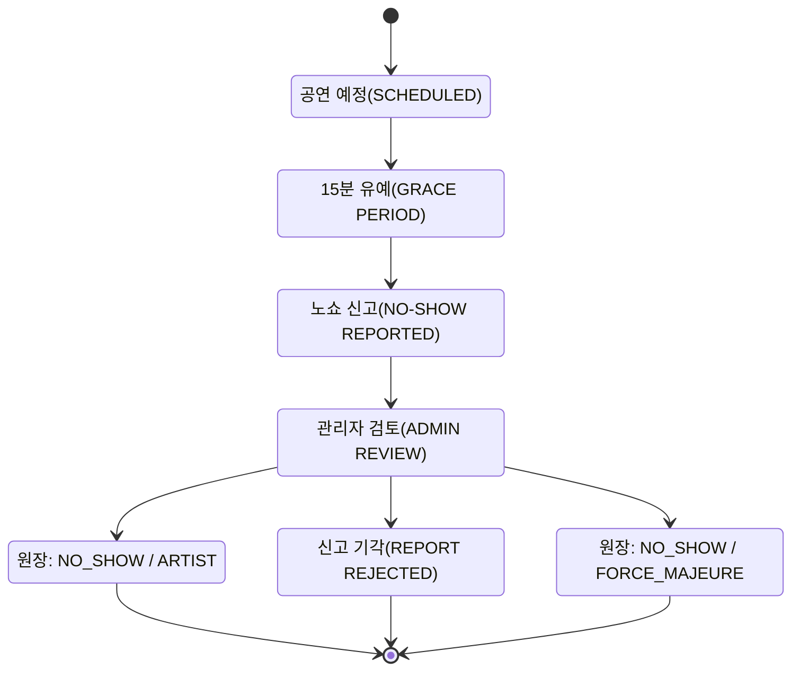
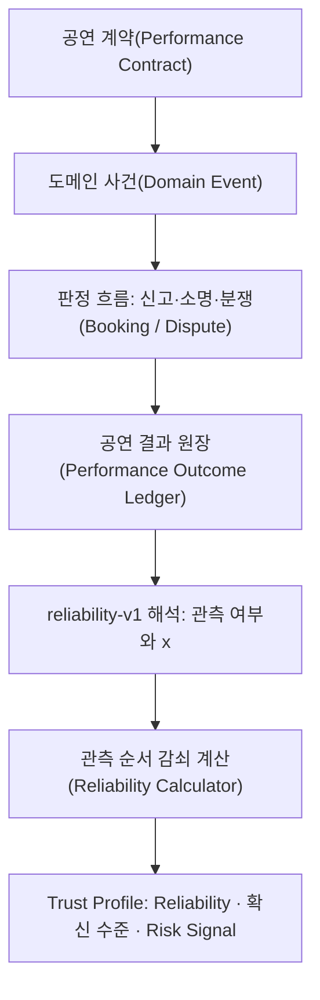
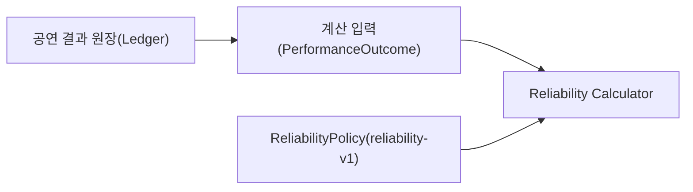

# 공연 결과 카탈로그

이 문서는 Artist Reliability 계산의 유일한 입력인 **공연 결과**의 의미를 고정합니다.

핵심 원칙:

> **공연 결과는 “점수가 얼마나 변했는가”가 아니라 “무슨 일이 실제로 일어났고 누구의 귀책인가”를 저장합니다. 판정이 끝난 결과만 공연 결과 원장에 들어갑니다.**

> 2026-10-03 개정: `trust-v1`의 Trust Event Catalog를 대체했습니다. Severity·R/S·N_eff 열을 삭제했고, 신고·소명·분쟁 단계는 Booking/Dispute 도메인의 판정 흐름으로 분리했습니다. 폐기 이유는 [08 문서](./08_deprecated_legacy_decisions.md#trust-v1에서-reliability-v1으로)에 있습니다.

---

# 1. 공연 결과 목록

공연 결과는 **결과 유형 × 귀책**으로 표현합니다. 관측 여부와 `x`는 정책 `reliability-v1`이 해석한 값이며 원장에는 저장하지 않습니다.

| 결과 유형 | 귀책 | 발생 조건 | 관측 | `x` | Risk Signal 근거 | 순서 기준 시각 |
|---|---|---|---|---:|---|---|
| 정상 완료 `COMPLETED` | - | 계약된 공연이 실제 완료되고 완료가 확정 | 예 | 1 | - | 공연 예정 시작 시각 |
| 취소 `CANCELLED` | ARTIST | 공연 시작 전 아티스트 귀책 취소 확정 | 예 | 0 | 24시간 미만 통보, 반복 | 취소 통보 시각 |
| 노쇼 `NO_SHOW` | ARTIST | 시작 +15분 이후 미도착·미공연, 관리자가 아티스트 귀책 확정 | 예 | 0 | 노쇼 | 공연 예정 시작 시각 |
| 취소 `CANCELLED` | EVENT_PARTNER | EVENT_PARTNER 귀책 취소 확정 | 아니오 | - | - | - |
| 취소·노쇼 | FORCE_MAJEURE | 불가항력·정당 사유 승인 | 아니오 | - | - | - |
| 취소·노쇼 | MUTUAL, PLATFORM, OTHER | 공동·플랫폼·기타 귀책 판정 | 아니오 | - | - | - |

판정 전의 신고, 소명, 분쟁은 공연 결과가 아닙니다. 신고가 기각되면 그 신고로 인한 공연 결과는 생기지 않습니다.

---

# 2. 공연 결과와 관측을 구분한다

한 공연에는 여러 도메인 사건이 생길 수 있습니다.

```text
CONTRACT_CONFIRMED
PERFORMANCE_SCHEDULED
CHECK_IN_CONFIRMED
PERFORMANCE_COMPLETED
SETTLEMENT_COMPLETED
REVIEW_SUBMITTED
```

하지만 공연 결과는 **공연 1건당 하나**이고, Reliability 계산에 들어가는 **관측**은 그중 아티스트의 이행 여부를 보여 주는 결과뿐입니다.

```text
정상 완료              → 관측 1건 (성공)
아티스트 귀책 취소      → 관측 1건 (실패)
아티스트 귀책 노쇼      → 관측 1건 (실패)

EVENT_PARTNER 귀책 취소 → 아티스트 이행 미관측 → 관측 아님
정당 사유 취소          → 아티스트 이행 미관측 → 관측 아님
```

---

# 3. 정상 완료

## 확정 조건

최소 조건:

- 유효한 계약
- 공연 종료 시간이 지남
- 취소 / 노쇼 최종 결과가 아님
- 공연 수행에 대한 확인 근거 존재
- 분쟁이 있으면 해결 완료

원장 기록:

```text
결과 유형 = COMPLETED
→ reliability-v1: 관측 1건, x = 1
```

정산·리뷰는 같은 공연의 성공 관측을 추가하지 않습니다.

```mermaid
flowchart TD
    Scheduled["공연 예정(SCHEDULED)"]
    Scheduled --> Perform["공연 수행(PERFORMANCE PERFORMED)"]
    Perform --> Confirm["완료 확인(COMPLETION CONFIRMATION)"]
    Confirm --> Dispute{"이의 있음?(DISPUTED?)"}
    Dispute -->|아니오(NO)| Completed["공연 결과 원장: COMPLETED"]
    Dispute -->|예(YES)| Review["관리자 검토(ADMIN REVIEW)"]
    Review --> Completed
```

---

# 4. 아티스트 귀책 취소

## 통지 시점 분류

```text
notice >= 168h        → 7일 이상 전
24h <= notice < 168h  → 24시간~7일 전
0h < notice < 24h     → 24시간 미만 (LATE_ARTIST_CANCELLATION)
notice <= 0           → 노쇼 판정 흐름
```

`notice = scheduled_start_at_snapshot - requested_at`

Reliability에서 아티스트 귀책 취소는 통지 시점과 관계없이 실패 1건입니다. 통지 시점은 근거 분류와 Risk Signal에만 씁니다.

Reason은 귀책 판정에 사용합니다.

대표 Reason:

- `SCHEDULE_CONFLICT`
- `DOUBLE_BOOKING`
- `PERSONAL_REASON`
- `UNPREPARED`
- `TRANSPORTATION_SELF_CAUSED`
- `MEDICAL_EMERGENCY`
- `FAMILY_EMERGENCY`
- `NATURAL_DISASTER`
- `PUBLIC_RESTRICTION`
- `EVENT_PARTNER_BREACH`
- `OTHER`

`MEDICAL_EMERGENCY`, `FAMILY_EMERGENCY`, `OTHER` 등은 자동으로 ARTIST 귀책으로 처리하지 않고 검토합니다.

---

# 5. 노쇼

## 신고 가능

```text
reportEligibleAt = performanceStartAt + 15 minutes
```

이 시각부터 만들 수 있는 것은 **노쇼 신고**이며, 공연 결과가 아닙니다.

## V1 판정 규칙

- EVENT_PARTNER 신고만으로 확정하지 않음
- 모든 노쇼 관리자 판정
- 아티스트 48시간 소명 가능
- GPS 필수 아님
- QR/일회용 체크인은 보조 근거
- 체크인 누락 단독으로 노쇼 확정 금지

신고·소명·판정 흐름은 Booking/Dispute 도메인이 소유하며 Contract 도입 시 구현합니다.



---

# 6. EVENT_PARTNER 귀책 취소

관측이 아닙니다. Reliability와 확신 수준이 바뀌지 않습니다.

원장에 저장할 정보:

- 요청 시각
- 원래 공연 시각 Snapshot
- Reason
- EVENT_PARTNER ID
- 귀책 판정
- 관련 분쟁

이 정보는 나중에 EVENT_PARTNER 신뢰성의 입력이 될 수 있지만 현재 Artist Reliability에는 반영하지 않습니다.

---

# 7. 정당 사유 취소

귀책이 FORCE_MAJEURE로 판정되면 관측이 아닙니다.

승인 가능한 Category:

- 자연재해
- 공공 통제
- 광범위한 교통 마비
- 긴급 의료 상황
- 중대한 가족 긴급 상황
- 관리자 승인 기타 긴급 상황

증빙은 “승인 여부를 판단하는 최소 정보”만 사용하고, 공연 결과에는 상세 민감정보를 복사하지 않습니다.

---

# 8. 판정 흐름과 원장의 경계

| 단계 | 소유 | 원장 기록 |
|---|---|---|
| 신고, 소명, 검토 대기 | Booking/Dispute 판정 흐름 | 없음 |
| 분쟁 진행 | Booking/Dispute 판정 흐름 | 없음 |
| 신고 기각 | Booking/Dispute 판정 흐름 | 없음 |
| 판정 완료 | 판정 흐름 → 원장 | 공연 결과 1행 |
| 정정·무효화 | 판정 흐름 → 원장 | 다음 revision 행 |

- 원장은 append-only입니다. 기존 행을 덮어쓰지 않아 과거 판정을 잃지 않습니다.
- 정정은 같은 공연의 다음 revision 행으로 기록하고, 가장 큰 revision이 유효한 결과입니다. 무효화는 “유효한 결과 없음”을 뜻하는 `VOIDED` revision으로 기록합니다.
- 정정이 일어나면 해당 아티스트의 Reliability를 원장 처음부터 다시 계산합니다.

---

# 9. Actor와 Responsible Party

둘은 반드시 분리합니다.

```text
actor
= 누가 신고/행동했는가? (판정 흐름의 정보)

responsibleParty
= 판정으로 확정된 귀책 주체 (공연 결과의 정보)
```

예:

```text
EVENT_PARTNER가 노쇼 신고

actor = EVENT_PARTNER
responsibleParty = 아직 없음 (판정 전)
```

관리자 판정 후:

```text
responsibleParty = ARTIST
```

가 될 수 있습니다. `responsibleParty`는 ARTIST, EVENT_PARTNER, MUTUAL, FORCE_MAJEURE, PLATFORM, OTHER 중 하나이며, 판정 전에는 값이 존재하지 않습니다.

---

# 10. Verification Event

다음 Event는 Trust Profile에 표시하지만 Artist Reliability에는 들어가지 않습니다.

| Event | 역할 |
|---|---|
| `IDENTITY_VERIFIED` | 신원 검증 상태 |
| `EXTERNAL_ACCOUNT_VERIFIED` | 외부 계정 제어권 |
| `WORK_VERIFIED` | 작업물 확인 |
| `RIGHTS_VERIFIED` | 권리 확인 |
| `VERIFICATION_REVOKED` | 검증 취소 |
| `ACCOUNT_SUSPENDED` | Eligibility 차단 |

```text
Verification != Artist Reliability
```

이라는 원칙을 유지합니다.

---

# 11. Behavior / Review Event

V1 Reliability에서 제외합니다.

```text
OFFER_RESPONDED
OFFER_EXPIRED
MESSAGE_RESPONSE_DELAY
PROFILE_INACTIVE
REVIEW_SUBMITTED
```

이벤트 자체를 저장할 수는 있지만 관측으로 변환하지 않습니다.

---

# 12. 최종 처리 흐름



---

<a id="d25-evidence-contract"></a>

# 13. 공연 결과 원장 입력 계약

## 13.1 확정 출처

공연 결과가 **어떻게 확정되었는지**를 기록합니다.

| 확정 출처 | 의미 |
|---|---|
| `PLATFORM_AUTOMATIC` | 체크인·상태 머신 등 플랫폼 기록과 이의 기간 경과로 자동 확정 |
| `BILATERAL_CONFIRMATION` | 아티스트와 EVENT_PARTNER가 모두 확인 |
| `EVENT_PARTNER_CONFIRMATION` | EVENT_PARTNER가 정상 완료를 확인 (정상 완료에만 허용) |
| `ADMIN_DECISION` | 관리자가 근거를 검토해 판정 |

결과별로 허용하는 확정 출처:

| 결과 | 허용하는 확정 출처 |
|---|---|
| 정상 완료 | 네 가지 모두 |
| 취소 (ARTIST, EVENT_PARTNER, MUTUAL, PLATFORM, OTHER 귀책) | `BILATERAL_CONFIRMATION`, `ADMIN_DECISION` |
| 취소·노쇼 (FORCE_MAJEURE 귀책) | `ADMIN_DECISION` |
| 노쇼 | `ADMIN_DECISION` |
| 무효화 (`VOIDED`) | `ADMIN_DECISION` |

**한쪽 당사자의 확인으로 확정되는 결과는 EVENT_PARTNER의 정상 완료 확인 하나뿐입니다.** EVENT_PARTNER는 아티스트가 공연하지 않으면 피해를 보는 쪽이므로, 정상 완료 확인은 스스로 이의 제기 기회를 내려놓는 진술입니다. 거짓 완료 확인으로 이득을 보는 경우는 아티스트와 공모한 경우뿐인데, 공모한 양측은 양측 확인도 함께 통과하므로 양측 확인을 요구해도 막을 수 없습니다. 공모는 V1에서 정교하게 탐지하지 않는 위험으로 남깁니다([D23](./04_final_policy_decisions.md#d23-fraud)).

반대로 실패 결과는 보복성 신고 위험이 있으므로 한쪽 진술로 확정하지 않습니다. 이 규칙은 DB 제약으로도 강제합니다([06](./06_database_and_implementation_roadmap.md#d42-outcome-ledger)).

## 13.2 계산 포함 여부와 제외 사유

원장에는 판정이 끝난 결과만 들어가므로 별도의 검증 상태 컬럼을 두지 않습니다. 결과별 포함 여부와 제외 사유는 **저장하지 않고 계산기가 반환**합니다.

```text
NON_ARTIST_ATTRIBUTION
SUPERSEDED
```

예:

```text
결과 유형 = CANCELLED
responsibleParty = EVENT_PARTNER

included = false
exclusionReason = NON_ARTIST_ATTRIBUTION
```

이를 통해 “왜 이 결과가 Reliability에 들어가지 않았는가?”를 설명할 수 있습니다.

관측이 아닌 결과는 Reliability의 분모에서 빠지므로, Trust Profile은 계산에서 제외한 결과를 **사유별 건수로 함께 표시**합니다(예: “계산 제외 2건 · EVENT_PARTNER 귀책 취소”). 그래야 Reliability를 공연이 실제로 열릴 확률로 오해하지 않습니다.

## 13.3 원본 사건 추적

각 공연 결과는 대상 공연과 판정 근거를 추적할 수 있어야 합니다.

```text
performanceId
sourceDomain
sourceId
```

예:

```text
performanceId = 456
sourceDomain = DISPUTE
sourceId = 78
결과 유형 = NO_SHOW
```

## 13.4 멱등성 계약

- 공연 1건에는 유효한 공연 결과가 하나만 존재합니다(가장 큰 revision).
- 같은 내용의 결과가 다시 들어오면 무시합니다.
- 다른 내용의 결과는 직전 revision의 다음 번호로만 받습니다. 두 정정이 같은 번호를 동시에 기록하면 하나만 성공합니다.

이 규칙으로 같은 공연에 정상 완료와 노쇼가 함께 유효해지는 상황을 막습니다.

## 13.5 계산 엔진 입력은 JPA Entity가 아니다

Spring Boot 계산기는 Persistence Entity를 직접 입력으로 받지 않습니다.



계산 전용 입력 모델에는 최소 다음 정보가 들어갑니다.

- 결과 유형
- 귀책(`responsibleParty`)
- Artist ID
- Performance ID
- 순서 기준 시각
- 취소 통보 시각과 공연 예정 시각 Snapshot(취소인 경우)
- 확정 출처
- revision

이 경계 덕분에 JPA 변경이 Reliability 수학 모델까지 직접 전파되는 것을 줄일 수 있습니다.
