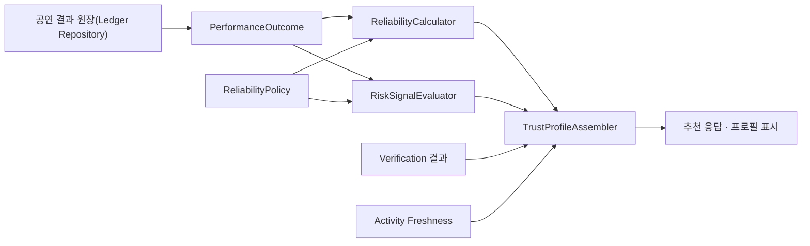
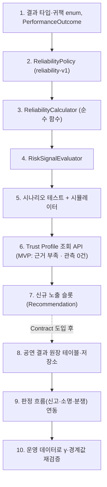
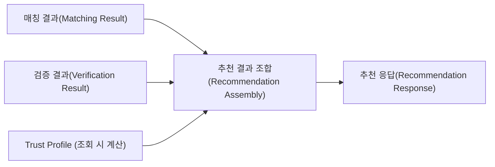
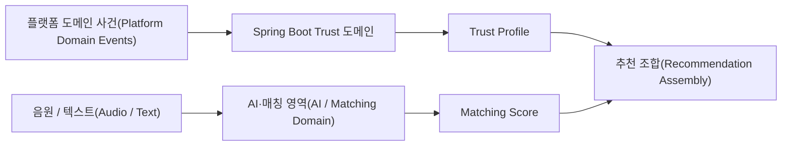

# Database & Implementation Roadmap

이 문서는 최종 정책을 Java / Spring Boot / PostgreSQL 구현으로 옮길 때 지켜야 할 저장 구조와 순서를 설명합니다.

> 2026-10-03 개정: `trust_event` / `trust_evidence` / `artist_trust_snapshot` 3계층과 일일 감쇠 배치를 **공연 결과 원장 1개 + 조회 시 계산**으로 대체했습니다. 폐기 이유는 [08 문서](./08_deprecated_legacy_decisions.md#trust-v1에서-reliability-v1으로)에 있습니다.

---

# 1. 데이터 모델 핵심

```text
공연 결과 원장
= 판정이 끝난 공연 결과 (append-only, 정책과 무관한 사실)

ReliabilityPolicy
= 정책 버전별 해석 규칙과 파라미터 (코드)

Trust Profile
= 원장과 정책으로 조회 시 계산한 결과 (저장하지 않음)
```

---

<a id="d42-outcome-ledger"></a>

# 2. 공연 결과 원장

## 선택지 A. 3계층 저장 (이전 `trust-v1`)

`trust_event`(상태 전이 포함) → `trust_evidence`(정책별 R/S) → `artist_trust_snapshot`(집계 이력)을 저장합니다.

**문제:**

- `trust_event`를 “불변 사실”이라 하면서 `event_status`, `responsible_party`가 바뀌었고, 신고·분쟁 같은 처리 단계와 최종 결과가 한 표에 섞였습니다.
- 이진 관측에서는 결과와 정책 버전만 알면 해석을 언제든 다시 계산할 수 있어 `trust_evidence`는 동기화 대상만 늘립니다.
- 관측 순서 감쇠에서는 원장의 결과 순서로 어느 시점의 값이든 정확히 재현되므로 Snapshot은 원본이 아니라 캐시입니다.

## 선택지 B. 원장 + Snapshot 이력

원장은 하나로 줄이고, 결과가 확정될 때마다 Snapshot 1행을 추가합니다. 점수 변화 이력을 바로 조회할 수 있지만 재현 가능한 값을 중복 저장합니다.

## 선택지 C. 원장 1개 + 조회 시 계산

**추천 및 적용: C**

- 원장에는 판정이 끝난 공연 결과만 append-only로 기록합니다.
- Reliability, 확신 수준, Risk Signal, 결과별 포함 여부는 조회 시 계산합니다.
- 추천 1회에 필요한 아티스트는 최대 6명(TOP 5 + 신규 노출 1)이므로 조회 시 계산 비용이 작습니다. 성능이 필요해지면 캐시를 추가합니다.

## `performance_outcome` (개념 모델)

| Field | 설명 |
|---|---|
| `id` | UUID |
| `performance_id` | 대상 공연(계약) |
| `artist_id` | Artist |
| `event_partner_id` | EVENT_PARTNER |
| `outcome_type` | `COMPLETED` / `CANCELLED` / `NO_SHOW` / `VOIDED` |
| `responsible_party` | `ARTIST` / `EVENT_PARTNER` / `MUTUAL` / `FORCE_MAJEURE` / `PLATFORM` / `OTHER` (정상 완료와 무효화는 비움) |
| `reason_code` | 사유 |
| `ordering_at` | 관측 순서 기준 시각 (행동 시각) |
| `scheduled_start_at_snapshot` | 당시 공연 예정 시작 시각 |
| `cancellation_requested_at` | 취소 통보 시각 (취소인 경우) |
| `confirmation_source` | `PLATFORM_AUTOMATIC` / `BILATERAL_CONFIRMATION` / `EVENT_PARTNER_CONFIRMATION` / `ADMIN_DECISION` |
| `decided_by` | 판정 주체 |
| `decided_at` | 판정 시각 |
| `revision` | 공연별 결과 이력 번호 (1부터 1씩 증가) |
| `previous_revision` | 직전 revision (revision 1은 비움) |
| `source_domain`, `source_id` | 판정 근거 추적 |
| `metadata` | 비핵심 확장 JSONB |
| `created_at` | 생성 시각 |

`VOIDED`는 “유효한 공연 결과가 없음”으로 정정하는 revision입니다.

### 저장하지 않는 값

```text
x (성공/실패 해석)
α, β, Reliability
확신 수준
Risk Signal
```

이 값들은 정책이 바뀌면 달라지므로 원장에 저장하지 않습니다.

### 열 제약

아래 조건 제약들은 값이 NULL이면 검사 결과가 NULL로 평가되어 통과합니다. 그래서 필수 열은 `NOT NULL`로, 값 목록은 열 단위 `CHECK`로 먼저 막습니다.

```sql
ALTER TABLE performance_outcome
    ALTER COLUMN performance_id SET NOT NULL,
    ALTER COLUMN revision SET NOT NULL,
    ALTER COLUMN outcome_type SET NOT NULL,
    ALTER COLUMN confirmation_source SET NOT NULL;

ALTER TABLE performance_outcome
    ADD CONSTRAINT ck_performance_outcome_type CHECK (
        outcome_type IN ('COMPLETED', 'CANCELLED', 'NO_SHOW', 'VOIDED')),
    ADD CONSTRAINT ck_performance_outcome_party CHECK (
        responsible_party IN ('ARTIST', 'EVENT_PARTNER', 'MUTUAL', 'FORCE_MAJEURE', 'PLATFORM', 'OTHER')),
    ADD CONSTRAINT ck_performance_outcome_source CHECK (
        confirmation_source IN ('PLATFORM_AUTOMATIC', 'BILATERAL_CONFIRMATION', 'EVENT_PARTNER_CONFIRMATION', 'ADMIN_DECISION'));
```

`responsible_party`는 정상 완료와 무효화에서 비어 있어야 하므로 `NOT NULL`을 두지 않고, 결과 유형별 규칙은 아래 `ck_responsible_party`가 맡습니다.

### 유일성 제약: 공연별 revision

공연 1건의 결과 이력은 revision 1부터 1씩 증가하는 한 줄로 기록하고, **가장 큰 revision이 유효한 공연 결과**입니다. 정정은 기존 행을 고치지 않고 다음 revision을 추가합니다.

```sql
ALTER TABLE performance_outcome
    ADD CONSTRAINT uq_performance_outcome_revision UNIQUE (performance_id, revision);

-- revision 1은 직전 revision이 없고, 그 뒤는 바로 앞 번호만 가리킨다
ALTER TABLE performance_outcome
    ADD CONSTRAINT ck_performance_outcome_revision CHECK (
        (revision = 1 AND previous_revision IS NULL)
        OR (revision > 1 AND previous_revision IS NOT NULL AND previous_revision = revision - 1)
    );

-- 직전 revision이 실제로 있어야 다음 revision을 기록할 수 있다
ALTER TABLE performance_outcome
    ADD CONSTRAINT fk_performance_outcome_previous
        FOREIGN KEY (performance_id, previous_revision)
        REFERENCES performance_outcome (performance_id, revision);
```

- 번호가 항상 증가하므로 자기 참조와 순환이 생길 수 없고, FK 때문에 번호를 건너뛸 수 없습니다.
- 두 정정이 동시에 같은 번호를 기록하면 유일성 제약으로 하나만 성공합니다. 실패한 쪽은 최신 결과를 다시 읽고 판정을 다시 확인한 뒤에만 다음 번호로 기록합니다.
- 이전 초안의 `supersedes_outcome_id` + 제약 3개는 자기 참조 행과 한 문장 다중 행 순환을 허용해 폐기했습니다.

### 확정 출처 제약

```sql
ALTER TABLE performance_outcome
    ADD CONSTRAINT ck_responsible_party CHECK (
        (outcome_type IN ('COMPLETED', 'VOIDED') AND responsible_party IS NULL)
        OR (outcome_type IN ('CANCELLED', 'NO_SHOW') AND responsible_party IS NOT NULL)
    );

ALTER TABLE performance_outcome
    ADD CONSTRAINT ck_confirmation_source_by_outcome CHECK (
        CASE
            WHEN outcome_type = 'COMPLETED' THEN true
            WHEN outcome_type IN ('NO_SHOW', 'VOIDED') OR responsible_party = 'FORCE_MAJEURE'
                THEN confirmation_source = 'ADMIN_DECISION'
            ELSE confirmation_source IN ('BILATERAL_CONFIRMATION', 'ADMIN_DECISION')
        END
    );
```

결과별로 허용하는 확정 출처와 그 이유는 [05 §13.1](./05_trust_event_catalog.md#131-확정-출처)에 있습니다.

이 절의 열 제약과 조건 제약을 모두 적용한 PostgreSQL에서 다음 행이 거부되는 것을 확인했습니다: 자기 참조, 순환, revision 건너뛰기(직전 revision을 비운 경우 포함), 동시 정정 경쟁, 비어 있거나 허용값 밖인 결과 유형·확정 출처, 결과별로 허용되지 않은 확정 출처. 조건 제약만 두면 NULL이 들어간 행이 통과하므로 열 제약을 함께 두어야 합니다.

판정 전 단계(신고, 소명, 분쟁)는 Booking/Dispute 도메인의 테이블이 소유하며 Contract 도입 시 설계합니다.

---

# 3. PostgreSQL 타입 선택

V1에서는 PostgreSQL ENUM보다:

```text
VARCHAR
+
Java enum
+
DB CHECK constraint
```

조합을 권장합니다.

이유:

- 결과 유형과 사유가 향후 늘어날 가능성이 큼
- PostgreSQL ENUM 변경보다 Migration 관리가 유연함
- Java Domain Enum으로 컴파일 시점 안정성을 얻을 수 있음

핵심 검색 필드는 JSONB로 숨기지 않고 정규 Column으로 둡니다.

---

# 4. 시간 저장

모든 서버 Timestamp는:

```text
TIMESTAMPTZ
UTC 저장
```

을 사용합니다.

사용자 UI에서 지역 시간으로 변환합니다.

`scheduled_start_at_snapshot`을 공연 결과에 보존하는 이유는 공연 일정이 이후 수정되어도 **취소 당시의 통보 시점과 관측 순서를 재현하기 위해서**입니다.

---

# 5. Reliability 계산

```text
관측을 ordering_at 순서(같으면 performance_id 순)로 정렬한 뒤

α₀ = 1,  β₀ = 1
αₜ = 0.95 × αₜ₋₁ + xₜ
βₜ = 0.95 × βₜ₋₁ + (1 − xₜ)
Reliability = αₙ / (αₙ + βₙ)
```

관측을 행동 시각 순서로 하나씩 반영합니다. 매번 기존 누적값의 영향력을 95%로 줄이고 새 결과(정상 완료 1, 실패 0)를 더하며, 마지막 누적값 중 이행의 비율이 Reliability입니다.

```text
n = 관측 건수
확신 수준 = 낮음 (n ≤ 3) / 보통 (4 ≤ n ≤ 9) / 높음 (n ≥ 10)
```

관측 건수로 확신 수준을 정하고, 낮음이면 Reliability를 표시하지 않습니다.

```text
최근 관측 14건 안에
  노쇼 ≥ 1                         → RECENT_NO_SHOW
  24시간 미만 통보 귀책 취소 ≥ 1     → LATE_ARTIST_CANCELLATION
  아티스트 귀책 취소 ≥ 2            → REPEATED_ARTIST_CANCELLATION
```

가장 최근 관측 14건 안에 해당 사건이 있으면 경고를 켭니다. 14건은 `γ = 0.95`의 사건 반감기입니다.

근거: [04 정책](./04_final_policy_decisions.md), [09 ADR](./09_reliability_decay_gamma.md)

---

# 6. 계산 시점: 조회 시 계산

## 선택지 A. 조회 시 계산

추천·프로필 조회 때 대상 아티스트의 원장을 읽어 계산합니다.

## 선택지 B. 결과 확정 시 Snapshot 저장

조회는 빠르지만 재현 가능한 값을 중복 저장하고 정정 시 무효화가 필요합니다.

## 선택지 C. 결과 확정 시 + 일일 감쇠 배치 (이전 `trust-v1`)

시간 감쇠가 없어졌으므로 일일 배치가 필요 없습니다.

**V1 선택: A**

- 관측 순서 감쇠에서는 새 결과가 확정될 때만 값이 바뀌므로, 시간이 흘러 값이 낡는 문제가 없습니다.
- 캐시가 필요해지면 `(artist_id, policy_version, 마지막 결과 ID)`를 키로 둡니다. 원장에 새 행이 생기면 키가 바뀌므로 별도 무효화 규칙이 필요 없습니다.

---

# 7. Policy Version

공연 결과 원장은 정책과 독립적인 사실이므로 `x`, 가중치, 점수를 저장하지 않습니다.

```text
공연 결과 원장
  policy-independent

ReliabilityPolicy
  policy_version = reliability-v1
  γ = 0.95, α₀ = β₀ = 1
  확신 수준 경계 = 3 / 10
  Risk Signal 창 = 14
```

정책 변경:

```text
reliability-v1
   ↓
reliability-v2
   ↓
같은 원장을 새 정책으로 재계산
```

과거 결과를 잃지 않고 정책 실험과 γ 재검증이 가능합니다.

---

# 8. Idempotency와 중복 방지

필수 규칙:

- 공연 1건에는 유효한 공연 결과 하나만 존재 (가장 큰 revision)
- 같은 내용의 결과가 다시 들어오면 무시
- 다른 내용의 결과는 직전 revision의 다음 번호로만 기록
- 동시에 같은 번호를 기록하면 하나만 성공하고, 나머지는 최신 결과를 다시 확인
- 정정이 생기면 해당 아티스트를 원장 처음부터 다시 계산(조회 시 계산이므로 자동)

---

# 9. V1 Fraud Guard

ML 없이 다음을 구현합니다.

```text
1. 실제 공연(계약) ID 필수
2. 판정이 끝난 결과만 원장 기록
3. 공연 1건당 유효 결과 1개 (DB 제약)
4. 노쇼 관리자 판정
5. 리뷰는 Reliability 미반영
6. 관리자 판정 Audit Log
7. 원장 append-only + 정정 revision
8. 실패 결과는 단일 당사자 확인으로 확정 불가 (DB 제약)
```

거래 금액과 상대방 반복 패턴은 저장할 수 있지만 V1 Reliability 계산에는 사용하지 않습니다.

---

# 10. Java / Spring Boot 도메인 경계

권장 컴포넌트:



Java에서 분리할 책임:

```text
PerformanceOutcome        계산 입력 record (JPA Entity 아님)
OutcomeType               COMPLETED / CANCELLED / NO_SHOW / VOIDED
ResponsibleParty          6개 귀책 값
ReliabilityPolicy         정책 버전과 파라미터
ReliabilityCalculator     관측 해석·정렬·감쇠·확신 수준 (순수 함수)
RiskSignalEvaluator       최근 관측 창 규칙 (순수 함수)
TrustProfileAssembler     Verification · Reliability · 계산 제외 건수 · Risk · Freshness 조합
```

---

<a id="d37-mvp-scope"></a>

# 11. 구현 순서

SSOT v1.0부터 Contract·취소·노쇼가 MVP에서 제거되었으므로(`BOOKING-061`, `TRUST-144`), MVP에서는 공연 결과를 만들어 낼 도메인이 없습니다. 따라서 MVP는 **계산 코어와 시뮬레이터**까지 구현하고, 원장과 판정 흐름은 Contract 도입 시 구현합니다.



- 5단계 시뮬레이터는 [09 ADR](./09_reliability_decay_gamma.md)의 비교 시나리오와 12장의 시나리오를 재현해 결과 표를 출력합니다. 정책값 검증과 발표 시연에 같은 도구를 씁니다.
- 6단계 API는 MVP에서 모든 아티스트에 대해 “근거 부족 · 관측 0건”과 Verification 정보를 반환합니다.
- 10단계 재검증 지표는 다음 관측의 예측 오차(Brier score), 보정, 실패 감지 지연입니다.

---

# 12. 구현 완료 전 테스트해야 할 시나리오

`γ = 0.95`, `α₀ = β₀ = 1` 기준입니다.

| 시나리오 | 기대 결과 |
|---|---|
| 신규 아티스트 | n = 0, 확신 수준 낮음, Reliability 숨김(내부 값 0.5) |
| 정상 완료 4회 | n = 4, 확신 수준 보통, 0.847 |
| 정상 완료 10회 | n = 10, 확신 수준 높음, 0.935 |
| 정상 완료 20회 → 노쇼 1회 | 0.974 → 0.903, `RECENT_NO_SHOW` 활성 |
| 위 상태에서 정상 완료 13회 / 14회 | 13회까지 `RECENT_NO_SHOW` 유지, 14회째 해제 |
| 같은 결과 순서, 다른 공연 간격(연 1회 / 연 10회) | 두 아티스트의 Reliability가 같음 |
| 결과 없이 3년 경과 | Reliability, 확신 수준, Risk Signal 모두 불변 |
| EVENT_PARTNER 귀책 취소 | Reliability와 n 불변, 제외 사유 `NON_ARTIST_ATTRIBUTION` |
| 노쇼 신고 후 기각 | 원장 기록 없음, 모든 값 불변 |
| 24시간 미만 통보 아티스트 귀책 취소 | 실패 1건, `LATE_ARTIST_CANCELLATION` 활성 |
| 최근 관측 14건 안에 아티스트 귀책 취소 2건 | `REPEATED_ARTIST_CANCELLATION` 활성 |
| 같은 공연에 revision 1을 다시 기록 | 거부 (유일성 제약) |
| revision을 건너뛰거나(직전 revision을 비운 경우 포함) 자기 번호를 직전 revision으로 지정 | 거부 (FK, CHECK) |
| 결과 유형이나 확정 출처가 비어 있거나 허용값 밖인 행 | 거부 (열 제약) |
| 한 문장으로 서로를 가리키는 두 행 기록 | 거부 (CHECK) |
| 두 정정이 동시에 같은 revision을 기록 | 하나만 성공, 나머지는 최신 결과 재확인 |
| EVENT_PARTNER 단독 확인으로 노쇼·아티스트 귀책 취소 확정 | 거부 (확정 출처 제약) |
| 노쇼를 정상 완료로 정정(revision 2) | 처음부터 정상 완료였던 경우와 같은 값 |
| EVENT_PARTNER 귀책 취소 10건 + 정상 완료 10회 | Reliability는 정상 완료 10회와 같고, “계산 제외 10건 (EVENT_PARTNER 귀책 취소)”이 함께 표시됨 |
| 앞선 행동 시각의 결과가 늦게 확정 | 행동 시각 순서로 계산한 값과 같음 |

---

# 13. V2로 미루는 항목

V1 구현을 막지 않습니다.

- Reliability의 순위 보정(우선 후보: Risk Signal 기반 하향, `TRUST-153` Human Decision 필요)
- 결과 유형별 다범주 모델(Dirichlet)과 기대 피해 지수
- EVENT_PARTNER Reliability
- EigenTrust 기반 그래프 평판
- 자동 담합 탐지
- Isolation Forest
- 거래 금액 Context Weight
- Behavior 신호의 Reliability 반영
- Review Credibility 계산
- Learning to Rank
- Neural Ranker

이 항목은 **V1 미완료 사항이 아니라 의도적으로 분리한 V2 고도화 범위**입니다.

---

<a id="d26-data-boundary"></a>

# 14. Matching / Verification / Trust 데이터 경계

기존 `ADR-003-matching-verification-reliability-data-boundary.md`에서 이미 Accepted 되었고 현재 문서와 충돌하지 않는 데이터 경계를 유지합니다.

```text
Matching Result
= 특정 행사에 얼마나 잘 맞는가

Verification Result
= 무엇이 검증되었는가

공연 결과 원장
= 약속된 공연이 실제로 어떻게 끝났고 누구 귀책인가

Trust Profile
= 현재 정책으로 조회 시 계산한 Reliability · 확신 수준 · Risk Signal
```

이 모델들을 하나의 `artist_score` 테이블에 섞지 않습니다.

### 직접 FK로 묶지 않는 관계

```text
MATCHING_RESULT
    X
공연 결과 원장 / Trust Profile
```

두 데이터의 수명이 다르기 때문에 Matching Result가 신뢰 정보를 직접 FK로 소유하지 않습니다.

추천 응답을 만들 때 Application 계층에서 `artistId`를 기준으로 조합합니다.



---

<a id="d27-snapshot-history"></a>

# 15. Snapshot History (폐기)

이전에는 Snapshot을 덮어쓰지 않고 이력으로 누적하기로 했습니다. 관측 순서 감쇠에서는 원장과 정책 버전만으로 **어느 시점의 값이든 정확히 재현**되므로, Snapshot 이력은 감사·설명·버그 재현에 필요한 정보를 새로 더하지 않습니다.

- 과거 시점 값: 원장을 그 시점까지 재생해 계산
- 정책 비교: 같은 원장을 두 정책 버전으로 계산
- 정정 전후 비교: 이전 revision으로 계산

[D42](#d42-outcome-ledger)로 대체되었습니다.

---

<a id="d28-risk-signal"></a>

# 16. Risk Signal은 Reliability와 분리한다

```text
노쇼 1건
  ├─ Reliability에 실패 1건으로 반영
  └─ RECENT_NO_SHOW Risk Signal로 표시
```

하지만:

```text
노쇼 → 실패 1건
     + 추가 -30점
```

처럼 같은 사건을 두 번 감점하지 않습니다. Risk Signal은 점수를 깎지 않는 경고입니다.

V1 Risk Signal은 원장에서 조회 시 계산하며 별도 테이블에 저장하지 않습니다. 활성 규칙은 [D41](./04_final_policy_decisions.md#d41-risk-signal-rules)에 있습니다.

| Risk Signal | V1 |
|---|---|
| `RECENT_NO_SHOW` | 사용 |
| `LATE_ARTIST_CANCELLATION` | 사용 |
| `REPEATED_ARTIST_CANCELLATION` | 사용 |
| 활동 부족 | Risk Signal 아님 → Activity Freshness |
| `ACCOUNT_SANCTION` | Risk Signal 아님 → Eligibility(Hard Filter) |
| `REPUTATION_MANIPULATION_SUSPECTED` | 관리자 전용 내부 신호 |

---

<a id="d29-system-ownership"></a>

# 17. Spring Boot와 AI/Matching 서버 책임 경계

기존 `ADR-001`의 시스템 경계 결정을 유지합니다.

## Spring Boot Backend

소유 책임:

- Performance / Contract / Offer 등 도메인 상태
- 판정 흐름과 공연 결과 원장
- Responsible Party 판정 결과
- Reliability 계산
- 확신 수준 계산
- Risk Signal
- Trust Profile 조합
- Verification 결과
- 추천 API의 최종 조합

## AI / Matching 영역

소유 책임:

- CLAP Embedding
- 음악 의미 유사도
- BPM / Rhythm / Audio Feature
- 음악 기반 후보 검색 및 Matching 계산

AI/Matching 영역은 공연 완료·취소·노쇼의 기준 원본을 소유하지 않으므로 **Artist Reliability를 직접 계산하지 않습니다.**



---

<a id="d30-batch-query"></a>

# 18. 추천 결과의 Trust Profile은 일괄 조회한다

기존 ADR의 N+1 방지 결정을 유지합니다.

사용하지 않는 방식:

```java
for (MatchingResult result : matchingResults) {
    outcomeRepository.findByArtistId(result.artistId());
}
```

권장 구조:

```text
TOP 5 + 신규 노출 1 Artist IDs
    ↓
공연 결과 원장 일괄 조회
Verification 일괄 조회
    ↓
Map<ArtistId, List<PerformanceOutcome>>
    ↓
ReliabilityCalculator / RiskSignalEvaluator (메모리 계산)
    ↓
Recommendation Assembler
```

추천 결과 수가 늘어도 아티스트마다 DB Query를 반복하지 않습니다.

---

# 19. 패키지 경계

기존 ADR의 도메인 분리 원칙을 현재 용어로 유지합니다.

```text
matching/
├── domain/
└── application/

verification/
├── domain/
├── application/
└── infrastructure/

trust/
├── reliability/
│   ├── domain/          PerformanceOutcome, OutcomeType, ResponsibleParty,
│   │                    ReliabilityPolicy, ReliabilityCalculator
│   └── infrastructure/  공연 결과 원장 저장소 (Contract 도입 시)
├── risk/                RiskSignalEvaluator
└── profile/             TrustProfileAssembler, 조회 서비스

recommendation/
└── application/
    ├── RecommendationQueryService
    ├── RecommendationAssembler
    └── NewArtistExposurePolicy
```

Trust를 `matching/` 하위 패키지로 넣지 않습니다. 신규 노출 슬롯은 신뢰 정책이 아니라 추천 노출 정책이므로 `recommendation/`에 둡니다.

---

# 20. Cold Start 전용 테이블을 만들지 않는다

기존 `ADR-004`에서 유지할 수 있는 비충돌 결정입니다.

신규 아티스트라고 해서 별도의 Cold Start 테이블을 만들지 않습니다.

```text
신규 Artist
   ↓
동일한 공연 결과 원장 사용
   ↓
확신 수준(관측 건수)으로 근거 부족을 표현
```

신규 노출 슬롯의 대상 판정(매칭 성사 0건, 활성화 90일 이내)은 Offer와 Artist 데이터로 계산하며 별도 테이블이 필요 없습니다.
