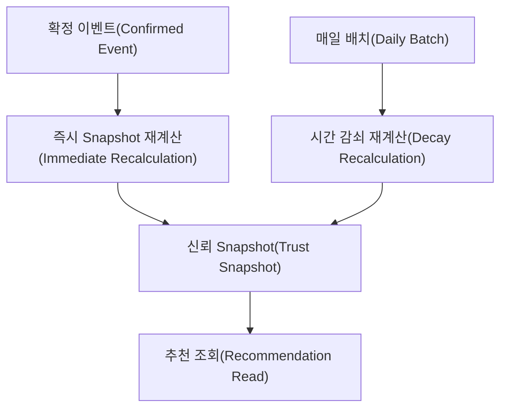
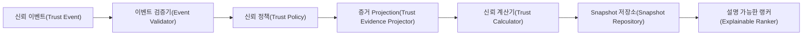
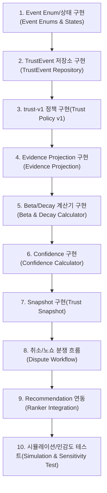
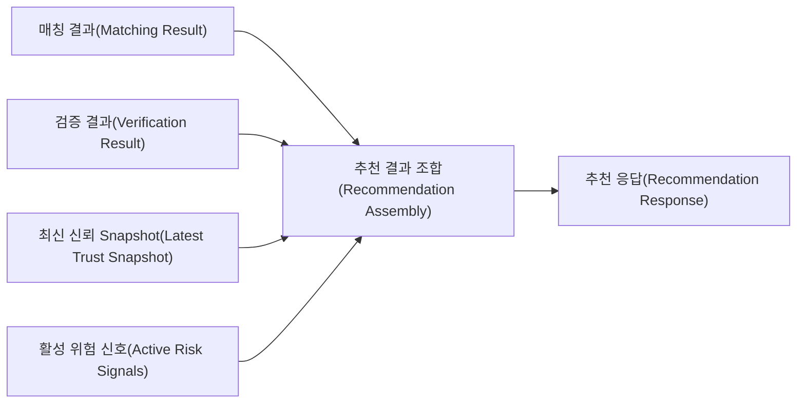
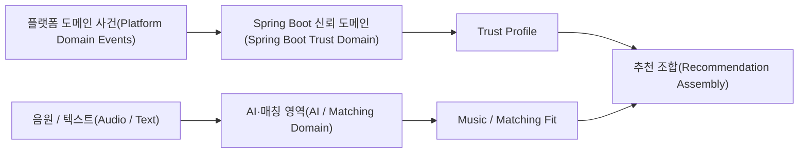

# Database & Implementation Roadmap

이 문서는 최종 정책을 Java / Spring Boot / PostgreSQL 구현으로 옮길 때 지켜야 할 저장 구조와 순서를 설명합니다.

---

# 1. 데이터 모델 핵심

```text
TrustEvent
= 변경하지 않는 원본 사실

TrustEvidence
= 특정 정책 버전으로 원본 Event를 R/S로 해석한 결과

ArtistTrustSnapshot
= 현재 시점의 Artist 단위 집계
```

이 세 계층을 분리합니다.

---

# 2. 추천 테이블

## `trust_event`

핵심 필드:

| Field | 설명 |
|---|---|
| `id` | UUID |
| `artist_id` | 대상 Artist |
| `performance_id` | 공연 |
| `contract_id` | 계약 |
| `event_type` | Event 종류 |
| `event_status` | PENDING / CONFIRMED / ... |
| `actor_type` | 신고/행동 주체 |
| `actor_id` | Actor ID |
| `responsible_party` | ARTIST / ORGANIZER / NONE / UNKNOWN |
| `reason_code` | 사유 |
| `occurred_at` | 실제 사건 시각 |
| `reported_at` | 신고 시각 |
| `confirmed_at` | 확정 시각 |
| `scheduled_start_at_snapshot` | 당시 공연 시작 시각 |
| `scheduled_end_at_snapshot` | 당시 종료 시각 |
| `required_check_in_at_snapshot` | 당시 체크인 시각 |
| `supersedes_event_id` | 정정 대상 Event |
| `dispute_id` | 관련 분쟁 |
| `source_type` | ARTIST / ORGANIZER / SYSTEM / ADMIN |
| `source_reference_id` | Evidence 참조 |
| `idempotency_key` | 중복 방지 |
| `metadata` | 비핵심 확장 JSONB |
| `created_at` | 생성 시각 |

### 저장하지 않는 값

```text
severity
temporal_weight
trust_score
confidence
```

이 값들은 시간이 흐르거나 정책이 바뀌면 달라질 수 있으므로 Raw Event에 저장하지 않습니다.

---

## `trust_evidence`

| Field | 설명 |
|---|---|
| `id` | UUID |
| `trust_event_id` | 원본 Event |
| `artist_id` | Artist |
| `policy_version` | `trust-v1` |
| `positive_evidence` | 기본 R |
| `negative_evidence` | 기본 S |
| `observation_value` | Confidence Observation |
| `derived_at` | 파생 시각 |

`ARTIST_NO_SHOW_CONFIRMED` 예:

```text
positive_evidence = 0
negative_evidence = 5
observation_value = 1
policy_version = trust-v1
```

시간 가중치는 Snapshot 계산 시 현재 시각으로 다시 계산합니다.

---

## `artist_trust_snapshot`

| Field | 설명 |
|---|---|
| `artist_id` | Artist |
| `policy_version` | 정책 버전 |
| `weighted_r` | 현재 시간 감쇠 R |
| `weighted_s` | 현재 시간 감쇠 S |
| `trust_estimate` | Beta 기댓값 |
| `n_eff` | 유효 Observation |
| `confidence` | 확신도 |
| `confidence_level` | LIMITED / MODERATE / HIGH |
| `completed_count` | 설명용 Raw Count |
| `artist_cancelled_count` | 설명용 Raw Count |
| `no_show_count` | 설명용 Raw Count |
| `calculated_at` | 계산 시각 |

---

## `trust_dispute`

| Field | 설명 |
|---|---|
| `id` | UUID |
| `trust_event_id` | 대상 Event |
| `opened_by` | 이의 제기자 |
| `status` | OPEN / UNDER_REVIEW / RESOLVED |
| `resolution` | ARTIST_FAULT / ORGANIZER_FAULT / NO_FAULT / REJECTED |
| `resolved_by` | 관리자 |
| `opened_at` | 생성 시각 |
| `resolved_at` | 해결 시각 |
| `evidence_refs` | 증거 참조 |

---

# 3. PostgreSQL 타입 선택

V1에서는 PostgreSQL ENUM보다:

```text
VARCHAR
+
Java enum
+
DB CHECK constraint
```

조합을 권장합니다.

이유:

- Event Type이 향후 늘어날 가능성이 큼
- PostgreSQL ENUM 변경보다 Migration 관리가 유연함
- Java Domain Enum으로 컴파일 시점 안정성을 얻을 수 있음

핵심 검색 필드는 JSONB로 숨기지 않고 정규 Column으로 둡니다.

---

# 4. 시간 저장

모든 서버 Timestamp는:

```text
TIMESTAMPTZ
UTC 저장
```

을 사용합니다.

사용자 UI에서 지역 시간으로 변환합니다.

`scheduled_start_at_snapshot`을 Event에 보존하는 이유는 공연 일정이 이후 수정되어도 **취소 당시의 통보 시간 계산을 재현하기 위해서**입니다.

---

# 5. Trust 계산

V1:

$$
R = \sum_i r_i e^{-\lambda \Delta t_i}
$$

$$
S = \sum_i s_i e^{-\lambda \Delta t_i}
$$

$$
Trust = \frac{R+1}{R+S+2}
$$

$$
N_{eff} = \sum_j e^{-\lambda \Delta t_j}
$$

$$
Confidence = 1-e^{-0.16094N_{eff}}
$$

$$
\lambda = \frac{\ln2}{365}
$$

---

# 6. Snapshot 갱신 전략

## 선택지 A. 요청마다 전체 Event 계산

항상 최신이지만 추천 요청마다 비용이 큽니다.

## 선택지 B. Event가 생길 때만 Snapshot 계산

빠르지만 시간이 지나면 Temporal Decay가 반영되지 않아 Snapshot이 오래될수록 틀립니다.

## 선택지 C. Event-driven + Daily Recalculation

**V1 선택: C**



추가 안전장치:

```text
Snapshot age > 24h
→ 추천 조회 전 Lazy Recalculation 허용
```

---

# 7. Policy Version

Raw Event는 정책과 독립적인 사실이므로 `severity=5` 같은 값을 저장하지 않습니다.

```text
TrustEvent
  policy-independent

TrustEvidence
  policy_version = trust-v1

ArtistTrustSnapshot
  policy_version = trust-v1
```

정책 변경:

```text
trust-v1
   ↓
trust-v2
   ↓
모든 CONFIRMED Event 재해석
   ↓
Snapshot 재생성
```

이 방식이면 과거 Event를 잃지 않고 정책 실험이 가능합니다.

---

# 8. Idempotency와 중복 방지

필수 규칙:

- 같은 Domain Event가 재전송되어도 TrustEvidence가 두 번 생기지 않음
- `idempotency_key` UNIQUE
- 한 Contract에는 활성 최종 Outcome 하나만 존재
- Reversal/Supersede 시 이전 Evidence를 무효화한 후 Snapshot 재계산

---

# 9. V1 Fraud Guard

ML 없이 다음을 구현합니다.

```text
1. 실제 Contract ID 필수
2. Event Status = CONFIRMED만 Evidence 생성
3. 하나의 Contract 결과 중복 집계 금지
4. No-show 관리자 판정
5. 리뷰는 Trust Score 미반영
6. 관리자 판정 Audit Log
7. Event 불변성 + Reversal
```

거래 금액과 상대방 반복 패턴은 저장할 수 있지만 V1 Trust Score의 Context Weight로 사용하지 않습니다.

---

# 10. Java / Spring Boot 도메인 경계

권장 컴포넌트:



Java에서 분리할 책임:

```text
TrustEvent
TrustEventType
TrustEventStatus
TrustPolicy
TrustEvidence
TemporalDecayPolicy
ConfidencePolicy
TrustCalculator
ArtistTrustSnapshot
TrustDisputeService
TrustSnapshotService
```

---

# 11. 구현 순서



---

# 12. 구현 완료 전 테스트해야 할 시나리오

### 신규 아티스트

```text
R=0, S=0
Trust=0.5
Confidence=0
```

### 정상 공연 10회

Trust는 높아지고 Confidence는 약 80%에 도달해야 합니다.

### 정상 공연 5회 후 No-show 1회

`S=5`의 영향이 뚜렷하게 나타나야 하지만 데이터 전체가 사라지지는 않아야 합니다.

### 2년 전 No-show

반감기 1년이면 현재 가중치는 약 25%가 되어야 합니다.

### Organizer 취소

Artist의 `R/S/N_eff`가 바뀌면 안 됩니다.

### No-show 신고 후 기각

`NO_SHOW_REPORTED`는 존재해도 최종 Trust는 바뀌면 안 됩니다.

### Event 중복 전송

동일 Idempotency Key로 Trust가 두 번 변하면 안 됩니다.

---

# 13. V2로 미루는 항목

V1 구현을 막지 않습니다.

- EigenTrust 기반 그래프 평판
- 자동 담합 탐지
- Isolation Forest
- Event별 서로 다른 Half-life
- 거래 금액 Context Weight
- Behavior Trust의 Ranker 반영
- Review Credibility 계산
- Learning to Rank
- Neural Ranker

이 항목은 **V1 미완료 사항이 아니라 의도적으로 분리한 V2 고도화 범위**입니다.


---

<a id="d26-data-boundary"></a>

# 14. Matching / Verification / Trust 데이터 경계

기존 `ADR-003-matching-verification-reliability-data-boundary.md`에서 이미 Accepted 되었고 현재 문서와 충돌하지 않는 데이터 경계를 유지합니다.

```text
Matching Result
= 특정 행사에 얼마나 잘 맞는가

Verification Result
= 무엇이 검증되었는가

Trust Event / Evidence
= 플랫폼에서 어떤 행동이 실제로 발생했는가

Artist Trust Snapshot
= 현재 정책으로 계산한 신뢰 결과

Risk Signal
= 현재 별도로 보여줘야 하는 위험 상태
```

이 모델들을 하나의 `artist_score` 테이블에 섞지 않습니다.

### 직접 FK로 묶지 않는 관계

```text
MATCHING_RESULT
    X
ARTIST_TRUST_SNAPSHOT
```

두 데이터의 수명이 다르기 때문에 Matching Result가 특정 Trust Snapshot을 직접 FK로 소유하지 않습니다.

추천 응답을 만들 때 Application 계층에서 `artistId`를 기준으로 최신 상태를 조합합니다.



---

<a id="d27-snapshot-history"></a>

# 15. Snapshot은 Append-only History로 저장한다

기존 ADR에서 확정했던 다음 결정을 유지합니다.

> Trust Snapshot은 최신 Row를 계속 `UPDATE`하는 것이 아니라 **새 Snapshot을 추가하여 계산 이력을 보존**합니다.

사용하지 않는 방식:

```text
Artist 42
trust_score = 83

재계산
→ 동일 Row를 88로 UPDATE
```

사용하는 방식:

```text
Snapshot #101
policyVersion = trust-v1
trust = 0.83

Snapshot #118
policyVersion = trust-v1
trust = 0.86

Snapshot #145
policyVersion = trust-v2
trust = 0.88
```

장점:

- 과거 결과 추적
- 정책 버전 변경 전후 비교
- 재계산 감사
- 설명 가능성
- 버그 재현

현재 값은 `artist_id + calculated_at DESC` 기준 최신 Snapshot을 조회합니다.

PostgreSQL 인덱스 개념:

```sql
CREATE INDEX idx_artist_trust_snapshot_artist_calculated
    ON artist_trust_snapshot (artist_id, calculated_at DESC);
```

### 기존 Snapshot을 수정해야 하는가?

Raw Event가 Reverse/Supersede되더라도 기존 Snapshot History를 삭제하거나 수정하지 않습니다.

새로운 계산 시점의 Snapshot을 추가합니다.

---

<a id="d28-risk-signal"></a>

# 16. Risk Signal은 Trust Score와 분리한다

기존 ADR에서 유지하는 중요한 원칙입니다.

```text
No-show 1건
  ├─ Trust Evidence로 S에 반영
  └─ RECENT_NO_SHOW Risk Signal의 근거가 될 수 있음
```

하지만:

```text
No-show → S += 5
       + 추가 -30점
```

처럼 같은 사건을 두 번 감점하지 않습니다.

개념 모델:

```text
artist_risk_signal
- id
- artist_id
- risk_type
- status
- source_evidence_id
- detected_at
- resolved_at
- policy_version
```

초기 Risk Type 후보:

```text
RECENT_NO_SHOW
REPEATED_ARTIST_CANCELLATION
REPEATED_LATE_ARRIVAL
REPEATED_NO_RESPONSE
REPUTATION_MANIPULATION_SUSPECTED
ACCOUNT_SANCTION
```

V1에서는 Risk Signal을 자동 점수 가중치로 사용하지 않고 설명·운영 판단용으로 유지합니다.

---

<a id="d29-system-ownership"></a>

# 17. Spring Boot와 AI/Matching 서버 책임 경계

기존 `ADR-001`의 시스템 경계 결정을 유지합니다.

## Spring Boot Backend

소유 책임:

- Performance / Contract / Offer 등 도메인 상태
- Trust Event 생성과 검증
- Responsible Party 판정 결과
- Trust Evidence 생성
- Trust 계산
- Confidence 계산
- Risk Signal
- Trust Snapshot
- Verification 결과
- 추천 API의 최종 조합

## AI / Matching 영역

소유 책임:

- CLAP Embedding
- 음악 의미 유사도
- BPM / Rhythm / Audio Feature
- 음악 기반 후보 검색 및 Matching 계산

AI/Matching 영역은 공연 완료·취소·No-show의 기준 원본을 소유하지 않으므로 **Artist Trust를 직접 계산하지 않습니다.**



---

<a id="d30-batch-query"></a>

# 18. 추천 TOP N은 일괄 조회한다

기존 ADR의 N+1 방지 결정을 유지합니다.

사용하지 않는 방식:

```java
for (MatchingResult result : matchingResults) {
    trustRepository.findLatestByArtistId(result.artistId());
}
```

권장 구조:

```text
TOP N Artist IDs
    ↓
Trust Snapshot 일괄 조회
Verification 일괄 조회
Risk Signal 일괄 조회
    ↓
Map<ArtistId, ...>
    ↓
Recommendation Assembler
```

추천 결과 수가 늘어도 아티스트마다 DB Query를 반복하지 않습니다.

---

# 19. 패키지 경계

기존 ADR의 도메인 분리 원칙을 현재 용어로 유지합니다.

```text
matching/
├── domain/
└── application/

verification/
├── domain/
├── application/
└── infrastructure/

trust/
├── domain/
│   ├── event/
│   ├── evidence/
│   ├── snapshot/
│   ├── risk/
│   └── policy/
├── application/
│   ├── calculate/
│   ├── dispute/
│   └── query/
└── infrastructure/
    └── persistence/

recommendation/
└── application/
    ├── RecommendationQueryService
    └── RecommendationAssembler
```

Trust를 `matching/` 하위 패키지로 넣지 않습니다.

---

# 20. Cold Start 전용 테이블을 만들지 않는다

기존 `ADR-004`에서 유지할 수 있는 비충돌 결정입니다.

신규 아티스트라고 해서 별도의 Cold Start Evidence 테이블을 만들지 않습니다.

```text
신규 Artist
   ↓
동일 TrustEvent / TrustEvidence 사용
   ↓
Confidence와 Evidence 상태로 데이터 부족을 표현
```

현재 `trust-v1`의 신규 아티스트 노출/표현 정책은 최신 문서의 Cold Start 결정을 따릅니다.
