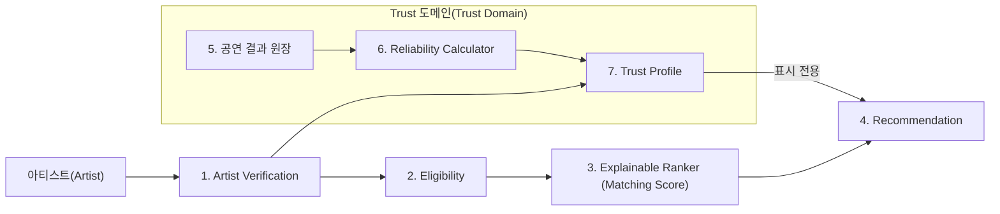

# 아티스트 신뢰성 아키텍처 문서

> **결정사항 빠른 이동:** [00_decision_index.md](./00_decision_index.md)에서 현재 구현 기준의 모든 주요 결정으로 바로 이동할 수 있습니다.
> 졸업작품의 **Artist Trust / Reputation System**을 비전공자도 이해할 수 있도록 정리한 문서 모음입니다.  
> 문서의 기준은 현재까지 대화에서 정한 아키텍처와 제공된 평판 시스템 관련 논문입니다.

---

## 1. 이 문서를 왜 만들었는가

우리 서비스의 추천 기능은 단순히 **“음악이 행사 분위기와 잘 맞는 아티스트”**를 찾는 것만으로는 충분하지 않습니다.

EVENT_PARTNER 입장에서는 다음과 같은 걱정이 있습니다.

- 이 사람이 실제 활동하는 아티스트인가?
- 업로드한 작업물이 본인의 작업물이 맞는가?
- 계약을 맺고 공연 당일 실제로 올 것인가?
- 공연을 자주 취소하는 사람은 아닌가?
- 플랫폼에서 거래 이력이 없는 신규 아티스트는 어떻게 판단해야 하는가?
- 별점이나 리뷰를 서로 짜고 올리면 어떻게 해야 하는가?
- 오래전의 실수와 최근의 성실한 활동을 똑같이 평가해도 되는가?

따라서 추천 시스템 내부에 **아티스트 신뢰성 평가 시스템**을 별도 영역으로 설계합니다.

핵심 생각은 다음 한 문장으로 요약할 수 있습니다.

> **아티스트를 “좋은 사람 / 나쁜 사람”으로 평가하는 것이 아니라, 검증 가능한 사실과 플랫폼에서 관측된 거래 이력을 이용하여 앞으로의 거래 위험을 설명 가능한 형태로 보여준다.**

---

## 2. 현재 상태를 읽는 방법

문서에서는 설계 상태를 세 단계로 나눕니다.

| 표시 | 의미 |
|---|---|
| **[V1 확정]** | 현재 구현에 사용할 기본 정책 |
| **[설계 원칙]** | 버전이 바뀌어도 유지할 구조적 원칙 |
| **[V2 보류]** | V1 구현을 막지 않으며 데이터 축적 후 검토할 고도화 항목 |

현재는 구현 시작을 위해 V1 정책값을 확정했습니다.

```text
공연 결과 해석        정상 완료 = 성공 1건, 아티스트 귀책 취소·노쇼 = 실패 1건
최근성 감쇠           관측 순서 기준, γ = 0.95 (약 14건마다 영향력 절반)
확신 수준             관측 건수: 낮음 ≤ 3 (점수 숨김) / 보통 4~9 / 높음 ≥ 10
Risk Signal           최근 관측 14건 안의 노쇼·24시간 미만 통보 취소·반복 취소
추천 순위             Matching Score만 사용, Trust Profile은 표시 전용
```

이 값들은 학술적으로 영구 고정된 정답이 아니라 `reliability-v1` 서비스 정책입니다. 공연 결과 원장을 보존하므로 이후 시뮬레이션과 운영 데이터에 따라 `reliability-v2`로 재계산할 수 있습니다. 2026-10-03에 이전 `trust-v1`을 대체했습니다.

용어 정의는 저장소 루트의 [CONTEXT.md](../../../CONTEXT.md)를 따릅니다.

---

## 3. 문서 구성

### [00_decision_index.md](./00_decision_index.md)

현재 구현 기준의 모든 결정사항을 한 페이지에서 찾는 **Decision Hub**입니다.

### [01_artist_trust_architecture.md](./01_artist_trust_architecture.md)

전체 아키텍처와 개념 관계를 설명합니다.

### [02_problem_solution_tradeoffs.md](./02_problem_solution_tradeoffs.md)

문제 → 선택지 → Trade-off → 현재 결정의 흐름을 기록합니다.

### [03_research_foundations.md](./03_research_foundations.md)

연구 근거와 프로젝트 자체 정책값을 구분합니다.

### [04_final_policy_decisions.md](./04_final_policy_decisions.md)

V1 실제 운영 정책값을 확정한 문서입니다.

### [05_trust_event_catalog.md](./05_trust_event_catalog.md)

공연 결과 카탈로그와 원장 입력 계약을 정의합니다.

### [06_database_and_implementation_roadmap.md](./06_database_and_implementation_roadmap.md)

공연 결과 원장, 조회 시 계산, Risk Signal, Spring Boot 책임 경계와 구현 순서를 설명합니다.

### [07_external_account_verification_policy.md](./07_external_account_verification_policy.md)

기존 ADR-005의 비중복 Provider별 External Account / OAuth 결정을 통합합니다.

### [08_deprecated_legacy_decisions.md](./08_deprecated_legacy_decisions.md)

삭제된 이전 Artist Trust ADR과 `trust-v1`에서 현재 V1이 폐기·대체한 결정과 그 이유만 간단히 기록합니다.

### [09_reliability_decay_gamma.md](./09_reliability_decay_gamma.md)

관측 순서 기반 감쇠와 γ = 0.95를 선택한 ADR입니다.

---

## 4. 전체 시스템 한눈에 보기



이 구조에서 중요한 것은 다음 세 가지입니다.

1. **인증(Verification)과 평판(Reputation)을 분리한다.**
2. **신뢰도를 별점 하나로 만들지 않는다.**
3. **최종 결과보다 근거를 먼저 보존한다.**

---

## 5. 현재 아키텍처 핵심 요약

### [확정] Verification과 Trust는 다른 개념

```text
Identity Verified
        ≠
Reliable Performer
```

본인 인증을 했다고 해서 공연을 잘 지킨다는 뜻은 아닙니다.

반대로 공연을 여러 번 잘 했더라도 해당 계정이나 작업물 권리가 검증되었다는 뜻도 아닙니다.

---

### [확정] Trust는 추천 적합도와 다른 평가 축

```text
Music Fit
Business Fit
Performance Fit
Artist Trust
```

이 네 가지는 서로 다른 질문에 답합니다.

| 평가 | 질문 |
|---|---|
| Music Fit | 음악적으로 행사와 잘 맞는가? |
| Business Fit | 예산, 지역 등 비즈니스 조건이 맞는가? |
| Performance Fit | 행사 공연 조건을 만족하는가? |
| Artist Trust | 실제 거래를 진행하기에 신뢰할 근거가 있는가? |

---

### [확정] 설명 가능성을 우선

최종 결과를 단순히 다음처럼 보여주는 것이 목표가 아닙니다.

```text
신뢰도 87점
```

대신 아래처럼 **왜 그런 판단을 했는지** 함께 보여주는 것이 목표입니다.

```text
본인 인증              완료
권리 인증              완료
아티스트 귀책 기준 이행률  91%
확신 수준              높음 (관측 17건)
정상 완료              16회
아티스트 귀책 취소      1회 (3일 전 통보)
No-show                0회
계산 제외              1건 (EVENT_PARTNER 귀책 취소)
최근 12개월 공연        8회
```

---

## 6. 추천하는 문서 읽는 순서

처음 보는 사람이라면 다음 순서가 가장 쉽습니다.

```text
README
 ↓
00. Decision Index
 ↓
01. 전체 아키텍처
 ↓
04. V1 최종 정책 결정
 ↓
05. 공연 결과 카탈로그
 ↓
06. DB / 구현 Roadmap

필요 시
02. Trade-off / 03. 논문 근거 / 07. External Account / 08. 폐기된 이전 결정 / 09. γ 결정 ADR
```

---

## 7. 최신 결정: Reliability 계산 골격

현재 Artist Reliability 계산의 핵심 골격은 다음과 같습니다.

```text
판정이 끝난 공연 결과
   ↓
귀책 해석 (관측 여부)
   ↓
이진 관측 x = 1 / 0
   ↓
행동 시각 순서 정렬
   ↓
관측 순서 감쇠 (γ = 0.95)
   ↓
Artist Reliability

+ 별도의 확신 수준 (관측 건수)
+ 별도의 Risk Signal (최근 관측 14건)
```

```text
α₀ = 1,  β₀ = 1
αₜ = 0.95 × αₜ₋₁ + xₜ
βₜ = 0.95 × βₜ₋₁ + (1 − xₜ)
Rₜ = αₜ / (αₜ + βₜ)
```

관측이 확정될 때마다 기존 이행·실패 누적값의 영향력을 95%로 줄이고 새 결과를 더합니다. Reliability는 전체 누적값 중 이행의 비율입니다.

V1에서는 다음까지 확정했습니다.

```text
정상 완료 = 성공 1건, 아티스트 귀책 취소·노쇼 = 실패 1건
γ = 0.95 (사건 반감기 약 14건)
확신 수준 = 관측 건수 (낮음 ≤ 3 / 보통 4~9 / 높음 ≥ 10)
Risk Signal = RECENT_NO_SHOW / LATE_ARTIST_CANCELLATION / REPEATED_ARTIST_CANCELLATION
Review = Reliability 계산 제외
추천 순위 = Matching Score만 사용
신규 노출 = Top10 아래 별도 1칸
```

이 값들은 `reliability-v1` 정책으로 관리하며 이후 시뮬레이션과 운영 데이터에 따라 새 정책 버전으로 조정할 수 있습니다. γ 선택 근거는 [09 ADR](./09_reliability_decay_gamma.md)에 있습니다.

---

## 8. 한 문장 정의

> **Artist Trust System은 아티스트의 신원·권리 검증 정보와 플랫폼에서 판정으로 확정한 공연 결과를 수집하고, 최근성·근거 충분도·조작 가능성을 고려하여 설명 가능한 Trust Profile을 만든 뒤 추천 결과와 함께 별도 정보로 제공하는 시스템이다.**
