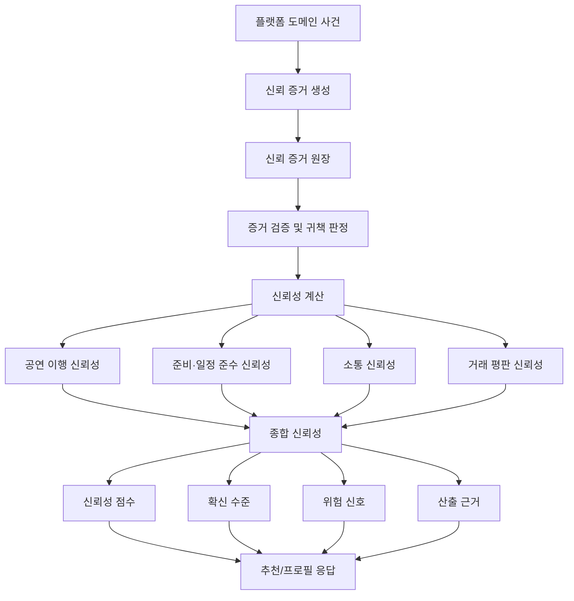
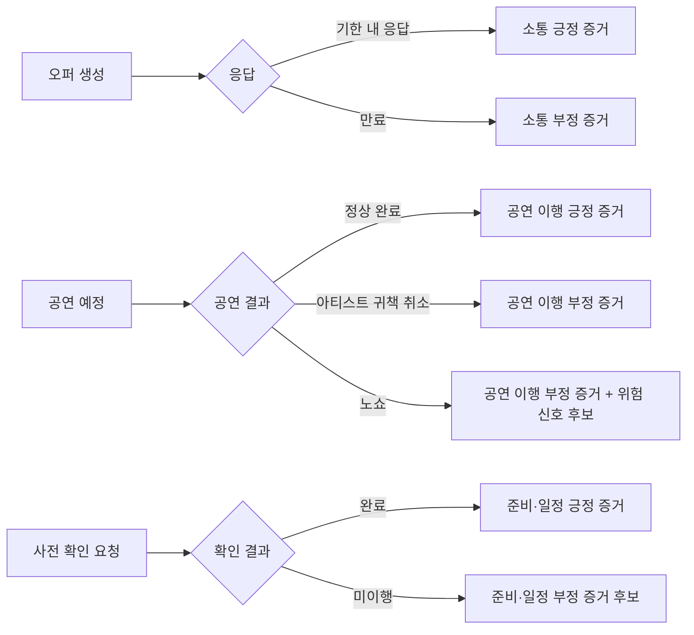

# 아티스트 신뢰성 모델 V2

> 문서 상태: 설계 제안 — PR 검토 대상  
> 제품 요구사항 기준: Linear SSOT v1.3 `TRUST-142~154`  
> 구현 책임 범위: Spring Boot 백엔드  
> 작성일: 2026-09-30

## 1. 이 문서가 해결하려는 문제

우리 서비스에서 **매칭 적합도**와 **아티스트 신뢰성**은 서로 다른 질문에 답한다.

- 매칭 적합도: "이 행사 조건에 이 아티스트가 얼마나 잘 맞는가?"
- 아티스트 신뢰성: "이 아티스트가 약속된 공연과 섭외 과정을 얼마나 안정적으로 이행할 근거가 있는가?"

따라서 음악 유사도, BPM, 리듬, 예산, 지역, 일정 같은 매칭 조건과 공연 완료, 귀책 취소, 노쇼, 응답, 검증 후기 같은 신뢰 근거를 하나의 점수에 섞지 않는다.

이 문서는 아티스트 신뢰성을 다음 네 가지 결과로 설명할 수 있게 만드는 기술 설계다.

1. **신뢰성 점수**
2. **확신 수준**
3. **위험 신호**
4. **산출 근거**

---

## 2. 핵심 원칙

### 2.1 매칭 적합도와 신뢰성은 분리한다

```text
행사-아티스트 추천 결과
│
├── 매칭 적합도
│   ├── 음악 의미 적합도
│   ├── BPM 적합도
│   ├── 리듬 적합도
│   ├── 공연 스타일 적합도
│   └── 운영 조건
│
└── 아티스트 신뢰성
    ├── 신뢰성 점수
    ├── 확신 수준
    ├── 위험 신호
    └── 산출 근거
```

아티스트 신뢰성을 매칭 점수 원본에 합쳐 저장하지 않는다.

랭킹 보정이 필요하더라도 별도의 파생 값으로 계산하며, 실제 보정 방식은 별도 결정이 있기 전까지 확정하지 않는다.

### 2.2 검증 정보와 신뢰성은 분리한다

다음은 **검증 정보**다.

- 실명 본인확인
- YouTube/SoundCloud 등 외부 아티스트 계정 연결
- 저작권 보유 증빙
- 실연 참여 증빙
- 공식 발매 또는 공연 활동 증빙

이 정보는 "누구인지", "어떤 권리나 활동을 확인했는지"를 나타낸다.

반면 아티스트 신뢰성은 "플랫폼 활동을 얼마나 안정적으로 이행했는지"를 나타낸다.

따라서 다음과 같은 방식은 사용하지 않는다.

```text
저작권 인증 완료 → 신뢰성 +20점
외부 계정 연결 → 신뢰성 +10점
```

### 2.3 신규 아티스트를 낮은 신뢰도로 취급하지 않는다

거래 이력이 없다는 이유만으로 신규 아티스트를 0점 또는 저신뢰 상태로 만들지 않는다.

신규 아티스트는 다음처럼 표현한다.

```text
신뢰성 데이터: 부족
확신 수준: 낮음
플랫폼 공연 이력: 0건
```

---

## 3. 전체 구조



이 구조의 핵심은 **점수보다 먼저 증거를 저장하는 것**이다.

최종 점수만 저장하면 "왜 이 점수가 나왔는가?"를 설명하기 어렵다. 반대로 원시 증거를 보존하면 계산식을 변경해도 다시 계산할 수 있고, 사용자에게 산출 근거도 제공할 수 있다.

---

## 4. 신뢰 증거

### 4.1 증거는 플랫폼에서 발생한 사건으로 만든다

초기 신뢰 증거 후보는 다음과 같다.

| 영역 | 사건 | 기본 의미 | 현재 MVP |
| --- | --- | --- | --- |
| 공연 이행 | 공연 정상 완료 | 긍정 근거 | 후속 활성화 |
| 공연 이행 | 아티스트 귀책 취소 | 부정 근거 | 후속 활성화 |
| 공연 이행 | 노쇼 | 부정 근거 + 위험 신호 후보 | 후속 활성화 |
| 준비·일정 | 사전 일정 확인 완료 | 긍정 근거 | 후속 활성화 |
| 준비·일정 | 체크인/현장 도착 확인 | 긍정 근거 | 후속 활성화 |
| 준비·일정 | 합의 시간 미준수 | 부정/위험 근거 후보 | 후속 활성화 |
| 소통 | 응답 기한 내 오퍼 응답 | 긍정 근거 | Offer 기능 범위에 따라 가능 |
| 소통 | 늦은 응답 | 부분 근거 후보 | Offer 기능 범위에 따라 가능 |
| 소통 | 오퍼 무응답 만료 | 부정 근거 | Offer 기능 범위에 따라 가능 |
| 거래 평판 | 검증된 거래 후기 | 평판 근거 | 후속 활성화 |

현재 MVP에서 실제 계약·공연 완료·노쇼·체크인·거래완료 기반 후기가 생성되지 않는다면 **데이터 구조만 준비하고 사건 생성은 하지 않는다.**

### 4.2 귀책 주체를 반드시 구분한다

공연이 취소됐다는 사실만으로 아티스트를 감점하면 안 된다.

```text
취소 사건
│
├── 아티스트 귀책
├── 행사 관계자 귀책
├── 상호 합의
├── 불가항력
├── 플랫폼 귀책
└── 기타
```

초기 귀책 주체는 다음 값을 사용한다.

- `ARTIST`
- `EVENT_PARTNER`
- `MUTUAL`
- `FORCE_MAJEURE`
- `PLATFORM`
- `OTHER`

아티스트 귀책이 아닌 사건은 아티스트의 자동 부정 근거로 사용하지 않는다.

---

## 5. 신뢰 증거 원장의 개념 모델

구체적인 DB 테이블명은 구현 이슈에서 확정한다. 여기서는 저장해야 할 개념만 정의한다.

| 항목 | 설명 |
| --- | --- |
| 증거 식별자 | 개별 신뢰 증거를 구분하는 ID |
| 대상 아티스트 | 신뢰성 평가 대상 |
| 증거 유형 | 공연 완료, 노쇼, 응답 만료 등 |
| 신뢰성 영역 | 공연 이행 / 준비·일정 / 소통 / 거래 평판 |
| 발생 시각 | 사건 발생 시각 |
| 관련 도메인 | Event / Offer / 향후 Booking·공연 등 |
| 귀책 주체 | 실패·취소 사건의 책임 주체 |
| 결과 값 | 성공 / 실패 / 부분 성공 |
| 증거 출처 | 상태 머신, 시스템 기록, 사용자 확인 등 |
| 검증 상태 | 계산에 사용할 수 있는 수준인지 표시 |
| 계산 포함 여부 | 현재 계산 대상인지 여부 |
| 제외 사유 | 계산에서 제외한 이유 |
| 위험 신호 후보 | 위험 신호 생성에 사용할 수 있는지 여부 |

### 증거 출처 우선순위

가능하면 플랫폼이 직접 관찰할 수 있는 정보를 우선한다.

```text
플랫폼 상태 머신 / 시스템 기록
        ↓
양측 확인
        ↓
단일 사용자 주장
```

단일 사용자 주장만으로 강한 부정 신호가 자동 생성되지 않도록 검증 상태를 둔다.

---

## 6. 네 개의 신뢰성 영역

### 6.1 공연 이행 신뢰성

가장 직접적인 거래 이행 근거다.

주요 증거:

- 공연 정상 완료
- 아티스트 귀책 취소
- 노쇼

### 6.2 준비·일정 준수 신뢰성

공연 전 준비 과정에서 약속된 절차를 이행했는지를 본다.

주요 증거:

- 사전 일정 확인
- 공연 준비 절차 이행
- 체크인 또는 현장 도착 확인
- 합의 시간 준수

상시 위치 추적은 V2 범위에 포함하지 않는다.

### 6.3 소통 신뢰성

섭외 및 공연 준비 과정에서 필요한 응답을 정상적으로 수행했는지를 본다.

주요 증거:

- 응답 기한 내 오퍼 응답
- 늦은 응답
- 오퍼 무응답 만료

단순히 "5분 응답은 100점, 3시간은 80점" 같은 임의적인 연속 감점보다 **플랫폼 정책 기한 충족 여부**를 우선 사용한다.

### 6.4 거래 평판 신뢰성

평판은 실제 거래와 연결된 후기만 사용한다.

```text
실제 거래/공연
    ↓
완료 확인
    ↓
검증된 후기
```

거래와 연결되지 않은 일반 별점은 아티스트 신뢰성의 핵심 근거로 사용하지 않는다.

---

## 7. 계산 모델

### 7.1 기본 방향

V2는 성공/실패 또는 부분 성공 증거를 누적할 수 있는 **Beta Reputation 기반 계산**을 기술적 기본안으로 사용한다.

각 신뢰성 영역 `d`에서:

```text
S_d = Σ(w_e × x_e)
F_d = Σ(w_e × (1 - x_e))

α_d = α0 + S_d
β_d = β0 + F_d

영역 신뢰성 = α_d / (α_d + β_d)
```

- `x_e = 1`: 성공
- `x_e = 0`: 실패
- `0 < x_e < 1`: 부분 성공
- `w_e`: 증거 가중치
- `α0, β0`: 사전분포 파라미터

초기 파라미터 값은 아직 확정하지 않는다.

### 7.2 증거 가중치

증거 가중치는 다음 요소를 조합할 수 있도록 설계한다.

```text
증거 가중치
= 최근성 가중치
× 거래 맥락 가중치
× 증거 검증 가중치
```

시간 감쇠의 구현 후보는 반감기 형태다.

```text
최근성 가중치 = 2 ^ (-경과일 / 반감기)
```

다만 반감기와 각 맥락 가중치의 실제 값은 PR 리뷰 및 별도 결정 후 확정한다.

### 7.3 종합 신뢰성

네 개의 영역 점수를 하나의 종합 신뢰성으로 보여줄 수 있지만, 각 영역의 가중치는 아직 확정하지 않는다.

```text
종합 신뢰성
= 공연 이행 신뢰성
+ 준비·일정 준수 신뢰성
+ 소통 신뢰성
+ 거래 평판 신뢰성
```

실제 구현에서는 가중합 또는 다른 집계 방식을 선택할 수 있다. **제품 SSOT에는 특정 숫자를 고정하지 않는다.**

---

## 8. 확신 수준

신뢰성 점수와 **데이터가 얼마나 충분한지**는 다른 정보다.

예를 들어 아래 두 아티스트가 같은 90점이라도 의미가 다르다.

```text
아티스트 A: 근거 2건 → 신뢰성 90점 / 확신 낮음
아티스트 B: 근거 30건 → 신뢰성 90점 / 확신 높음
```

기술 구현 후보는 유효 증거량 `N_eff`를 이용하는 방식이다.

```text
확신 계수 = N_eff / (N_eff + K)
```

`K`와 낮음/보통/높음 표시 임계값은 아직 확정하지 않는다.

향후에는 Beta 분포의 신뢰구간 폭을 이용하는 방식도 비교할 수 있다.

---

## 9. 위험 신호

위험 신호는 신뢰성 점수와 별도로 관리한다.

초기 후보:

- 최근 노쇼
- 반복 아티스트 귀책 취소
- 반복 지각
- 반복 무응답
- 평판 조작 의심
- 계정 제재

중요한 원칙은 **중복 감점을 하지 않는 것**이다.

예를 들어 노쇼가 공연 이행 신뢰성의 실패 근거로 이미 반영됐다면, 위험 신호에서 다시 `-30점` 같은 고정 감점을 적용하지 않는다.

위험 신호는 사용자 설명, 내부 제한 정책 또는 운영 판단에 사용할 수 있다.

---

## 10. 콜드 스타트

신규 아티스트에게 거래 이력이 없다는 이유로 부정적인 점수를 주지 않는다.

### 사용자 표현 예시

```text
아티스트 신뢰 정보

신뢰성 데이터: 아직 부족함
확신 수준: 낮음

본인확인: 완료
권리 검증: 완료

플랫폼 공연 이력: 0건
노쇼 이력: 0건
```

여기서 본인확인과 권리 검증은 **신뢰성 점수를 올리는 값이 아니라 별도의 검증 정보**다.

---

## 11. Spring Boot와 AI 서버의 책임 경계

Artist Reliability V2는 **Spring Boot 백엔드가 소유하는 도메인 모델**로 둔다.

### Spring Boot 백엔드

- Event / Offer / 사용자 / 검증 정보 관리
- 도메인 상태 변경
- 신뢰 증거 생성 및 저장
- 귀책 주체와 검증 상태 관리
- 신뢰성 계산
- 확신 수준 계산
- 위험 신호 판정
- 신뢰성 결과 및 설명 근거 제공

### AI/Matching 서버

- CLAP 기반 음악 의미 유사도
- 오디오 특징 추출
- 음악/BPM/리듬 등 매칭 계산
- AI/임베딩 영역의 매칭 결과 반환

AI 서버는 아티스트의 공연 완료, 취소, 노쇼, 응답 이력을 소유하지 않으므로 **Artist Reliability의 기준 원본을 계산하지 않는다.**

두 서버가 함께 사용하는 추천 응답에서는 적합도와 신뢰 정보를 별도 필드로 합성한다.

---

## 12. 응답 계약 예시

실제 DTO 이름은 구현 이슈에서 확정한다.

```json
{
  "artistId": 123,
  "matching": {
    "overallScore": 89.0,
    "musicSimilarity": 92.0,
    "bpmScore": 87.0,
    "rhythmScore": 85.0
  },
  "reliability": {
    "status": "AVAILABLE",
    "score": 88.0,
    "confidence": "HIGH",
    "dimensions": {
      "performance": 90.0,
      "schedule": 87.0,
      "communication": 85.0,
      "reputation": 89.0
    },
    "riskSignals": [],
    "evidenceSummary": {
      "completedPerformances": 10,
      "artistCancellations": 1,
      "noShows": 0
    }
  }
}
```

신규 아티스트처럼 데이터가 부족할 때는 `score = 0`으로 표현하지 않는다.

예:

```json
{
  "reliability": {
    "status": "INSUFFICIENT_DATA",
    "score": null,
    "confidence": "LOW"
  }
}
```

이 표현은 구현 후보이며 최종 API 규칙은 별도 검토에서 확정한다.

---

## 13. 상태 머신에서 증거가 만들어지는 방식



증거 생성은 도메인 상태 변경과 같은 트랜잭션 경계를 기준으로 설계하고, 중복 증거가 생성되지 않도록 멱등성을 보장해야 한다.

---

## 14. 설명 가능성

사용자에게 최종 숫자만 보여주지 않는다.

예:

```text
아티스트 신뢰성
88점 · 확신 높음

공연 이행       90점
준비·일정       87점
소통            85점
거래 평판       89점

근거
- 최근 공연 10건 정상 완료
- 아티스트 귀책 취소 1건
- 노쇼 0건
- 검증된 후기 8건

위험 신호
- 없음
```

설명 문구는 원시 증거에서 규칙 기반으로 생성할 수 있어야 한다. V2에서는 설명 생성을 위해 LLM을 필수로 요구하지 않는다.

---

## 15. 조작 방어

V2에서는 복잡한 그래프 알고리즘이나 GNN을 구현하지 않는다.

MVP/초기 구현에서 우선하는 방어는 다음과 같다.

- 실제 거래와 연결되지 않은 리뷰 제외
- 동일 거래당 리뷰 횟수 제한
- 계산에 포함된 증거의 원본 도메인 추적
- 증거 중복 생성 방지
- 사용자 일방 주장과 시스템 관측 근거 구분
- 의심스러운 증거를 계산에서 제외할 수 있는 상태 제공
- 계정 재가입/평판 세탁을 향후 탐지할 수 있는 확장 구조

EigenTrust 전체 그래프 계산, GNN 기반 공모 탐지는 장기 확장으로 둔다.

---

## 16. 현재 MVP와 후속 범위

### 현재 MVP에서 확정할 것

- 매칭 적합도와 아티스트 신뢰성 분리
- 검증 정보와 신뢰성 분리
- 신뢰 증거 데이터 모델
- 신뢰성 계산 인터페이스
- 신규 아티스트 데이터 부족 상태
- 추천 응답의 적합 정보/신뢰 정보 분리
- 선택적 Trust Verification과 Reliability의 경계

### 거래·공연 기능 이후 활성화

- 실제 공연 완료 근거
- 아티스트 귀책 취소
- 노쇼
- 공연 전 체크인
- 실제 거래 이력 기반 계산
- 검증된 거래 후기

### V2 범위 밖

- EigenTrust 전체 그래프
- GNN 기반 공모 탐지
- 머신러닝 기반 신뢰성 예측
- 상시 위치 추적
- 실시간 위치 기반 신뢰성 점수
- 결제/에스크로 자체를 신뢰성 요소로 사용

---

## 17. 아직 결정하지 않은 항목

이 문서가 존재한다고 해서 아래 항목이 자동으로 확정되는 것은 아니다.

| 항목 | 상태 |
| --- | --- |
| 네 신뢰성 영역의 최종 가중치 | 결정 필요 |
| 시간 감쇠 반감기 | 결정 필요 |
| 행사 중요도/증거 검증 가중치 | 결정 필요 |
| 확신 수준 계산식의 최종 형태 | 결정 필요 |
| 낮음/보통/높음 표시 임계값 | 결정 필요 |
| 위험 신호별 임계값 | 결정 필요 |
| 위험 신호 사용자 노출 정책 | 결정 필요 |
| Artist Reliability의 랭킹 보정 여부 | 결정 필요 |
| 신규 아티스트의 최종 API/UI 표시 형식 | 결정 필요 |
| EVENT_PARTNER 신뢰성 모델 | 별도 설계 |

---

## 18. 관련 요구사항과 이슈

### Linear 요구사항

- `TRUST-142` 양측 Trust Signal
- `TRUST-143` Trust Signal과 Matching Score 분리
- `TRUST-144` 플랫폼 활동 이력 기반 거래 신뢰도
- `TRUST-145~154` Artist Reliability V2

### Linear 이슈

- NSU-18 — Trust Signal과 Matching Score 분리
- NSU-19 — 아티스트·주최자 신뢰도 요소 설계
- NSU-20 — 거래 신뢰도 계산 시스템 설계
- NSU-32 — 거래 Trust Signal 모델 설계
- NSU-39 — 아티스트·주최자 Trust Signal 요소 설계
- NSU-53 — Trust Signal과 Matching Score 데이터 모델 분리

### GitHub 이슈

- #21 — Trust Signal과 Matching Score 분리
- #22 — 아티스트·주최자 신뢰도 요소 설계
- #23 — 거래 신뢰도 계산 시스템 설계
- #36 — 거래 Trust Signal 모델 설계
- #43 — 아티스트·주최자 Trust Signal 요소 설계
- #57 — Trust Signal과 Matching Score 데이터 모델 분리

---

## 19. 연구 및 선행기술 근거

이 설계는 다음 자료의 아이디어를 프로젝트 상황에 맞게 조합했다. 논문의 알고리즘을 그대로 복제한 것이 아니라, 각 연구가 제시한 문제와 설계 원칙을 활용한다.

### 연구

- **PeerTrust (Xiong & Liu, 2003)**
  - 피드백뿐 아니라 거래 횟수, 평가자 신뢰성, 거래 맥락 등을 고려하는 관점
- **The Beta Reputation System (Ismail & Jøsang, 2002)**
  - 성공/실패 증거를 Beta 분포로 누적하는 확률적 평판 모델
- **EigenTrust (Kamvar et al., 2003)**
  - 평가자의 신뢰성 및 공모 공격을 고려하는 확장 관점
- **Survey of Attack and Defense Techniques for Reputation Systems**
  - 자기 평판 부풀리기, 비방, 공모, 평판 세탁 등 공격 모델
- **Reputation Meta-analysis (Jiao et al., 2021)**
  - 온라인 시장에서 평판 정보가 거래 행동과 관련된다는 실증적 근거
- **Monitoring and Cold Start in Digital Platforms**
  - 이력 부족이 신규 참여자의 진입 장벽이 될 수 있다는 콜드 스타트 관점

### 선행특허 조사에서 참고한 항목

- `KR103014044B1` — 추천 이후 섭외·운영 흐름, 행사 당일 운영 리스크
- `KR102622507B1` — 과거 행사·아티스트 관계 데이터
- `KR102138881B1` — 일정·이동·예산과 실제 섭외 가능성
- `KR101850494B1` — 지각·노쇼·응답 등 운영 신뢰 지표
- `KR102830771B1` — 행사 운영 결과와 설명 가능한 차이
- `KR20240060171A` — 성과 예측은 신뢰성과 별도 축으로 분리
- `KR102261834B1` — 검증된 공연 이력의 아티스트 프로필 연결

> 선행특허는 기술·제품 설계를 이해하기 위한 참고 자료다. 이 문서는 특허 침해 여부나 권리범위에 대한 법률 판단을 제공하지 않는다.

---

## 20. 구현 전에 확인할 체크리스트

- [ ] 신뢰 증거 타입과 귀책 주체가 도메인 모델로 표현되는가?
- [ ] 동일 도메인 사건에서 중복 증거가 생성되지 않는가?
- [ ] 검증 정보와 신뢰성 점수가 별도 모델인가?
- [ ] Matching Score와 Reliability가 별도 모델/응답 필드인가?
- [ ] 데이터가 없는 신규 아티스트를 0점으로 만들지 않는가?
- [ ] 위험 신호와 점수에서 동일 사건을 이중 감점하지 않는가?
- [ ] 계산 결과에서 원본 증거를 추적할 수 있는가?
- [ ] 파라미터 변경 시 과거 증거로 재계산할 수 있는가?
- [ ] 아직 결정되지 않은 가중치/임계값을 코드 상수로 고정하지 않았는가?
