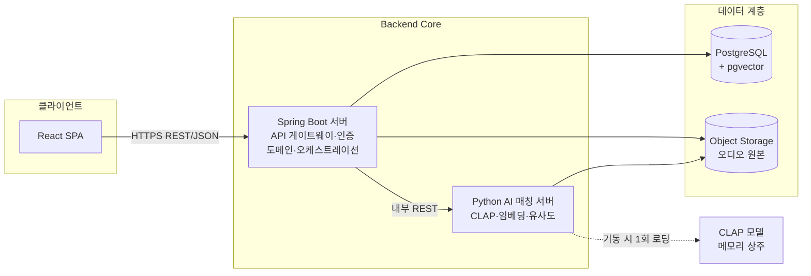
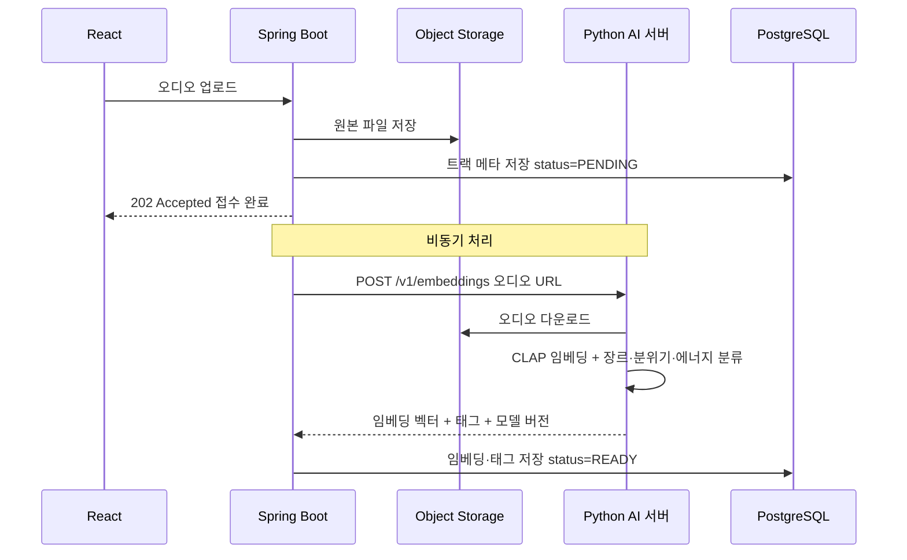
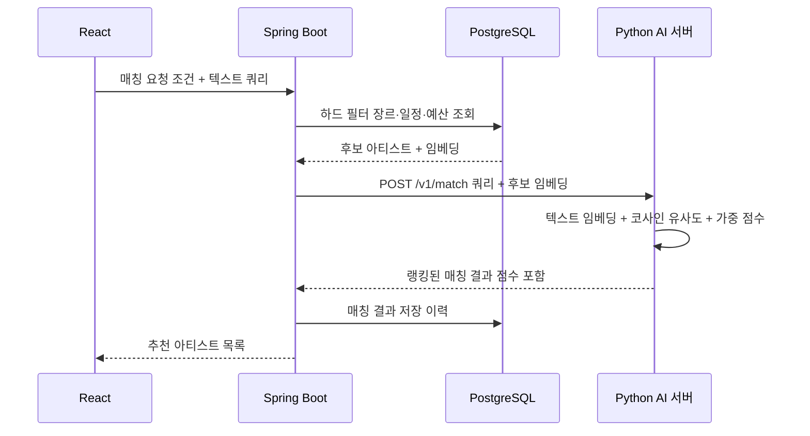
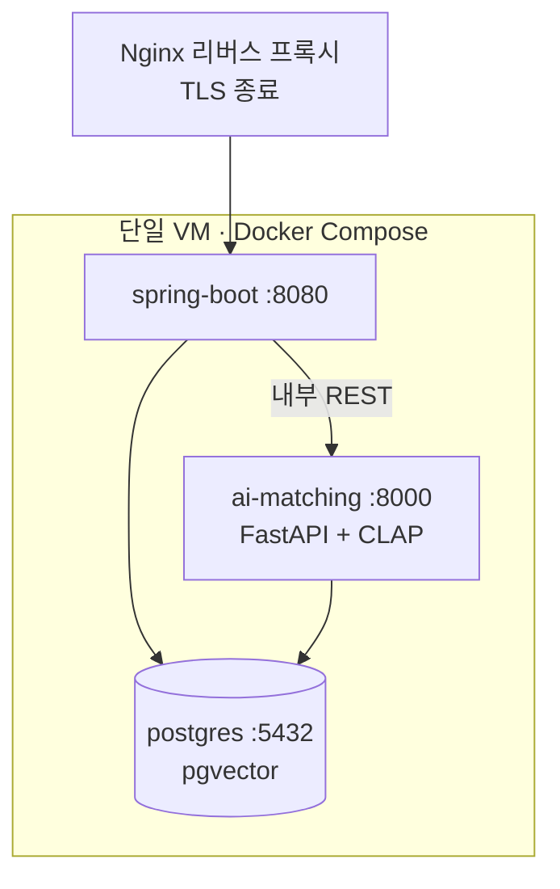

# Backend Core 아키텍처 — 아티스트-행사 매칭 플랫폼

> 이 문서는 아티스트-행사 매칭 플랫폼의 백엔드 코어 아키텍처를 설명한다.
> 두 개의 서버(Spring Boot 코어 · Python AI 매칭)로 역할을 분리한 이유, 내부 동작 원리,
> 서버 간 통신 계약, 기술 스택, 배포 구성, 그리고 실무에서 지켜야 할 원칙을 다룬다.

## 1. 배경

우리 서비스는 **행사 주최자가 원하는 분위기·장르·조건에 맞는 아티스트를 추천**하는 매칭 플랫폼이다.
매칭 품질의 핵심은 오디오 자체를 이해하는 것이다. 아티스트가 올린 음원을 CLAP 같은 오디오-텍스트
임베딩 모델로 벡터화하고, 주최자의 텍스트 쿼리(예: "잔잔하고 감성적인 어쿠스틱")와의 의미적
유사도를 계산해 순위를 매긴다.

이 요구사항은 두 가지 성격이 전혀 다른 작업을 동시에 요구한다.

| 성격 | 대표 작업 | 기술 특성 |
|---|---|---|
| 전통적 웹 백엔드 | 인증, 도메인 CRUD, 파일 업로드, 트랜잭션, 권한 | 안정적인 상태 관리·영속성·일관성이 중요 |
| ML 추론 | CLAP 임베딩, 장르·분위기 분류, 유사도 계산 | GPU/CPU 집약적, 파이썬 생태계(PyTorch) 의존, 느린 추론 |

이 둘을 하나의 서버·하나의 언어에 억지로 묶으면 다음 문제가 생긴다.

- 무거운 ML 라이브러리(PyTorch, transformers)가 웹 서버 프로세스에 얹혀 메모리·기동 시간이 폭증한다.
- ML 추론의 부하가 API 응답 지연으로 직결된다.
- 자바 생태계에서 CLAP 계열 모델을 다루기가 현실적으로 어렵다.

따라서 **책임에 따라 서버를 둘로 분리**한다. 담당자도 이 경계에 맞춰 나뉜다.

| 서버/영역 | 담당자 | 언어·런타임 |
|---|---|---|
| Spring Boot 코어 | Seokyun | Java 21 / Spring Boot 3.x |
| Python AI 매칭 서버 | JinSol | Python 3.11 / FastAPI |
| React 프론트엔드 | 이성범 | React SPA |

## 2. 개념 — 전체 아키텍처

전체 구조는 **클라이언트 → Backend Core(2서버) → 데이터 계층**의 3계층이다.

### 2.1 서버별 책임

| 구분 | Spring Boot 코어 (Seokyun) | Python AI 매칭 서버 (JinSol) |
|---|---|---|
| 성격 | 상태 있음(Stateful), 시스템의 정본 보관자 | **무상태(Stateless), 순수 추론기** |
| 대외 노출 | 유일한 외부 진입점(REST API) | **외부 비노출, 내부 네트워크 전용** |
| 인증 | JWT 기반 사용자 인증·인가 | 내부 공유 시크릿/mTLS |
| 주요 책임 | 도메인 CRUD, 파일 업로드→Object Storage, 하드 필터(SQL), 오케스트레이션, RDB+벡터 정본 영속화 | CLAP 임베딩 생성, 장르/분위기/에너지 분류, 코사인 유사도·매칭 점수 계산 |
| 데이터 소유 | PostgreSQL(정본), Object Storage 관리 | 소유하지 않음(입력을 받아 결과만 반환) |

### 2.2 핵심 설계 원칙 — 정본은 하나, 추론기는 무상태

> **정본(source of truth) 데이터는 PostgreSQL에만 존재하고, Python 서버는 어떤 상태도 보관하지 않는다.**

- 아티스트·트랙·임베딩·매칭 이력 등 **모든 영속 데이터는 PostgreSQL에만** 저장한다.
- Python 서버는 요청을 받아 계산 결과만 반환하는 **순수 함수처럼** 동작한다. 내부에 캐시나
  세션 상태를 두지 않는다(모델 가중치는 예외 — 읽기 전용 상수로 취급).
- 이 원칙 덕분에 Python 서버는 **자유롭게 수평 확장·재기동**할 수 있다. 인스턴스를 몇 개로
  늘리든, 언제 재시작하든 데이터 유실이나 정합성 문제가 없다. 부하가 몰리는 추론 계층만
  독립적으로 스케일 아웃하면 된다.

## 3. 내부 동작 원리

시스템의 두 축은 **① 오디오 임베딩 파이프라인(쓰기 경로)** 과 **② 매칭 흐름(읽기 경로)** 이다.

### 3.1 오디오 임베딩 파이프라인 (비동기)

아티스트가 음원을 업로드하면 CLAP 임베딩을 생성해 저장한다. 이 과정은 **동기(sync)가 아니라
비동기(async)** 로 처리한다.

#### 왜 비동기인가

**CLAP 추론은 느리다.** 오디오를 디코딩하고, 전처리하고, 딥러닝 모델을 통과시키는 데
수 초 이상 걸릴 수 있다. 이를 업로드 요청 스레드에서 동기로 기다리면 다음 문제가 발생한다.

- 사용자는 업로드 버튼을 누른 뒤 수 초~수십 초간 멈춘 화면을 본다(나쁜 UX).
- HTTP 요청 타임아웃·재시도로 중복 처리 위험이 생긴다.
- 웹 스레드가 추론이 끝날 때까지 점유되어 처리량이 급감한다.

그래서 **업로드 요청은 즉시 `202 Accepted` 로 접수만 확정**하고, 실제 임베딩은 뒤에서 처리한다.
트랙의 상태를 다음과 같이 관리한다.

| status | 의미 |
|---|---|
| `PENDING` | 업로드 접수됨, 임베딩 대기·진행 중 |
| `READY` | 임베딩·태그 저장 완료, 매칭에 사용 가능 |
| `FAILED` | 임베딩 실패, 재시도 대상 |

#### 비동기 실행 방식 — 지금과 나중

| 단계 | 구현 방식 | 이유 |
|---|---|---|
| MVP | Spring `@Async` (별도 스레드 풀) | 인프라 추가 없이 가장 단순하게 비동기 확보 |
| 확장기 | 메시지 큐(예: SQS/RabbitMQ/Kafka) | 재시도·백프레셔·워커 독립 확장·장애 격리가 필요해질 때 |

MVP에서는 메시지 큐를 도입하지 않는다. `@Async` 로 시작하되, **큐로 전환하기 쉽도록**
"접수 → 상태 저장 → 백그라운드 처리 → 상태 갱신" 이라는 흐름 자체를 큐 친화적으로 설계한다.

### 3.2 매칭 흐름 (2단계 매칭)

매칭은 **하드 필터(hard filter) → 소프트 매칭(soft matching)** 의 2단계로 나뉜다.

| 단계 | 위치 | 방식 | 목적 |
|---|---|---|---|
| 1단계 하드 필터 | Spring Boot / SQL | 장르·일정·예산 등 **명확한 조건**으로 SQL WHERE 필터링 | 전체 아티스트에서 후보군을 대폭 축소 |
| 2단계 소프트 매칭 | Python AI 서버 | 텍스트 쿼리 임베딩 후 후보들과 **코사인 유사도 + 가중 점수** 계산 | 축소된 후보만 정밀 랭킹 |

#### 왜 2단계로 나누는가

- 하드 필터는 **정답이 명확한 배제 조건**이다. 일정이 안 맞거나 예산 범위를 벗어난 아티스트는
  아무리 음악적으로 잘 맞아도 후보가 될 수 없다. 이런 조건은 SQL에서 인덱스로 값싸게 걸러낸다.
- 소프트 매칭은 **비싼 벡터 연산**이다. 후보가 많을수록 계산량이 선형으로 늘어난다.
- 따라서 **먼저 SQL로 후보를 줄이고(hard-filter-first)**, 남은 소수의 후보에 대해서만 Python이
  유사도를 계산한다. 이렇게 하면 매칭 응답 시간과 AI 서버 부하를 동시에 줄인다.

## 4. 서버 간 통신 계약

### 4.1 프로토콜 — MVP는 REST/JSON

| 항목 | 결정 | 근거 |
|---|---|---|
| 프로토콜 | **REST/JSON** | 디버깅·관찰 용이, 스택 무관, 도입 비용 낮음 |
| gRPC | **MVP에서 채택하지 않음(overkill)** | 스키마·코드 생성·운영 복잡도 대비 이득 적음. 초고성능 스트리밍이 필요해지면 재검토 |
| 네트워크 | **내부 네트워크 전용** | Python 서버는 외부에 노출하지 않음 |
| 서버 간 인증 | **공유 시크릿 헤더 또는 mTLS** | 내부 호출임을 보증. JWT(사용자 인증)와 별개 |
| 버전 관리 | URL 경로 `/v1` 프리픽스 | 계약 변경 시 하위 호환 유지 |

상세 엔드포인트와 JSON 예시는 [`docs/api/spring-boot-ai-contract.md`](../api/spring-boot-ai-contract.md)를 참고한다.

### 4.2 모델 버전 관리 (modelVersion)

> **모든 임베딩에는 그것을 생성한 모델의 버전(`modelVersion`)을 함께 저장한다.**

임베딩 벡터는 특정 모델·가중치에 종속된다. 모델을 교체하면 과거 벡터와 신규 벡터를 같은
공간에서 비교할 수 없다. 따라서 각 임베딩 레코드에 `modelVersion` 을 남겨야 한다.

- 어떤 벡터가 어떤 모델로 만들어졌는지 추적 가능하다.
- 모델 교체 시 **버전이 다른 트랙만 골라 재임베딩(re-embedding)** 할 수 있다.
- 매칭 시 "같은 modelVersion끼리만 비교" 같은 정합성 규칙을 적용할 수 있다.

## 5. 기술 스택

| 계층 | 기술 | 비고 |
|---|---|---|
| 코어 서버 | Spring Boot 3.x / **Java 21** | I/O 바운드 오케스트레이션에 **가상 스레드(virtual threads)** 활용 |
| 빌드 | Gradle | |
| RDB + 벡터 | **PostgreSQL 16 + pgvector** | 정본 + 벡터 저장을 한 DB에서 |
| DB 마이그레이션 | Flyway | 스키마 버전 관리 |
| 회복탄력성 | Resilience4j | Python 호출에 timeout/retry/circuit-breaker |
| AI 서버 | **Python 3.11 + FastAPI + Uvicorn** | 비동기 ASGI 서버 |
| ML | PyTorch + transformers (**CLAP**) | 오디오-텍스트 임베딩·분류 |
| 오브젝트 스토리지 | S3 호환 오브젝트 스토리지 | 오디오 원본 저장 |
| 배포 | **Docker Compose** (MVP) | 단일 VM에 컨테이너 구성 |

### 5.1 벡터 저장소 결정 — MVP는 PostgreSQL + pgvector

| 후보 | 장점 | 단점 | MVP 판단 |
|---|---|---|---|
| **PostgreSQL + pgvector** | 정본 RDB와 **동일 DB·동일 트랜잭션**, 운영 대상 1개, 조인으로 하드 필터+벡터 결합 용이 | 초대규모에서 전용 엔진보다 성능 한계 | **채택** |
| FAISS | 매우 빠른 인메모리 ANN | 라이브러리(무상태 저장소 아님), 영속성·정합성 직접 구현 필요, 정본과 분리 | 기각 |
| 전용 벡터 DB (Pinecone/Milvus/Weaviate 등) | 대규모 벡터에 최적화 | 인프라·비용·운영 대상 추가, 정본과 이원화 | 기각(오버스펙) |

MVP 규모에서는 데이터가 크지 않고, **하드 필터(SQL)와 벡터 검색을 한 쿼리·한 트랜잭션에서
결합**할 수 있다는 점이 결정적이다. 전용 벡터 DB는 데이터·트래픽이 pgvector 한계에 다다랐을 때
재검토한다.

## 6. 배포 구성

MVP는 **단일 VM에서 Docker Compose**로 세 컨테이너를 띄운다. 앞단에 Nginx 리버스 프록시가
TLS를 종료하고 Spring Boot로 트래픽을 넘긴다.

| 컨테이너 | 포트 | 노출 범위 |
|---|---|---|
| Nginx | 443/80 | 외부 공개 |
| spring-boot | 8080 | Nginx 통해서만 |
| ai-matching (FastAPI + CLAP) | 8000 | **내부 네트워크 전용(외부 비노출)** |
| postgres (pgvector) | 5432 | 내부 네트워크 전용 |

Python AI 서버(8000)는 Compose 내부 네트워크에서 Spring Boot만 접근할 수 있고, 외부로는 절대
공개하지 않는다.

## 7. 실무 베스트 프랙티스

| 항목 | 내용 | 이유 |
|---|---|---|
| Python 호출 방어 | Resilience4j로 **timeout / retry / circuit-breaker** 적용 | AI 서버 지연·장애가 코어 전체를 마비시키지 않도록 격리 |
| 배치 임베딩 | 여러 오디오/후보를 **묶어서(batch)** 요청 | 모델 추론 오버헤드 분산, 처리량 향상 |
| 하드 필터 우선 | 벡터 연산 전에 SQL로 후보 축소(hard-filter-first) | AI 서버 부하·응답 시간 절감 |
| API 버전 관리 | 내부 계약에 `/v1` 프리픽스 | 계약 변경 시 하위 호환 |
| Correlation-ID 전파 | 요청마다 상관관계 ID를 생성해 **Spring→Python까지 전파** | 분산 요청 추적·디버깅 |
| 구조화 로깅 | JSON 등 **structured logging** 사용 | 로그 검색·집계·모니터링 용이 |

## 8. 성능 최적화

| 항목 | 방법 | 설명 |
|---|---|---|
| 모델 로딩 | **기동 시 1회 로딩**, `/ready` 게이팅 | CLAP 가중치를 요청마다 로드하면 치명적. 시작 시 메모리에 상주시키고, 로딩 완료 전에는 `/ready`가 준비 안 됨을 알려 트래픽을 받지 않음 |
| Uvicorn 워커 수 | **코어 수 = 워커 수** 기준, 단 모델 메모리 감시 | 워커마다 모델이 복제 적재되므로 메모리 상한을 반드시 고려 |
| 커넥션 풀 재사용 | **WebClient/RestClient** 커넥션 풀 유지 | 매 호출 새 연결 생성 방지, 지연 감소 |
| 가상 스레드 | Java 21 **virtual threads** 로 I/O 바운드 오케스트레이션 처리 | Python 호출·DB 대기 같은 블로킹 I/O를 값싸게 동시 처리 |
| 벡터 인덱스 | 규모 확대 시 pgvector **ivfflat / hnsw 인덱스** | 후보 벡터 검색 가속 |
| 쿼리 임베딩 캐시 | 텍스트 쿼리 임베딩을 **Redis 캐시**(추후) | 반복되는 쿼리의 재임베딩 비용 절감. MVP 이후 도입 |

## 9. 주의사항

| 주의 | 이유 |
|---|---|
| **Python을 상태 저장소로 쓰지 말 것** | Python은 무상태 추론기여야 확장·재기동이 자유롭다. 정본은 PostgreSQL에만 둔다 |
| **동기 업로드 금지** | CLAP 추론이 느려 UX·처리량이 무너진다. 업로드는 항상 `202 Accepted` 비동기 처리 |
| **modelVersion 항상 기록** | 모델 교체 시 벡터 정합성·재임베딩 대상 식별을 위해 필수 |
| **GIL / 워커 메모리 OOM 위험** | Python GIL과 워커별 모델 복제로 메모리가 폭증할 수 있다. 워커 수·메모리 상한을 감시 |
| **Python 서버 외부 노출 금지** | 내부 네트워크 전용. 외부에 열면 인증·비용·보안 위험. Nginx→Spring만 외부 진입점 |

## 관련 문서

- [ADR-0001: Backend Core 2-서버 아키텍처](../adr/0001-backend-core-two-server-architecture.md)
- [Spring Boot ↔ Python 내부 API 계약](../api/spring-boot-ai-contract.md)
- [협업 가이드](../협업-가이드/README.md)
