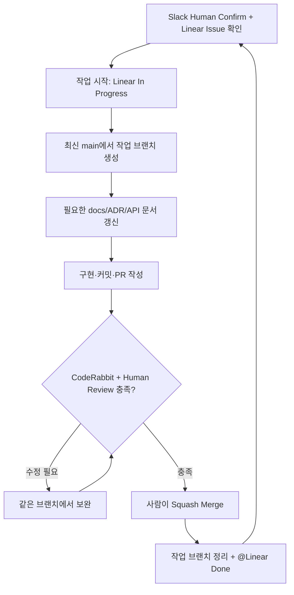

# GitHub Flow와 브랜치

← [가이드 목차](README.md)

장기 유지 브랜치는 `main` 하나다. `develop`, `release/*`, `frontend-dev`, `backend-dev`를 별도 상시 브랜치로 운영하지 않는다. `main`은 배포 가능한 상태를 목표로 관리한다. 실제 운영 배포 시점과 승인 절차는 별도의 배포 정책으로 정한다.

1. Slack 논의와 Human Confirm을 거쳐 작업의 목적과 완료 조건을 확정한다.
2. `@Linear`로 Issue를 만들고 제목, 범위, Acceptance Criteria, Requirement ID, 담당자, 우선순위, 일정을 확인한다.
3. 실제 개발을 시작할 때 Linear 상태를 `In Progress`로 바꾼다.
4. 최신 `main`에서 작업 브랜치를 만든다.
5. Linear 확정 내용이 장기 문서에 영향을 주면 같은 브랜치에서 README, `docs/`, API 문서 또는 ADR을 먼저 또는 구현과 함께 갱신한다.
6. 의미 있는 단위로 구현·커밋하고 원격 브랜치에 push한다.
7. 큰 작업이나 설계 논의가 필요하면 Draft PR을 일찍 연다.
8. 리뷰 가능한 상태에서 검증 결과를 기록하고 CodeRabbit 및 사람 리뷰를 진행한다.
9. 작성자 외 사람 1명 이상의 승인 조건을 충족하면 사람이 Squash Merge한다.
10. 병합된 작업 브랜치를 정리하고 `@Linear`로 Issue를 `Done` 처리한다. 다음 작업은 새 브랜치에서 시작한다.

GitHub Flow의 브랜치·PR·리뷰·병합 절차를 이 팀의 Linear/문서 운영 규칙과 결합한 운영안이다. [공식 설명][G1]

제품 요구사항은 Linear가 기준이며 GitHub 문서는 장기 유지할 설계·정책·API·운영 내용을 관리한다. 문서 정합성을 검사하는 별도 GitHub Action은 사용하지 않고 PR Human Review에서 Linear와 Git 문서의 일치 여부를 확인한다.

전체 작업 순서와 Slack 호출 예시는 [실제 개발 작업 절차](11-실제-개발-작업-절차.md)에 있다. 각 단계의 실제 Git 명령은 [로컬 설정과 일상 작업](04-로컬-설정과-일상-작업.md)에, PR 작성과 병합 조건은 [PR 작성과 리뷰](05-pr-작성과-리뷰.md)에 있다.

## 브랜치 이름

형식은 `유형/이슈키-짧은-영문-설명`으로 한다. 설명에는 소문자와 하이픈을 사용한다.

| 유형 | 용도 | 예시 |
|---|---|---|
| `feat` | 새 기능 | `feat/DEV-123-user-signup` |
| `fix` | 버그 수정 | `fix/DEV-142-refresh-token` |
| `refactor` | 동작을 유지하는 구조 개선 | `refactor/DEV-151-user-service` |
| `test` | 검증 자체를 개선하는 작업 | `test/DEV-163-payment-service` |
| `docs` | 문서 변경 | `docs/update-readme` |
| `chore` | 설정·도구 등 유지보수 | `chore/fix-config` |

`docs`·`chore`도 이슈가 있으면 키를 넣는다. 브랜치 유형과 [커밋 타입](03-커밋-전략과-메시지.md#타입)은 이름이 겹치지만 각각 판단한다. 커밋 타입에는 `build`, `ci`, `style`, `perf`가 더 있고, 한 브랜치 안에서 서로 다른 타입의 커밋이 나올 수 있다.

현재 `main` 직접 push 차단은 아직 적용 전이다. 팀원 합류 후 Ruleset으로 **Pull Request 없이 `main`에 반영하지 못하도록 보호**할 예정이다.

[G1]: https://docs.github.com/en/get-started/using-github/github-flow
