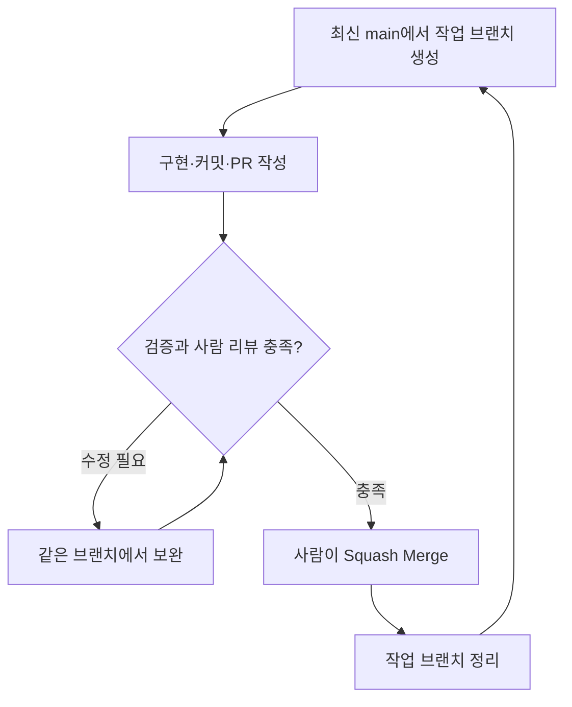

# GitHub Flow와 브랜치

← [가이드 목차](README.md)

장기 유지 브랜치는 `main` 하나다. `develop`, `release/*`, `frontend-dev`, `backend-dev`를 별도 상시 브랜치로 운영하지 않는다. `main`은 배포 가능한 상태를 목표로 관리한다. 실제 운영 배포 시점과 승인 절차는 별도의 배포 정책으로 정한다.

1. Slack에서 사람이 작업 목적을 확정하고 GitHub `docs/`에 먼저 기록한다.
2. GitHub 문서를 기준으로 Linear Issue를 `ToDo`로 만들고 Two-way Sync된 GitHub Issue를 확인한다.
3. 최신 `main`에서 실제 이슈 키가 포함된 작업 브랜치를 만든다.
4. 의미 있는 단위로 구현·테스트·커밋하고 원격 브랜치에 push한다.
5. 작업 중 공유가 필요하면 Draft PR을 열 수 있다. Draft PR은 Linear 상태를 바꾸지 않는다.
6. 리뷰 가능한 일반 PR을 열면 Linear가 자동으로 `In Progress`가 된다.
7. PR 본문에 GitHub 문서, Linear 이슈, GitHub Issue와 검증 결과를 남긴다.
8. CodeRabbit과 Human Review를 거쳐 작성자 외 팀원 1명 이상이 승인한다.
9. 사람이 Squash Merge하면 Linear가 `Done`, GitHub Issue가 `Closed`로 자동 전환된다.
10. 병합된 작업 브랜치를 정리하고 다음 작업은 최신 `main`의 새 브랜치에서 시작한다.

GitHub Flow의 브랜치·PR·리뷰·병합 절차를 이 팀의 승인 규칙과 결합한 운영안이다. [공식 설명][G1]

각 단계의 실제 명령은 [로컬 설정과 일상 작업](04-로컬-설정과-일상-작업.md)에, PR 작성과 병합 조건은 [PR 작성과 리뷰](05-pr-작성과-리뷰.md)에 있다.

## 브랜치 이름

형식은 `유형/이슈키-짧은-영문-설명`으로 한다. 설명에는 소문자와 하이픈을 사용한다.

| 유형 | 용도 | 예시 |
|---|---|---|
| `feat` | 새 기능 | `feat/DEV-123-user-signup` |
| `fix` | 버그 수정 | `fix/DEV-142-refresh-token` |
| `refactor` | 동작을 유지하는 구조 개선 | `refactor/DEV-151-user-service` |
| `test` | 검증 자체를 개선하는 작업 | `test/DEV-163-payment-service` |
| `docs` | 문서 변경 | `docs/update-readme` |
| `chore` | 설정·도구 등 유지보수 | `chore/fix-config` |

`docs`·`chore`도 이슈가 있으면 키를 넣는다. 브랜치 유형과 [커밋 타입](03-커밋-전략과-메시지.md#타입)은 이름이 겹치지만 각각 판단한다. 커밋 타입에는 `build`, `ci`, `style`, `perf`가 더 있고, 한 브랜치 안에서 서로 다른 타입의 커밋이 나올 수 있다.

[G1]: https://docs.github.com/en/get-started/using-github/github-flow
