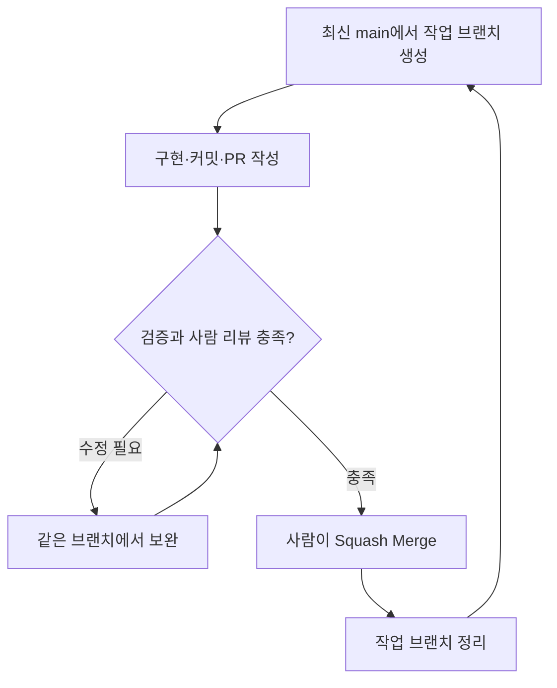

# GitHub Flow와 브랜치

← [가이드 목차](README.md)

장기 유지 브랜치는 `main` 하나다. `develop`, `release/*`, `frontend-dev`, `backend-dev`를 별도 상시 브랜치로 운영하지 않는다. `main`은 배포 가능한 상태를 목표로 관리한다. 실제 운영 배포 시점과 승인 절차는 별도의 배포 정책으로 정한다.

제품 요구사항·정책·설계를 새로 만들거나 변경하는 작업은 다음 순서를 따른다.

1. Slack에서 사람이 작업 목적과 요구사항을 확정한다.
2. 확정 내용을 GitHub `docs/`에 반영하는 문서 PR을 만들고 Human Review 후 Squash Merge한다.
3. 병합된 `main`의 GitHub 문서를 기준으로 Linear Issue를 `ToDo`로 만들고 Two-way Sync된 GitHub Issue를 확인한다.
4. 최신 `main`에서 작업 브랜치를 만든다. 이슈가 있는 작업은 실제 Linear 이슈 키를 포함한다.
5. 의미 있는 단위로 구현·테스트·커밋하고 원격 브랜치에 push한다.
6. 작업 중 공유가 필요하면 Draft PR을 열 수 있다. Draft PR은 Linear 상태를 바꾸지 않는다.
7. 리뷰 가능한 일반 PR을 열면 Linear가 `In Progress`로 전환되도록 설정되어 있다.
8. PR 본문에 GitHub 문서, Linear 이슈, GitHub Issue와 검증 결과를 남긴다.
9. CodeRabbit과 Human Review를 거쳐 작성자 외 팀원 1명 이상이 승인한다.
10. 사람이 Squash Merge하면 Linear `Done`과 GitHub Issue `Closed`로 전환되도록 자동화가 설정되어 있다. 실제 전체 동작 검증 완료 여부는 [도입 체크리스트](08-도입-체크리스트.md)를 기준으로 한다.
11. 병합된 작업 브랜치를 정리하고 다음 작업은 최신 `main`의 새 브랜치에서 시작한다.

이미 `main`의 GitHub `docs/`에 확정되어 있는 요구사항을 그대로 구현하거나, 제품 요구사항을 바꾸지 않는 버그 수정·리팩터링·테스트 작업은 별도 문서 PR을 먼저 만들지 않는다. 기존 `main` 문서를 기준으로 이슈를 만들고 개발을 시작한다.

GitHub Flow의 브랜치·PR·리뷰·병합 절차를 이 팀의 승인 규칙과 결합한 운영안이다. [공식 설명][G1]

각 단계의 실제 명령은 [로컬 설정과 일상 작업](04-로컬-설정과-일상-작업.md)에, PR 작성과 병합 조건은 [PR 작성과 리뷰](05-pr-작성과-리뷰.md)에 있다.

## 브랜치 이름

이슈가 있는 일반 작업은 `유형/이슈키-짧은-영문-설명` 형식을 사용한다. 이슈가 없는 Level 0 `docs`·`chore` 작업은 이슈 키를 생략한다. 설명에는 소문자와 하이픈을 사용한다.

| 유형 | 용도 | 예시 |
|---|---|---|
| `feat` | 새 기능 | `feat/NSU-123-user-signup` |
| `fix` | 버그 수정 | `fix/NSU-142-refresh-token` |
| `refactor` | 동작을 유지하는 구조 개선 | `refactor/NSU-151-user-service` |
| `test` | 검증 자체를 개선하는 작업 | `test/NSU-163-payment-service` |
| `docs` | 문서 변경 | `docs/update-readme` |
| `chore` | 설정·도구 등 유지보수 | `chore/fix-config` |

`docs`·`chore`도 실제 이슈가 있으면 키를 포함한다. 반대로 제품 요구사항이나 구현 작업을 별도로 추적할 필요가 없는 Level 0 문서·설정 유지보수는 키 없이 브랜치를 만든다. 추적을 위해 가짜 Linear Issue를 만들지 않는다.

브랜치 유형과 [커밋 타입](03-커밋-전략과-메시지.md#타입)은 이름이 겹치지만 각각 판단한다. 커밋 타입에는 `build`, `ci`, `style`, `perf`가 더 있고, 한 브랜치 안에서 서로 다른 타입의 커밋이 나올 수 있다.

[G1]: https://docs.github.com/en/get-started/using-github/github-flow
